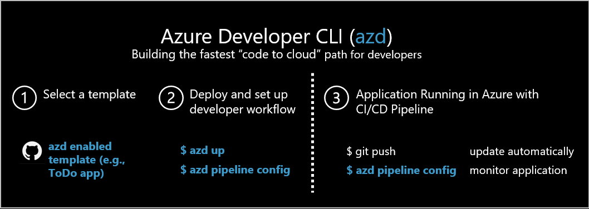

# What is the Azure Developer CLI

The Azure Developer CLI (**azd**) is a developer-centric command-line tool for cloud applications designed to reduce the time required for a developer to be productive and help developers understand core Azure development constructs. The CLI is a set of commands that allow you to use the same workflow for all Azure Developer CLI templates, DevOps workflows, and IDE. It also demonstrate opinionated best practices for Azure development

The quickest way to get started is to:
1. Pick an [Azure Developer CLI template](azure-dev-cli-templates.md) 
2. Deploy the sample by following the README in the template by running `azd up`

## Azure Developer CLI templates
[Azure Developer CLI templates](azure-dev-cli-templates.md) are sample repositories created using the Azure Developer CLI conventions so that you can use `azd` to easily get started and develop solutions using Azure. Each template includes application code, tools, infrstructure code, and CI/CD pipelines that serve as a foundation from which you can build upon and customize to create your own solutions. In addition, you can use subcommands in `azd` to manage cloud resources, configure continuous integration and delivery (CI/CD), and monitor application health. 

## Try it out

* [Pick your developer environment and get started](get-started.md)
* Learn how to [use VS Code with the Azure Dev CLI extension](how-to-use-vscode-extension-to-debug-locally.md)
* Learn how to [enable your project to work with the Azure Developer CLI](how-to-devify-a-project.md) so you can use `azd` as part of your engineering workflows.

## Introductory video

Watch this 2-min video to get a high level overview of `azd`:

## Development environment choices

To run any sample template, the first thing you need to do decide is where you want your development environment to be hosted.

|Environment|Description|Pros|Cons|Supported?|
|---|---|---|---|---|
|**[DevContainer / VS Code Remote - Containers](https://code.visualstudio.com/docs/remote/containers)**|Container with all dependencies installed and run on your local machine.|Other than VS Code, Docker, and the Remote Containers VS Code extension, all dependencies are installed for you in the DevContainer.| You need to clone the repository. The container initialization can take a long time.| Coming soon |
|**Bare Metal**|**Not** in a container, dependencies are manually installed by you, and the project is run on your local machine.|You control all dependencies. You may already have some of the dependencies installed. You don't need Docker installed.|You have to manually install all dependencies.| Yes |
|**[GitHub Codespaces](https://github.com/features/codespaces)** |Container with all dependencies installed and run on GitHub.com in the browser.|All dependencies installed and you don't need to clone the code locally.| Some features and functionality may not be supported. The container initialization can take a long time.| Coming soon |

## List of languages and Azure compute services (host) Azure Developer CLI supports

Currently supported/planned hosting platform for the application:

| Azure compute service      | Supported? |
| ----------- | ----------- |
| Azure App Service | Yes  |
| Function  | Yes |
| Azure Container Apps    | Yes |
| Azure Static Web Apps  | Coming soon |
| Azure Kubernetes Service | Coming soon |

Currently supported/planned languages:

| Language      | Supported? |
| ----------- | ----------- |
| Node.js | Yes  |
| Python    | Yes |
| .NET | Yes |
| Java | Coming soon |

## See also

- For a full list of supported commands, see the [Azure Developer CLI Reference](https://aka.ms/azure-dev/ref).

