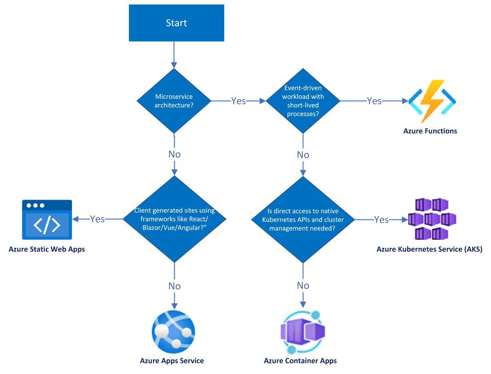

# Azure Developer CLI Templates

Each Azure Developer CLI template is built for specific host (Azure compute service) and programming language. 

If you haven't finalized the Azure compute service for hosting your application, use the following flowchart to choose a template to use as a base for your project:

> [!NOTE]
> The perfect solution is dependent on your use case and team. You can refer to these additinoal recommended resources for guidance: [Choose an Azure compute service](/azure/architecture/guide/technology-choices/compute-decision-tree) and [Comparing Container Apps with other Azure container options](https://docs.microsoft.com/en-us/azure/container-apps/compare-options).

### ToDo Application

Each repo contains a complete sample ToDo application with a web frontend built in React.js and the backend API built using a specific `azd` supported language. 

| Template      | Compute Service | Language (API layer) | Tech Stack	 | Link	
| ----------- | ----------| ----------- | --- | --- | 
| ToDo NodeJs Mongo | Azure App Service | Node.js | Azure Cosmos DB API for Mongo, Azure Monitor | https://github.com/azure-samples/todo-nodejs-mongo | 
| ToDo Python Mongo | Azure App Service | Python (FastAPI) | Azure Cosmos DB API for Mongo, Azure Monitor  | https://github.com/azure-samples/todo-python-mongo | 
| ToDo C# Mongo | Azure App Service | C# | Azure Cosmos DB API for Mongo, Azure Monitor | \<coming soon\> |
| ToDo C# Azure SQL | Azure App Service | C# | Azure SQL, Azure Monitor | \<coming soon\> |
| ToDo C# Cosmos DB (SQL) | Azure App Service |  C# | Azure Cosmos DB SQL API, Azure Monitor | \<coming soon\> |
| ToDo NodeJs Mongo ACA | Azure Container Apps | Node.js | Azure Cosmos DB API for Mongo, Azure Monitor | https://github.com/azure-samples/todo-nodejs-mongo-aca | 
| ToDo Python Mongo ACA | Azure Container Apps | Python (FastAPI)|  Azure Cosmos DB API for Mongo, Azure Monitor | https://github.com/azure-samples/todo-python-mongo-aca | 

