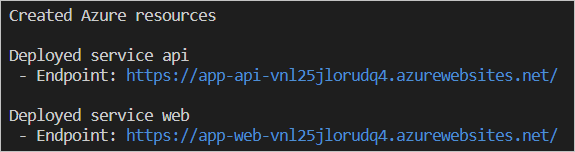

# Get started with Azure Developer CLI

We'll use a sample GitHub repo, a Todo app, for this walkthrough. Upon completion, you will get the code and will be able to run commands to build, deploy, and monitor the application in Azure. 

> [!NOTE] 
> You can use any of the [Azure Developer CLI templates](azure-dev-cli-templates.md) for this walkthrough. 

## Azure Subscription

You will create infrastructure and deploy code to Azure. If you don't have an Azure Subscription, sign up for a [free account here](https://azure.microsoft.com/free/). 

## Set up

To run any sample template, pick a development environment. For pros and cons, refer to the [development environment choices]( azure-dev-cli-overview#development-environment-choices).

### [Bare metal](#tab/bare-metal)

[!INCLUDE [azd-baremetal](includes/azd-baremetal.md)]

### [DevContainer](#tab/devcontainer)

[!INCLUDE [azd-devcontainer](includes/azd-devcontainer.md)]

---

Once complete, the command will print the following URLs:

- Azure portal link to view resources created
- ToDo web application frontend
- ToDo API application



Select the web application URL to launch the ToDo app. Create a new collection and add some items. 

### Clean up resources
When you're done, you can delete all the Azure resources created with this template by running the following command:

``` bash
azd down
```

## Next steps

* [Set up GitHub pipeline using azd pipeline](how-to-update-and-deploy-using-GitHub-Action.md)
* [Monitor the health of your app](how-to-monitor-your-app.md)
* [Run and debug using the Azure Developer CLI Visual Studio Code Extension](how-to-use-vscode-extension-to-debug-locally.md)

## Troubleshooting/Known issues

For known issues, refer to [Troubleshooting/known issues](azure-dev-cli-known-issues.md) 

## Explore more samples

To find more Azure Developer CLI enabled templates, see our [sample templates](azure-dev-cli-templates.md).

## Reference

A [reference](azure-cli-ref) is available.

## Get help and give feedback

Post questions to the community on [Discussions](https://github.com/Azure/azure-dev-pr/discussions). Report bugs and open issues against the Azure Developer CLI in the [GitHub repository](https://github.com/Azure/azure-dev-pr).