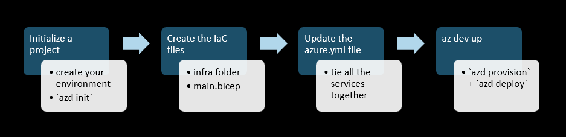

# How to create an Azure Developer CLI compatible template



`azd` looks for specific configuration files in a pre-defined folder structure. Here's a walkthrough on how to create an azd compatible template.

To start, you need the following required subfolder and files in your project folder:

```txt
├── infra                      [ Creates and configures Azure resources ]
│   ├── main.bicep             [ Main infrastructure file ]
│   ├── main.parameters.json   [ Parameters file ]
│   └── resources.bicep        [ Resources file ]
└── azure.yaml                 [ Describes the application and type of Azure resources]
```

Refer to the [azd conventions section](#azd-conventions) for complete folder structure.

## Your project folder

::: zone pivot="azd-create"

1. Create an empty folder
1. Change directory to your new folder
1. Add your source code either to the root or in a subfolder called /src. Note that the location of your source code needs to be the same as what you specify in your [azure.yaml file](#update-azureyaml).

::: zone-end

::: zone pivot="azd-convert"

1. Start from this [simple Python Flask web app](/azure/app-service/quickstart-python?tabs=flask%2Cwindows%2Cazure-portal%2Cterminal-bash%2Cvscode-deploy%2Cdeploy-instructions-azportal%2Cdeploy-instructions-zip-azcli). Get a copy of the code by running:
  `git clone https://github.com/Azure-Samples/msdocs-python-flask-webapp-quickstart`
1. (Optional) Follow instructions in the [tutorial](/azure/app-service/quickstart-python?tabs=flask%2Cwindows%2Cazure-portal%2Cterminal-bash%2Cvscode-deploy%2Cdeploy-instructions-azportal%2Cdeploy-instructions-zip-azcli#1---sample-application) to run the app locally to make sure the sample is working.
1. Change directory to `msdocs-python-flask-webapp-quickstart`. 

::: zone-end

## Initialize the project

To initialize the project:

1. Run `azd init`
1. Select "Empty Template" from the list of project templates
1. Provide any name for new environment 
1. Select an Azure location 
1. Select an Azure subscription 

### What happened?
After you run this command, the following are added: 

- a new folder `.azure` 
- a subfolder called &lt;your environment name&gt; in the `.azure` folder. 
- Configuration file `.env` in `\.azure\<your environment name>` that contains information like the environment name, Azure subscription etc.
- `azure.yaml` in the root of your project

## Add Bicep files

`azd provision` uses Bicep files found under the **infra** folder for creating Azure resources needed by your app.

To add, for example, Azure App Service resources:

1. Create an **infra** folder at the root of your project.
1. Create a new file named **main.parameters.json**. Include the environment variables (found in .env file under the .azure/\<environment name\> folder) you want to pass to your Bicep files. Here's an example:

    ```json
    {
        "$schema": "https://schema.management.azure.com/schemas/2019-04-01/deploymentParameters.json#",
        "contentVersion": "1.0.0.0",
        "parameters": {
            "name": {
            "value": "${AZURE_ENV_NAME}"
            },
            "location": {
            "value": "${AZURE_LOCATION}"
            },
            "principalId": {
            "value": "${AZURE_PRINCIPAL_ID}"
            }
        }
    }
    ```
1. Create a file named **main.bicep** as the main entry point. Make sure you create parameters you include in **main.parameters.json**. For more information, see [Parameters in Bicep](/azure/azure-resource-manager/bicep/parameters). You can also refer to the **main.bicep** of an Azure Developer CLI template, for example, https://github.com/Azure-Samples/todo-nodejs-mongo/blob/main/infra/main.bicep and remove the outputs you don't need. Here's a sample:

    ```json
    targetScope = 'subscription'

    @minLength(1)
    @maxLength(50)
    @description('Name of the the environment which is used to generate a short unqiue hash used in all resources.')
    param name string

    @minLength(1)
    @description('Primary location for all resources')
    param location string

    @description('Id of the user or app to assign application roles')
    param principalId string = ''

    resource resourceGroup 'Microsoft.Resources/resourceGroups@2020-06-01' = {
        name: '${name}-rg'
        location: location
        tags: tags
    }

    var resourceToken = toLower(uniqueString(subscription().id, name))
    var tags = {
        'azd-env-name': name
    }

    module resources './resources.bicep' = {
        name: 'resources-${resourceToken}'
        scope: resourceGroup
        params: {
            location: location
            principalId: principalId
            resourceToken: resourceToken
            tags: tags
        }
    }

    output APP_WEB_BASE_URL string = resources.outputs.WEB_URI
    output AZURE_LOCATION string = location
    
    ```

1. Create **resources.bicep**. For samples, you can refer to [sample Azure App Service Bicep files](/azure/app-service/samples-bicep). Here's a sample **resources.bicep** that creates a Python web frontend hosted on Azure App Service:

    ```json
    param location string
    param principalId string = ''
    param resourceToken string
    param tags object
    param sku string = 'S1' 
    param linuxFxVersion string = 'PYTHON|3.8'

    resource appServicePlan 'Microsoft.Web/serverfarms@2020-06-01' = {
      name: 'plan-${resourceToken}'
      location: location
      tags: tags
      sku: {
        name: sku
      }
      kind: 'linux'
      properties: {
      reserved: true
      }
    }

    resource web 'Microsoft.Web/sites@2020-06-01' = {
      name: 'app-web-${resourceToken}'
      location: location
      tags: union(tags, {
        'azd-service-name': 'web'
        })
      kind: 'app'
      properties: {
        serverFarmId: appServicePlan.id
        siteConfig: {
        linuxFxVersion: linuxFxVersion
        }
      }

      resource appSettings 'config' = {
        name: 'appsettings'
        properties: {
          'SCM_DO_BUILD_DURING_DEPLOYMENT': 'true'
          }
        }
      }

      output WEB_URI string = 'https://${web.properties.defaultHostName}'
    ```

1. Run `azd provision` to provision Azure resources.

### What happened?

After you run `azd provision`:
* Azure resources are created under the resource group **\<environment name\>-rg**. 
* The web end point is added to **.env** file under the .azure/\<environment name\> folder

## Update `azure.yaml`

To deploy the app, azd needs to know more about your app. Edit the azure.yaml file to let azd know where to find the source code; what kind of app you're building; the Azure service that will be hosting your app. 

1. Update `azure.yaml` by adding the following lines:

    ```yml
    services:
    web:
        project: .
        language: py
        host: appservice
    ```
    - **name**: Root element. Required. Name of the application.
    - **services**: Root element. Required. Definition of services that is part of the app.
    - **web**: Required. Name of the service. Can be any name, for example, api, web.
    - **project**: Required. Path to the service source code directory. Use **src/web** if your source code is found under /src/web.
    - **language**: Service implementation language. "py" for Python. If not specified, .NET will be assumed.
    - **host**: Type of Azure resource used for service implementation. "appservice" for Azure App Service. If not required, appservice is assumed.

    For full details, refer to [azure.yaml.json](https://github.com/Azure/azure-dev/blob/main/schemas/v1.0/azure.yaml.json/).

1. Run `azd deploy` to deploy the app to Azure
1. Visit the end point printed to test your app.

Your project is now compatible with Azure Develper CLI.

### What happened?

After you run `azd deploy`:
* The service **web** is deployed to the app service you provisioned in the previous step.

> [!NOTE] 
> * If you make any changes to your bicep file and/or code, you can run `azd up` to perform both `azd provision` and `azd deploy` in a single step. 
> * If you wish to create a new environment, run `azd env new`.

## Configure a DevOps pipeline

To set up GitHub Action:
1. Create a folder ".github" if it doesn't exist
1. Create a folder "workflows" under the .github folder
1. Copy the **azure-dev.yml** from any azd template, for example, https://github.com/Azure-Samples/todo-nodejs-mongo/blob/main/.github/workflows/azure-dev.yml and paste into the .github/workflows folder.

To test:

1. Run `azd pipeline config` to push updates to the repository. The GitHub Action workflow is triggered because of the update.
1. Go to the Action tab in your repo to check the workflow run result. 

::: zone pivot="azd-convert"

> [!NOTE]
> * `.venv` should be added to the `.gitignore` file

::: zone-end

## Clean up

Run `azd down` to remove all Azure resources.

## azd conventions

All Azure Developer CLI templates have the same file structure based on azd conventions. Here's the complete folder structure:

```txt
├── .devcontainer              [ For DevContainer ]
├── .github                    [ Configure GitHub workflow ]
├── .vscode                    [ VS Code workspace ]
├── assets                     [ Assets used by README.MD ]
├── infra                      [ Creates and configures Azure resources ]
│   ├── main.bicep             [ Main infrastructure file ]
│   ├── main.parameters.json   [ Parameters file ]
│   └── resources.bicep        [ Resources file ]
├── src                        [ Contains folder(s) for the application code ]
└── azure.yaml                 [ Describes the application and type of Azure resources]
```

## Useful Bicep resources

* For an introduction to working with Bicep files, see Quickstart: [Create Bicep files with Visual Studio Code](/azure/azure-resource-manager/bicep/quickstart-create-bicep-use-visual-studio-code?tabs=CLI).
* [Bicep Samples](/samples/browse/?languages=bicep)
* [How to decompile Azure Resource Manager templates (ARM templates) to Bicep](/azure/azure-resource-manager/bicep/decompile?tabs=azure-cli)