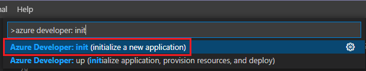
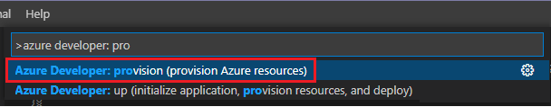
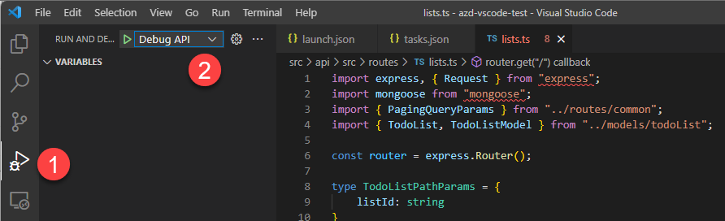
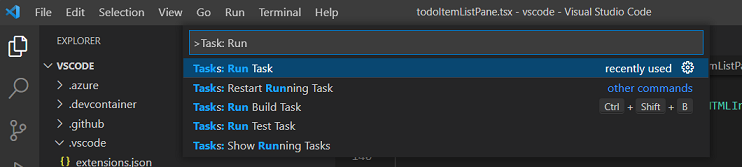
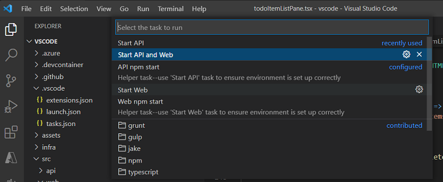

# How to use Visual Studio Code extension to run and debug locally

This article walks through how to use Visual Studio Code and Visual Studio Code extension for Azure Developer CLI to run and debug applications.

## Background

[Visual Studio Code](https://code.visualstudio.com/docs) is a lightweight, cross-platform source code editor that comes with support for many languages. To make it easy for you to debug code right from the editor, Azure Developer CLI enabled templates include configurations (`tasks.json` and `launch.json`) for building and debugging the application.

## Install Azure Developer CLI VS Code extension 

The first step is to download and install the extension.

1. Download the extension from https://azuresdkreleasepreview.blob.core.windows.net/azd/vscode/latest/azure-dev-latest.vsix
2. In VS Code
    1. Open "Extensions" (Ctrl+Shift+X)
    2. Click the `...` menu at top of Extensions sidebar
    3. Click "Install from VSIX"
    4. Select location of the downloaded file

> [!NOTE]
> Currently supported commands in the VS Code Extension for Azure Developer CLI:
> - `az dev deploy`
> - `az dev env`
> - `az dev infra delete`
> - `az dev init`
> - `az dev monitor`
> - `az dev pipeline`
> - `az dev provision`
> - `az dev up`

## Initialize a new application 

Use the VS Code extension to set up your local environment.

1. Create an empty directory and open this folder in VS Code
2. Open Command Pallette (Ctrl+Shift+P)
3. Type and pick **Azure Developer: Initialize a new application**

4. Select one of templates in private preview, for example, "Azure-Samples/todo-nodejs-mongo" 
    - Provide environment name, location and select the Azure subscription when prompted

The following files are included in the .vscode folder:

- `launch.json` includes debug configurations so you can **Debug Web** or **Debug API**. You see the same options in **Run and Debug** (Ctrl-Shift-D).
- `tasks.json` includes configurations so you can start the web and/or the API servers. You see the same options if you go to the Command Pallete and run **Task: run task**.

> Learn more about [Debugging](https://code.visualstudio.com/docs/editor/debugging) and [Tasks](https://code.visualstudio.com/docs/editor/tasks) in VS Code.

## Provision the Azure resources

Before you start debugging, make sure you provision the necessary Azure resources. All infrastructure is running in the cloud and must be provisioned for the application run to succeed. 

1. Open Command Pallette (Ctrl+Shift+P)
2. Type or pick **Azure Developer: Provision Azure resources**. (You can also right-click `azure.yaml` to kick **Provision Azure Resources** off.)

    

## Debug the application

Once provision is complete, you can run and debug the application. Let's walk through two scenarios.

### Scenario 1 - Debug API

**Debug API** is configured to run the API server and attach the debugger. So you don't need to run the task to start the API server.

1. Set a breakpoint. Open `lists.ts` in `src > api > src > route`. Set a breakpoint at say line 16. 
1. In the activity bar, click Run and Debug (Ctrl-Shift-D) and then "Debug API"

1. In your preferred terminal shell, type: >curl http://localhost:3100/lists
1. The breakpoint is hit, hit F5, an empty list is returned.

### Scenario 2 - Debug React Frontend Application

To debug web, you need to start both the API server and the development web server so make sure you run the task to start both API and web.

1. In Command Pallete, run "Task: run task", select Start API and Web

1. (Optional) You can check if the local web server is running by navigating to: http://localhost:3000 in a web browser.
1. Open `todoItemListPane.tsx` in `src > web > src > components`, set a breakpoint on deleteItems (line 150).
1. In the activity bar, click "Run and Debug" (Ctrl-Shift-D) and then "Debug Web". 
1. A web browser (http://localhost:3000) is launched automatically. 
1. You can now debug with the breakpoint, call stacks, and an interactive console.