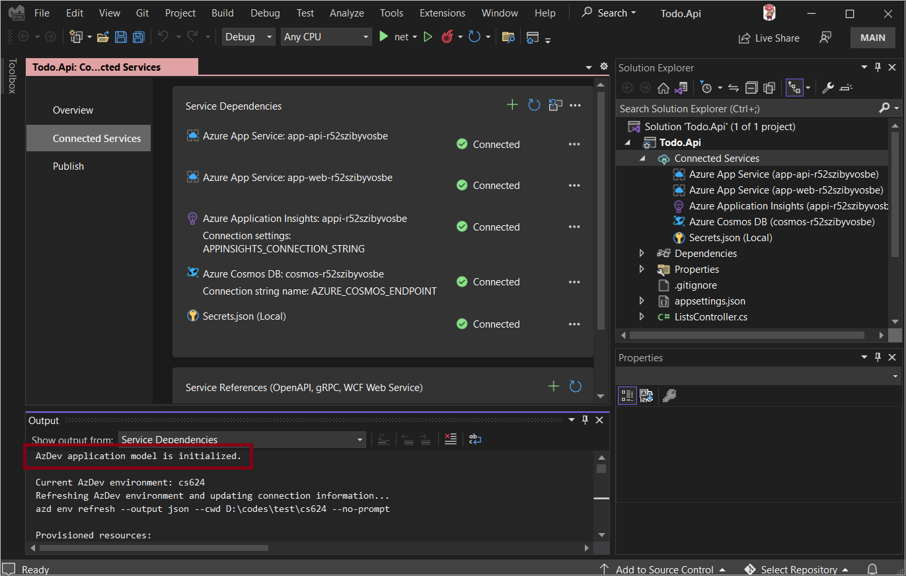
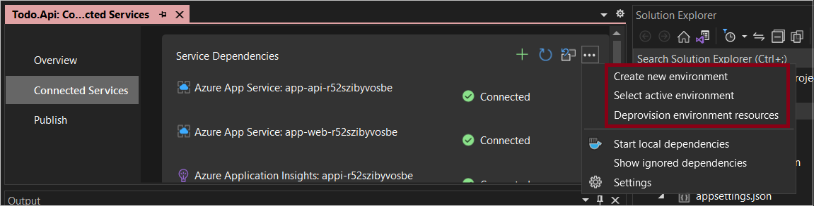
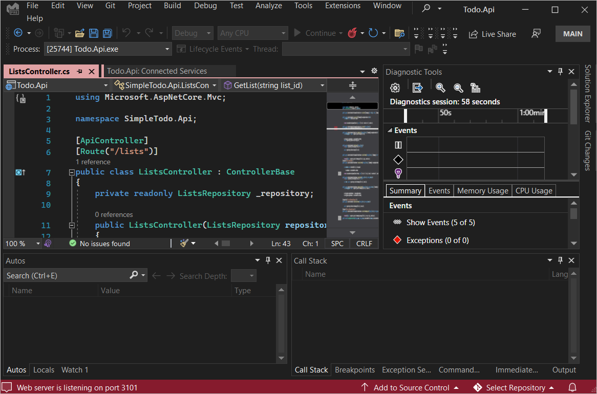

In this article, you learn how to use [Visual Studio](https://code.visualstudio.com/docs) to run and debug apps on your local machine.

## Prerequisites

We'll use the [Todo Application with C# and Azure Cosmos DB API for MongoDB](https://github.com/Azure-Samples/todo-csharp-cosmos-sql) for this tutorial.

By now, you should have your Azure resources provisioned and application deployed. If not, follow the steps in [get-started](get-started.md&pivots=programming-language-csharp) and then return to this article.

## Enable the preview feature

Integration with azd is shippped in version 17.3.0 Preview 2 behind a feature flag. Make sure you enable the preview feature before you proceed further.

1. Open Visual Studio 

1. From the **Tools** menu, select **Options** and then **Preview Features**.

1. Make sure **Integration with azd, the Azure Developer CLI** is enabled

 

## Open the API solution

1. Open **Todo.Api.sln** in /src/api. 

1. **azure.yaml** file is detected. Visual Studio automatically initializes the application model and runs `azd env refresh`.

1. Doubleclick **Connected Services** to see all the dependencies. Even though the web front-end running on Azure App Service is not part of the api solution, it's detected and shown.

 

## Provision environment resources

You can provision Azure resources to your environment.

1. In **Connected Services**

1. Click the icon at the top right to restore/provision environment resources

 

1. You will be asked to confim the environment name, subscription name and location.

## Manage azd environment

To manage azd environment, click ... and select the options in the dropdown. You can:
* create a new environment
* select and set a specific environment as the current active environment
* deprovision an environment

 

## Run and debug

1. From your project's `src/api` directory, open `ListController.cs`.

1. Set a breakpoint at line 20.

1. Hit &lt;F5>

1. Wait for the message indicating the debugger is listening on port 3101.

    

1. In your preferred browser, enter : `https://localhost:3101/lists`

1. When the breakpoint you set earlier is hit, app execution will pause. At this point, you can do standard debugging tasks such inspect variables, look at the call stack, and set additional breakpoints. Press &lt;F5> to continue running the app. The sample app returns a list.

```
[{"id":"fb9c1cb3811349b993421fc0e815c4c1","name":"My List","description":null,"createdDate":"2022-06-27T01:10:16.7721172+00:00","updatedDate":null}]
```

## Publish your app

If you make any update, publish your app by:

1. Doubleclick **Connected Services** in **Solution Explorer**

1. Click **Publish**

1. Click **Add a publish profile**

1. Select **Azure** as **Target**, click next

1. Select **AzDev Environment**, click next

    

1. Select the environment and click Finish

## Addtional resources

* [Visual Studio Connected Service](visualstudio/azure/overview-connected-services?view=vs-2022)