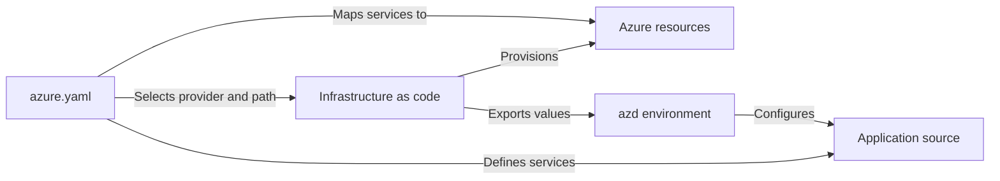

# Azure Developer CLI templates overview

An Azure Developer CLI (`azd`) template is a code repository that follows `azd` conventions. It combines project configuration, infrastructure as code, and optional application source so you can create repeatable Azure environments and deployments.

Templates can support different project types, including:

- A complete application with one or more deployable services.
- An infrastructure-only solution without application code.
- A reusable starting point that another developer can initialize and extend.
- An existing project that you prepare for provisioning and deployment with `azd`.

This article explains the structure of a template and how `azd` commands use its files.

## Why use a template?

A template captures the decisions required to run a project on Azure. Depending on the project, it can define:

- Azure resources and their configuration.
- Deployable application services and packaging instructions.
- Connections between application services and Azure resources.
- Environment-specific parameters and outputs.
- Local development, continuous integration, and continuous delivery configuration.

Because the configuration is stored with the project, teams can review changes in source control and create consistent development, test, and production environments.

## How `azd` uses a template

The files in a template support different stages of the `azd` workflow:

- `azd init` initializes the project and creates an `azd` environment. It can also use GitHub Copilot to generate an initial template or copy an existing template.
- `azd provision` evaluates the infrastructure definitions and creates or updates Azure resources.
- `azd package` prepares deployable application services according to `azure.yaml`.
- `azd deploy` associates each service with its Azure host and deploys the application package.
- `azd up` runs the provisioning, packaging, and deployment stages as a combined workflow.

The template files remain regular source files throughout this process. You can review, edit, and version them with the rest of the project.

[!INCLUDE [azd-template-structure](includes/azd-template-structure.md)]

The following diagram shows how the primary template assets work together:



## Required and optional assets

The exact structure varies by project, but most templates use the following assets.

### `azure.yaml`

The `azure.yaml` file is the primary project configuration file. It defines the project name and can define deployable services, infrastructure providers, hooks, workflows, and other `azd` behavior.

For an application service, `azure.yaml` commonly identifies:

- The path to the application source.
- The programming language or packaging strategy.
- The Azure service that hosts the application.
- Build, deployment, container, or Kubernetes settings.

Infrastructure-only templates can omit application services. For the complete configuration model, see the [`azure.yaml` schema](azd-schema.md).

The following example defines two application services. The service names, source paths, languages, and hosting targets tell `azd` what to package and where to deploy it:

```yaml
name: store
services:
  api:
    project: ./src/api
    language: js
    host: containerapp
  web:
    project: ./src/web
    language: js
    host: staticwebapp
```

### Infrastructure as code

Most templates contain an `infra` directory with Bicep or Terraform files. These files define the Azure resources, role assignments, networking, application settings, and deployment outputs required by the project.

For the default Bicep provider, `azd` typically uses `infra/main.bicep` as the deployment entry point and `infra/main.parameters.json` to map `azd` environment values to Bicep parameters. Terraform templates commonly use `infra/main.tf` and related Terraform files.

For example, a Bicep parameter file can pass values selected by `azd` into the infrastructure deployment:

```json
{
  "parameters": {
    "environmentName": { "value": "${AZURE_ENV_NAME}" },
    "location": { "value": "${AZURE_LOCATION}" }
  }
}
```

When Bicep provisioning completes, `azd` stores outputs from the entry point as environment values. Application services and hooks can use these values for resource endpoints, names, and other runtime configuration.

```bicep
output API_ENDPOINT string = api.outputs.uri
```

### Application source

Application source is optional. When a template contains deployable services, each service definition in `azure.yaml` points to its source directory. A template can organize services under `src`, use directories elsewhere in the repository, or point a service at the repository root.

The folder name itself isn't significant. The `project` value in `azure.yaml` determines where `azd` finds each service.

### Environment configuration

The `.azure` directory contains local environment state and values created by `azd`. It can contain subscription, location, resource name, endpoint, and deployment output values for multiple environments.

Treat this directory as local state rather than a reusable template asset. Don't commit environment files that contain secrets or environment-specific values.

### Supporting assets

Templates can also contain:

- GitHub Actions or Azure Pipelines definitions.
- Dockerfiles and container configuration.
- Development container configuration.
- Command and service hooks.
- Tests, scripts, and project documentation.

These assets are optional and should be included only when they support the intended template experience.

## Service and resource association

To deploy an application service, `azd` must associate its definition in `azure.yaml` with a provisioned Azure resource. By default, `azd` finds a resource whose `azd-service-name` tag matches the service name.

For example, a service named `api` maps to a resource tagged with `azd-service-name: api`. You can instead use the `resourceName` service property to identify the deployment target explicitly.

The following Bicep expression adds the discovery tag to a resource's existing tags:

```bicep
tags: union(tags, {
  'azd-service-name': 'api'
})
```

Keep service names, resource discovery settings, infrastructure outputs, and application environment variables aligned when you edit a template.

## Build or adapt a template

The recommended authoring experience is to run `azd init` and select **Set up with GitHub Copilot (Preview)**. The dedicated Copilot agent session can analyze existing files, help plan a new project, generate template assets, and validate the result. For this workflow and other authoring methods, see [Start with a new template](start-with-new-template.md).

The generated files aren't tied to Copilot. You can [explore and edit the template files](explore-edit-templates.md) directly after initialization. You can also create the same files manually or with another AI coding agent.

If a template from Microsoft, your organization, or the developer community already provides a useful architecture, [start from the existing template](start-with-existing-template.md) and adapt it for your project. Browse available templates in the [template galleries](azd-template-galleries.md).

## Template usage guidelines

Each template is licensed by its owner under the agreement that accompanies the template. Determine which license applies before you use or distribute a template.

Microsoft isn't responsible for non-Microsoft templates and doesn't screen them for security, privacy, compatibility, or performance issues. Templates, including Microsoft-provided templates, aren't supported by a Microsoft support program or service and are provided as is without warranty.

Review all template files before provisioning. In particular, evaluate role assignments, network exposure, authentication methods, service tiers, resource locations, and expected costs.

## Next steps

> [!div class="nextstepaction"]
> [Template development overview](build-templates-overview.md)
