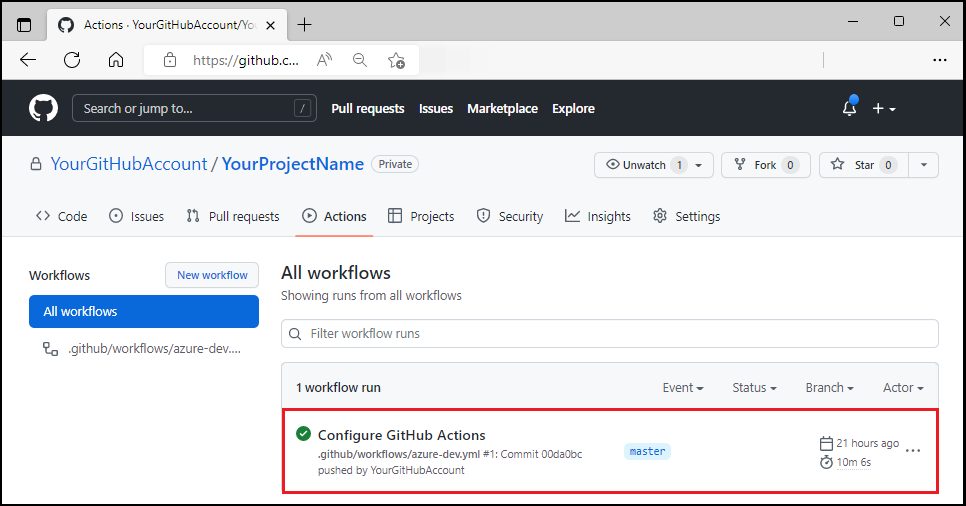
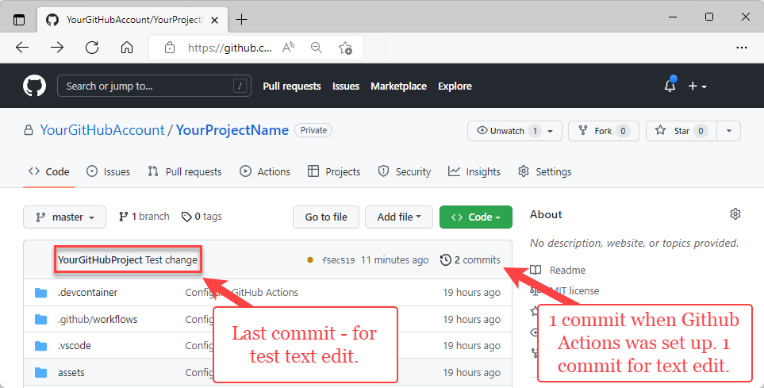
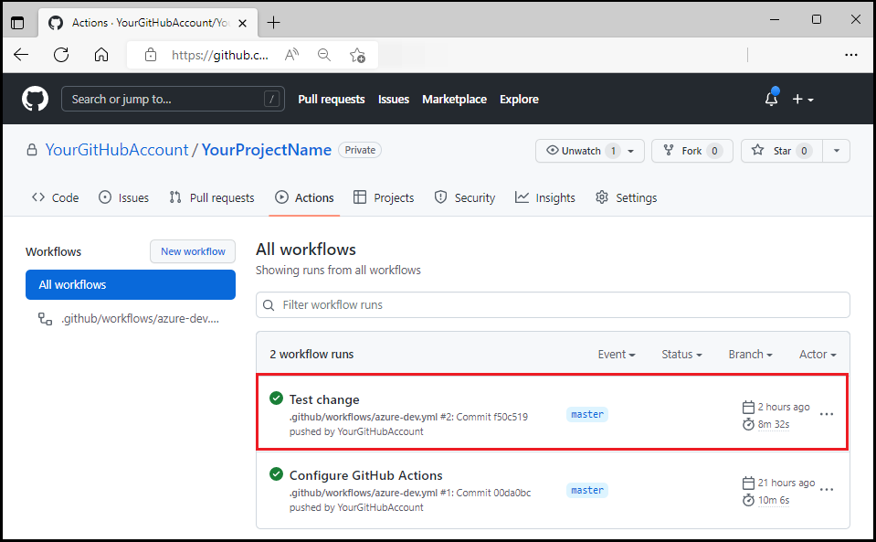

# Configure a pipeline and push updates using GitHub Actions

In this article, you learn how to push changes to your GitHub repo through GitHub Actions for apps created via Azure Developer CLI (azd) Preview.

This article uses the sample [Todo Application with Node.js and Azure Cosmos DB API for MongoDB](https://github.com/azure-samples/todo-nodejs-mongo). However, the principles you learn in this article apply to any of the [Azure Developer CLI template](overview.md#azure-developer-cli-templates).

## Prerequisites

- [Install azd](get-started.md).

## Configure a DevOps pipeline

All sample templates include a GitHub Actions pipeline configuration file that deploys your app whenever code is pushed to the main branch. This configuration file is called `azure-dev.yml` and is located in your project's `.github/workflow` directory.

Configuring the pipeline requires you to give GitHub permission to deploy to Azure on your behalf. Authorizing GitHub is done via an Azure service principle stored in a GitHub secret named `AZURE_CREDENTIALS`.

To create the service principle, run the command `azd pipeline config`. The command also creates a private GitHub repository and pushes code to the new repo.  

1. Run the following command to configure a GitHub Action:

    ```bash
    azd pipeline config
    ```

1. Supply the requested GitHub information. When prompted about committing and pushing your local changes to start a new GitHub Actions run, specify "y".

1. If the terminal window isn't open, from the **View** menu, select **Terminal**. The results of the `azd pipeline config` command display. The `azd pipeline config` command will output the GitHub repository name for your project.

1. Using your browser, open the GitHub repository for your project.

1. Select **Actions** to see the workflow running.

    

## Make and push a code change

1. In your project's `/src/web/src/layout` directory, open `header.tsx`.

1. Locate the line `<Text variant="xLarge">ToDo</Text>`.

1. Change the literal `ToDo` to `myTodo`.

1. Save the file.

1. Commit your change. In the following screenshot, you can see I used the Visual Studio Code Source Control pane to commit the change. Committing the change starts the GitHub Action pipeline to deploy the update.

    

1. Using your browser, open your project's GitHub repository to see the commit - along with the commit from GitHub Actions being set up.

    

1. Select **Actions** to see the test update reflected in the workflow.

    

1. Visit the web frontend URL to inspect the update.

## Clean up resources

When you no longer need the resources created in this article, run the following command:

``` bash
azd down
```

## Next steps

> [!div class="nextstepaction"]
> [Monitor your app using Azure Developer CLI (azd)](monitor-your-app.md)
