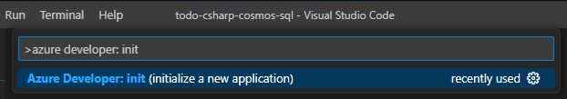
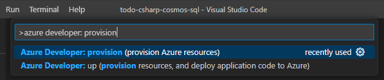
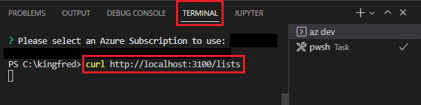
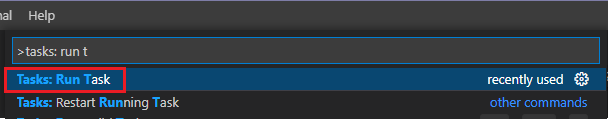
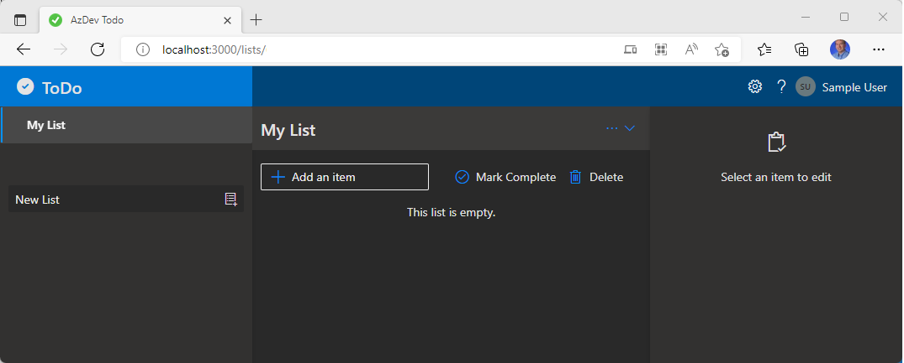

In this article, you learn how to use the [Visual Studio Code](https://code.visualstudio.com/docs) extension for Azure Developer CLI (azd) Preview to run and debug apps on your local machine.

This article uses the sample [Todo Application with Node.js and Azure Cosmos DB API for MongoDB](https://github.com/azure-samples/todo-nodejs-mongo). However, the principles you learn in this article apply to any of the [Azure Developer CLI template](../overview.md#azure-developer-cli-templates).

## Prerequisites

[!INCLUDE [azd-install](azd-install.md)]
- [Node.js with npm (v 16.13.1 LTS)](https://nodejs.org/)

## Install the Visual Studio Code extension for Azure Developer CLI

### Visual Studio Code

1. Open Visual Studio Code.

1. From the **View** menu, select **Extensions**.

1. In the search field, enter `Azure Developer CLI`.

1. Select **Install**.

### Marketplace

1. Using your browser, go to the [Azure Developer CLI - VS Code Extension](https://marketplace.visualstudio.com/items?itemName=ms-azuretools.azure-dev) page.

1. Select **Install**.

## Initialize a new app

1. Create and open a new directory in Visual Studio Code.

1. From the **View** menu, select **Command Palette...**.

1. Type and pick `Azure Developer: init`.

    

1. Select the template `Azure-Samples/todo-nodejs-mongo`.

    

The following files are included in the `.vscode` directory:

- `launch.json`: Defines the debug configurations such as **Debug Web** and **Debug API**. to see the debug configuration options, select **Run** from the **View** menu. The available debug configurations are listed at the top of the pane. To learn more about debugging in Visual Studio Code, see [Debugging](https://code.visualstudio.com/docs/editor/debugging).
- `tasks.json`: Defines the configurations to start the web or API server. To see these configuration options, open the Command Palette and run **Task: run task**. To learn more about Visual Studio Code Tasks, see [Integrate with External Tools via Tasks](https://code.visualstudio.com/docs/editor/tasks).

## Provision the Azure resources

Before you start debugging, provision the necessary Azure resources.

1. Open Command Palette.

1. Enter **Azure Developer: provision Azure resources**.

    

## Debug an API

The debug configuration **Debug API** automatically runs the API server and attaches the debugger. To test this pattern, do the following steps:

1. From your project's `src/api/src/routes` directory, open `lists.ts`.

1. Set a breakpoint at line 16.

1. In the Activity Bar, select **Run and Debug**, the **Debug API** debug configuration, and the **Start Debugging** arrow.

    

1. From the **View** menu, select **Debug Console**.

1. Wait for the message indicating the debugger is listening on port 3100.

    

1. In your preferred terminal shell, enter the following command: `curl http://localhost:3100/lists`

    

1. When the breakpoint you set earlier is hit, app execution will pause. At this point, you can do standard debugging tasks such inspect variables, look at the call stack, and set other breakpoints. Press `<F5>` to continue running the app. The sample app returns an empty list.

## Debug a React Frontend app

To use the **Debug Web** configuration, you must start both the API server and the development web server. To test this pattern, do the following steps:

1. Open the Command Palette and run **Task: Run task**.

    

1. Enter and select **Start API and Web**

    

1. (Optional) You can check if the local web server is running by navigating to the following URL in a web browser: `http://localhost:3000`.

1. In your project's `src/web/src/components` directory, open `todoItemListPane.tsx`.

1. Set a breakpoint on line 150 (the first line of the `deleteItems` function).

1. In the Activity Bar, select **Run and Debug**, the **Debug Web** debug configuration, and the **Start Debugging** arrow.

    

1. Running the web app will cause your default browser to open the following URL: `http://localhost:3000`. You can now debug the app by adding an item, selecting it from the list, and selecting **Delete**.

    

1. When the breakpoint you set earlier is hit, app execution will pause. At this point, you can do standard debugging tasks such inspect variables, look at the call stack, and set other breakpoints. Press `<F5>` to continue running the app and the selected item will be deleted.