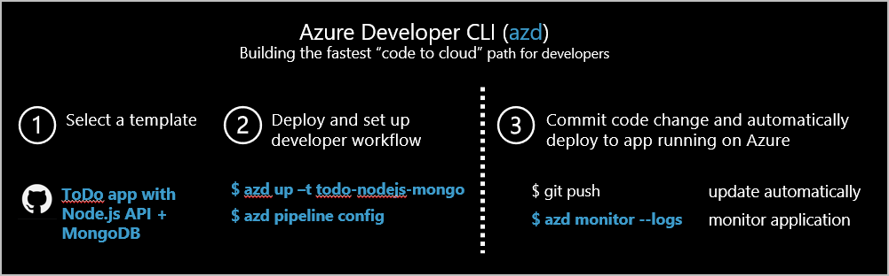

# What is the Azure Developer CLI (azd) Preview?

The Azure Developer CLI (azd) Preview is a developer-centric command-line tool for building cloud apps. The azd is a set of commands that allows you to work consistently across azd templates, DevOps workflows, and your IDE (integrated development environment).

## Recommended azd workflow

The following steps are the recommended workflow to using azd:

1. Select an [Azure Developer CLI template](#azure-developer-cli-templates).
1. Get the code and deploy the sample by running `azd up`.
1. Customize the app to meet your needs.

The following image shows a graphical representation of the suggested workflow:

## Azure Developer CLI templates

**Azure Developer CLI templates** are sample repositories created using the Azure Developer CLI conventions so that you can use `azd`. Each template includes app code, tools, and infrastructure code. The template configures continuous integration and delivery (CI/CD) pipelines. These pipelines serve as a foundation from which you can build upon and customize to create your own solutions.

The quickest way to get started with azd is to refer to the README in an Azure Developer CLI enabled template.

This list is grouped by supported language. Each repository contains a complete sample ToDo app with a web frontend built in React.js and the backend API built using a specific azd supported language.

### [Node.js](#tab/nodejs)

| Template      | App host | Database	 | 
| ----------- | ----------| ----------- | 
| [ToDo NodeJs Mongo](https://github.com/azure-samples/todo-nodejs-mongo) | [Azure App Service](/azure/app-service/) | [Azure Cosmos DB API for Mongo](/azure/cosmos-db/mongodb/mongodb-introduction) |  
| [ToDo NodeJs Mongo ACA](https://github.com/azure-samples/todo-nodejs-mongo-aca) | [Azure Container Apps](/azure/container-apps/overview) | [Azure Cosmos DB API for Mongo](/azure/cosmos-db/mongodb/mongodb-introduction) |
| [ToDo NodeJs Mongo SWA + Functions](https://github.com/azure-samples/todo-nodejs-mongo-swa-func) | [Azure Static Web Apps](/azure/static-web-apps/), [Azure Functions](/azure/azure-functions/) | [Azure Cosmos DB API for Mongo](/azure/cosmos-db/mongodb/mongodb-introduction) |

### [Python](#tab/python)

| Template      | App host | Database	 | 
| ----------- | ----------| ----------- | 
| [ToDo Python Mongo](https://github.com/azure-samples/todo-python-mongo) | [Azure App Service](/azure/app-service/) | [Azure Cosmos DB API for Mongo](/azure/cosmos-db/mongodb/mongodb-introduction)  |  
| [ToDo Python Mongo ACA](https://github.com/azure-samples/todo-python-mongo-aca) | [Azure Container Apps](/azure/container-apps/overview) |  [Azure Cosmos DB API for Mongo](/azure/cosmos-db/mongodb/mongodb-introduction) |  
| [ToDo Python Mongo SWA + Functions](https://github.com/azure-samples/todo-python-mongo-swa-func) | [Azure Static Web Apps](/azure/static-web-apps/), [Azure Functions](/azure/azure-functions/) |  [Azure Cosmos DB API for Mongo](/azure/cosmos-db/mongodb/mongodb-introduction)|

### [C#](#tab/csharp)

| Template      | App host | Database	 | 
| ----------- | ----------| ----------- | 
| [Todo C# Cosmos DB (SQL)](https://github.com/Azure-Samples/todo-csharp-cosmos-sql) | [Azure App Service](/azure/app-service/) | [Azure Cosmos DB SQL API](/learn/modules/intro-to-azure-cosmos-db-core-api/) | 

---

## Azure Developer CLI vs Azure CLI

[Azure Developer CLI (azd)](/azure/developer/az-dev-cli) and [Azure CLI](/cli/azure/what-is-azure-cli) are both command-line tools.

However, they help you do different tasks.

The azd focuses on the developer workflow. Apart from provisioning/managing Azure resources, the CLI helps to stitch cloud components, local development configuration and pipeline automation together into a complete solution. 

Azure CLI is a control plane tool for creating and administering Azure infrastructure such as virtual machines, virtual networks, and storage.

## Supported development environments

To run any sample template, the first thing you need to do decide is where you want your development environment to be hosted.

|Environment|Description|Pros|Cons|Supported?|
|---|---|---|---|---|
|**Bare Metal**|**Not** in a container, dependencies are manually installed by you, and the project is run on your local machine.|You control all dependencies. You may already have some of the dependencies installed. You don't need Docker installed.|You have to manually install all dependencies.| Yes |
|**[DevContainer / VS Code Remote - Containers](https://code.visualstudio.com/docs/remote/containers)**|Container with all dependencies installed and run on your local machine.|Other than VS Code, Docker, and the Remote Containers VS Code extension, all dependencies are installed for you in the DevContainer.| You need to clone the repository. The container initialization can take a long time.| Yes |
|**[GitHub Codespaces](https://github.com/features/codespaces)** |Container with all dependencies installed and run on GitHub.com in the browser.|All dependencies installed and you don't need to clone the code locally.| Some features and functionality may not be supported. The container initialization can take a long time.| Coming soon |

## Supported Azure compute services (host)

Currently supported/planned hosting platform for the app:

| Azure compute service      | Supported? |
| ----------- | ----------- |
| Azure App Service | Yes  |
| Function  | Yes |
| Azure Container Apps    | Yes |
| Azure Static Web Apps  | Yes |
| Azure Kubernetes Service | Coming soon |

## Supported programming languages

Currently supported/planned languages:

| Language      | Supported? |
| ----------- | ----------- |
| Node.js | Yes  |
| Python    | Yes |
| .NET | Yes |
| Java | Coming soon |

## Next steps

> [!div class="nextstepaction"] 
> [Get started using Azure Developer CLI (azd)](get-started.md)
