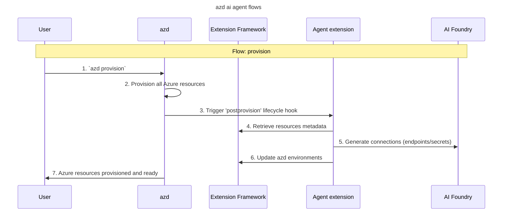
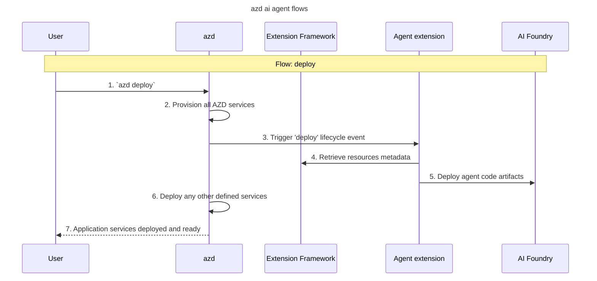

# </> CLI sequence

This lays out the commands we want to build, and how they're going to work.

_After pre-agent setup, the local environment is prepared for development with an Azure AI Foundry resource and a model deployment compatible with the agent service._

## End-to-end user journey

### Installation

To run the extension, users will have to:

1. Install the [Azure Developer CLI](https://learn.microsoft.com/en-us/azure/developer/azure-developer-cli/install-azd?tabs=winget-windows%2Cbrew-mac%2Cscript-linux&pivots=os-windows), for instance:

```sh
winget install microsoft.azd
```

2. The `azd ai agent` extension will [auto-install on the first command](https://github.com/Azure/azure-dev/pull/5753).

```sh
# running any command will auto-install the extension
azd ai agent init
```

### Pre-requirements

Using the `azd ai agent` extension assumes users are using an `azd` template with a file `infra/main.bicep`. A compatible template can be downloaded during project initialization.

That template will match the following:

**Environment variables**:

- env var `AZURE_SUBSCRIPTION_ID`
- env var `AZURE_RESOURCE_GROUP`
- env var `AZURE_LOCATION`
- env var `AZURE_AI_ACCOUNT_NAME`
- env var `AZURE_AI_PROJECT_NAME`
- env var `AZURE_AI_FOUNDRY_PROJECT_ENDPOINT`
- env var `ENABLE_HOSTED_AGENTS`: enable hosted agents by provisioning ACR (and set RBAC + connection to it)
- env var `ENABLE_CONTAINER_AGENTS`: enable container agents by provisioning ACR, ACA, and set RBAC + connections accordingly
- env var `AI_PROJECT_DEPLOYMENTS`: a json string with a list of deployments and their parameters
    - example: `AI_PROJECT_DEPLOYMENTS="[{'name':'gpt-4o-mini','model':{'format':'OpenAI','name':'gpt-4o-mini','version':'2024-07-18'},'sku':{'name':'GlobalStandard','capacity':100}}]"`
- env var `AI_PROJECT_CONNECTIONS`: a json string with a list of connections and their parameters
- env var `AI_PROJECT_DEPENDENT_RESOURCES`; a json string with a list of additional resources (ex: Azure AI Search) to provision and connect

‼️ **Need Clarity**

- Should the extension should that the template matches requirements before moving forward?
- How do we gracefully except and explain to users if template does not match?
- Is there a non-bicep-specific way to handle parameters? Can we just use env vars through and through?

### Entry points

**From the Azure AI Foundry portal** - Users navigating our NextGen experience can be pointed to `azd` in 4 different places:

- After creating a resource/project, they are invited to jump to code with an `azd` command to connect to their resource and start developping with (ex: `azd ai agent init --project-id /foo/bar`).

- In the agent catalog, they are invited to use `azd ai agent` extension to download the agent manifest/code (ex: `azd ai agent init -m azureml://registries/agentmanifest/foo/bar`).

- In the AI Templates catalog, users are given a list of `azd` templates. They are directed to GitHub repos each with their own instructions.

- In the "Open in VSCode" experience, in Agent playground, the portal opens a VSCode web experience with minimal code and a README. That README points to the `azd` template [Get started with ai agents](https://github.com/Azure-Samples/get-started-with-ai-agents).

**Directly from GitHub** - Users can also discover `azd` and foundry from any of the existing `azd` templates.

### Commands summary

1. If user is coming from an existing project in Azure AI Foundry portal

    ```bash
    # connect to an existing foundry project with resource id and location
    azd ai agent init -p /subscriptions/[SUBSCRIPTION]/resourceGroups/[RESOURCE_GROUP]/providers/Microsoft.CognitiveServices/accounts/[AI_ACCOUNT]/projects/[AI_PROJECT] -l [location]
    ```

    Results:
    - if not done yet: initialize project with the right template
    - set env vars so it points to the existing foundry resource

2. Grab an agent from our catalog

    ```bash
    # load a sample agent manifest from the public catalog
    azd ai agent init -m azureml://registries/[REGISTRYNAME]/agentmanifests/[AGENTNAME]/versions/[AGENTVERSION]
    ```

    Results:
    - if not done yet: initialize project with the right template
    - add the agent as an entry in file `azure.yaml` under `services`
    - set env vars so that template provisions the right model(s) and connections

3. Integrate the agent in a container app (front end)?

4. Provision the `infra/` to ensure agent can run

    ```bash
    azd provision
    ```

    Results:
    - deploys the models and connections under their rightful names so agent definition is valid

5. Deploy agent with the rest of the solution:

    ```bash
    azd deploy
    ```

    Results:
    - add new env vars (ex: `SERVICE_[NAME]_AGENT_NAME`) to reach to the agent in local code


## Details of `azd ai agent` commands and hooks

### `azd ai agent init`

This command scaffolds an agent manifest and runtime code in the local folder \[[JTBD1](../agent.md)\]. The agent It adds the agent as an entry under `azure.yaml`.

\>_ **Commands**

```sh
# load a sample agent manifest from the public catalog
azd ai agent init -m azureml://registries/[REGISTRYNAME]/agentmanifests/[AGENTNAME]/versions/[AGENTVERSION]

# download and initialize from an agent in a github repo
azd ai agent init -m https://github.com/Azure-Samples/azure-ai-foundry/samples/agents/travel-agent/agent.yaml

# initialize from a local folder created previously
azd ai agent init -m ./src/agent/agent.yaml

# connect to an existing foundry project with resource id and location
azd ai agent init -p /subscriptions/[SUBSCRIPTION]/resourceGroups/[RESOURCE_GROUP]/providers/Microsoft.CognitiveServices/accounts/[AI_ACCOUNT]/projects/[AI_PROJECT] -l [location]
```

📌 **Requirements**

Running this command, the `azd ai agent` extension will:

1. Set up the local project correctly:

    - If no `azure.yaml` exists, create one. If one exists, add the agent under the `azd` config `azure.yaml` under section `services` (see [directory structure](./directory-structure.md)).
    - If no `infra` entry is specified in `azure.yaml`, warn users that they need to use an azd template, and prompt users to use one of the compatible templates.
    - If given a `--project-id` (`-p`), set the env vars required for `infra/main.bicep` to connect to that project.

2. Setup the agent from its manifest:

    - Download the agent manifest from the public foundry catalog into an `agent.yaml` file on disk under `src/[AGENTNAME]/`.
    - Map this agent manifest into an agent definition, prompting users to provide/set values for the agent parameters (ex: pick a model deployment).

3. Populate the `infra/main.bicep` parameters with the right values for the agent to become deployable:

    - Inspect the model deployments of that agent definition, and add required model deployments to a parameter.
    - Inspect the [**connections**](./connections.md) of that agent definition, and add requires connections to a parameter

‼️ **Dependencies**

- [`azure-dev/5680`](https://github.com/Azure/azure-dev/issues/5680): We'll need the extension to be able to create its own service types

📖 **Example result**

Here's what the `azure.yaml` could look like with just one agent and no connections (see [directory structure](./directory-structure.md) for more):

```yaml
name: declarative-agent-project

services:
  my-agent:
    project: src  # points to where agent.yaml is
    host: foundry.hostedagent
```

Notes:

- The best `azd` native verb here would be `azd add`. But it is currently in alpha, and would need to be adapted for adding an agent.
- Pending further discussion on `azd add`, `azd ai agent init` is the preferred command to initialize an agent folder inside a full solution.
- `azd` has a pending "layered provisioning" feature that we could also leverage down the line.

### ... the developer develops ...

To develop the agent \[[JTBD2](#jtbd2)\], the developer uses a broad range of tools, in particular VS Code with the foundry extensions enabling agent yaml editing.

<!-- CAN WE NOT DO THIS FOR NOW
## `azd ai agent run <service>`

For local testing, the command [runs](#verbs) the agent from localhost to allow developer to test it out with their app \[[JTBD3](#jtbd3)\].

\>_ **Command**

```sh
azd ai agent run <service=agent>
```

📌 **Requirements**

Running this command, our `azd ai agent` extension will starts a local process to serve the model under `localhost`:

```text
Preparing "my-cool-agent"...
Creating virtual environment...
Agent can now be reached at 127.0.0.1:8000...
```

‼️ **Need Clarity**

- [AzD] A native `azd run <service>` is currently under `azd` backlog, need close collaboration to explore requirements. Likely not by Ignite, we would need to implement our own `azd ai agent run` as mitigation.
-->

### `azd infra generate` (hooks)

In `azd` native, `azd infra generate` populates the `infra/` folder with biceps based on what's in `azure.yaml`.

\>_ **Command**

```sh
azd infra generate
```

📌 **Requirements**

When using this `azd` command, the extension will hook into 

 this command, the `azd ai agent` extension will populate the `infra/` folder with the required Azure AI Foundry resource provisioning plans.

In particular, for each agent type:

| Agent       | Required Resources                                                                                                                                                                                                                      |
|:------------|:----------------------------------------------------------------------------------------------------------------------------------------------------------------------------------------------------------------------------------------|
| Declarative | Provision an Azure AI Foundry resource + project, with a model of the type required by the `agent.yaml`.                                                                                                                                |
| Code / HOBO | Provision a foundry resource + project, a model as specified in `agent.yaml` , and an Azure Container Registry. Set a connection towards the ACR in the foundry resource. Set RBAC so that foundry resource identity can pull from ACR. |
| Code / COBO | Foundry resource + project, a model a specified in `agent.yaml`, and a container app (with all its resources).                                                                                                                          |
| Workflow    | Foundry resource + project, and whatever is required per agent of the workflow (recursive).                                                                                                                                             |

Then per tool type per agent:

| Tool | Required Resources |
|:-----|:-------------------|
| foo  | bar                |


‼️ **Need Clarity**

- connections???

### `azd package`

In `azd` native, `azd package` prepares the application code for deployment by packaging it into a format suitable for Azure services. This includes bundling source files, configuration, and dependencies so that the application can be deployed using azd deploy.

\>_ **Command**

```sh
azd package
```

📌 **Requirements**

Our `azd ai agent` extension will just hook with `azd package` to package the agent code (container agent) or config (declarative agent) to be ready to upload/deploy in the AI Project.

In particular for each agent type:

| Agent       | Required Resources                                    |
|:------------|:------------------------------------------------------|
| Declarative | No packaging resources                                |
| Code / HOBO | Send the agent container to the ACR remote build.     |
| Code / COBO | Send the agent container to the ACR for remote build. |
| Workflow    | Depends on sub-agents, recursively.                   |

‼️ **Need Clarity**

- [Foundry] what assumptions do we make on the dockerfile? on the framework? are we automating generation of dockerfile?

### `azd provision`

In `azd` native, `azd provision` sets up the required infrastructure for the application in the cloud. It uses the environment configuration defined in the project to provision resources like databases, storage accounts, and compute services using tools like Bicep or Terraform.

\>_ **Command**

```sh
azd provision
```

📌 **Requirements**

Our `azd ai agent` extension will just hook with `azd provision` to set up the required infrastructure for the agent to run in the cloud This should work both for the context of our [agent only](#scenario-1--agent-only-project) scenario, and our [agent in a solution](#scenario-2--agent-in-a-solution) scenario.

This means:

- making sure the AI Services resource is spun up (`azd provision` should do this already if the ai project is under `services`)
- create the connections required are populated in the AI Project.

Note: Thanks to `azd` hooks, this will provision in the `env` specified by the user in its `azd` setup (see [Pre-agent section](#pre-agent-starting-from-scratch-using-azd-init)).



‼️ **Need Clarity**

- [Foundry] It's unclear what we need to do with dependencies of an agent, need clarity from container agent service side: are we injecting environment variables in a code container agent? or are we injecting them as references to connections? both?

### `azd deploy`

In `azd` native, `azd deploy` deploys the application code to the infrastructure that was provisioned. It handles packaging, uploading, and configuring the app so it runs correctly in the cloud environment (`azd deploy` automatically runs `azd package`). This should work both for the context of our [agent only](#scenario-1--agent-only-project) scenario, and our [agent in a solution](#scenario-2--agent-in-a-solution) scenario.

\>_ **Command**

```sh
azd deploy
```

📌 **Requirements**

Our `azd ai agent` extension will just hook with `azd provision` to [**deploy**](#verbs) the agent with all the right config, connections, etc, in the developer AI Project \[[JTBD3](#jtbd3)\]\[[JTBD4](#jtbd4)\]. The agent becomes available in the project playground for manual testing, and through some endpoint for connecting with an app.

Note: Thanks to `azd` hooks, this will provision in the `env` specified by the user in its `azd` setup (see [Pre-agent section](#pre-agent-starting-from-scratch-using-azd-init)).

If the project consists of an [agent only](#scenario-1--agent-only-project), what's deployed is only the agent, hosted in the Agent Service. If the project consists of an [agent in a solution](#scenario-2--agent-in-a-solution), what's deployed is the entire solution including the agent.

Note: `azd` has in backlog a feature for "layered provisioning" which will enable doing `azd up` or `azd provision` only on a sub-component of a solution. This avoid us having to develop an extension-specific `azd ai agent up` to deploy only the agent.




‼️ **Need Clarity**

- [Foundry] It's unclear what we need to do with dependencies of an agent, need clarity from container agent service side: are we injecting environment variables in a code container agent? or are we injecting them as references to connections? both?

### `azd up`

In `azd` native, `azd up` is a convenience wrapper: it runs `azd package`, `azd provision`, and `azd deploy` in sequence. This is ideal for bootstrapping a full environment from a template.

By implementing hooks for `azd package`, `azd provision` and `azd deploy`, this is a NO-OP.


## `azd` sequence per agent type

### declarative agent

In the scenario below, we're considering the case where the declarative agent is being used in an app (hosted in a container app).

| steps/hooks    | app lifecycle                                                   | agent lifecycle                                                 |
|:---------------|:----------------------------------------------------------------|:----------------------------------------------------------------|
| init           | adds app under `services` and `resource`                        | adds agent under `services`, add foundry project + model        |
| infra generate | hydrates the biceps with ACR, container env, container app, etc | hydrates the bicep with foundry project                         |
| prebuild       | n/a                                                             |                                                                 |
| build          | n/a                                                             |                                                                 |
| postbuild      | n/a                                                             |                                                                 |
| preprovision   | n/a                                                             |                                                                 |
| provision      | deploys whatever is under `infra/`                              | deploys whatever is under `infra/`                              |
| postprovision  | n/a                                                             |                                                                 |
| prepackage     | n/a                                                             |                                                                 |
| package        | (remote-) build the `app` container                             |                                                                 |
| postpackage    | n/a                                                             |                                                                 |
| prepublish     | n/a                                                             |                                                                 |
| publish        | pushed app container to ACR                                     | data plane call to create the agent instance, populate env vars |
| postpublish    | n/a                                                             |                                                                 |
| predeploy      | n/a                                                             |                                                                 |
| deploy         | update container app, use agent env vars                        |                                                                 |
| postdeploy     |                                                                 |                                                                 |


### hobo code-based agent

In the scenario below, we're considering the case where the hobo agent is being used in an app (hosted in a container app).

| steps/hooks    | app lifecycle                                                   | agent lifecycle                                               |
|:---------------|:----------------------------------------------------------------|:--------------------------------------------------------------|
| init           | adds app under `services` and `resource`                        | adds agent under `services`, add foundry project + model      |
| infra generate | hydrates the biceps with ACR, container env, container app, etc | hydrates the bicep with foundry project, model, ACR, and rbac |
| prebuild       | n/a                                                             |                                                               |
| build          | n/a                                                             |                                                               |
| postbuild      | n/a                                                             |                                                               |
| preprovision   | n/a                                                             |                                                               |
| provision      | deploys whatever is under `infra/`                              | deploys whatever is under `infra/`                            |
| postprovision  | n/a                                                             |                                                               |
| prepackage     | n/a                                                             |                                                               |
| package        | (remote-) build the `app` container                             | (remote-) build the `agent` container                         |
| postpackage    | n/a                                                             |                                                               |
| prepublish     | n/a                                                             |                                                               |
| publish        | push `app` container to ACR                                     | push `agent` container to ACR                                 |
| postpublish    | n/a                                                             |                                                               |
| predeploy      | n/a                                                             |                                                               |
| deploy         | update container app, use agent env vars                        |                                                               |
| postdeploy     |                                                                 |                                                               |


### cobo code-based agent

In the scenario below, we're considering the case where the cobo agent is being used in an app (hosted in a container app).

| steps/hooks    | app lifecycle                                                   | agent lifecycle                                                    |
|:---------------|:----------------------------------------------------------------|:-------------------------------------------------------------------|
| init           | adds app under `services` and `resource`                        | adds agent under `services`, add foundry project + model           |
| infra generate | hydrates the biceps with ACR, container env, container app, etc | hydrates the bicep with foundry project, model, and a containerapp |
| prebuild       | n/a                                                             |                                                                    |
| build          | n/a                                                             |                                                                    |
| postbuild      | n/a                                                             |                                                                    |
| preprovision   | n/a                                                             |                                                                    |
| provision      | deploys whatever is under `infra/`                              | deploys whatever is under `infra/`                                 |
| postprovision  | n/a                                                             |                                                                    |
| prepackage     | n/a                                                             |                                                                    |
| package        | (remote-) build the `app` container                             | (remote-) build the `agent` container                              |
| postpackage    | n/a                                                             |                                                                    |
| prepublish     | n/a                                                             |                                                                    |
| publish        | push `app` container to ACR                                     | push `agent` container to ACR                                      |
| postpublish    | n/a                                                             |                                                                    |
| predeploy      | n/a                                                             |                                                                    |
| deploy         | update container app, use agent env vars                        |  update `agent` container app                                                                  |
| postdeploy     |                                                                 |                                                                    |

