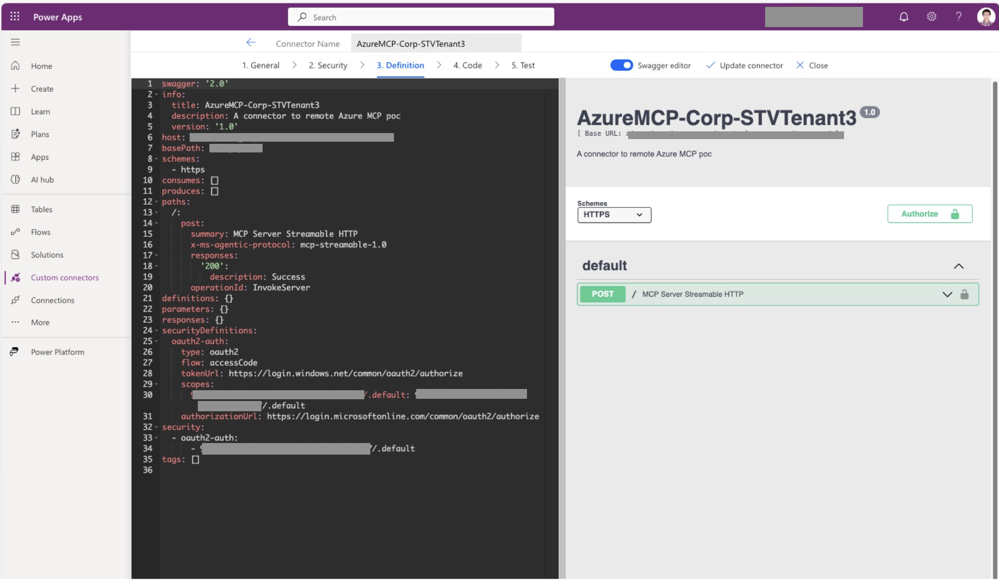
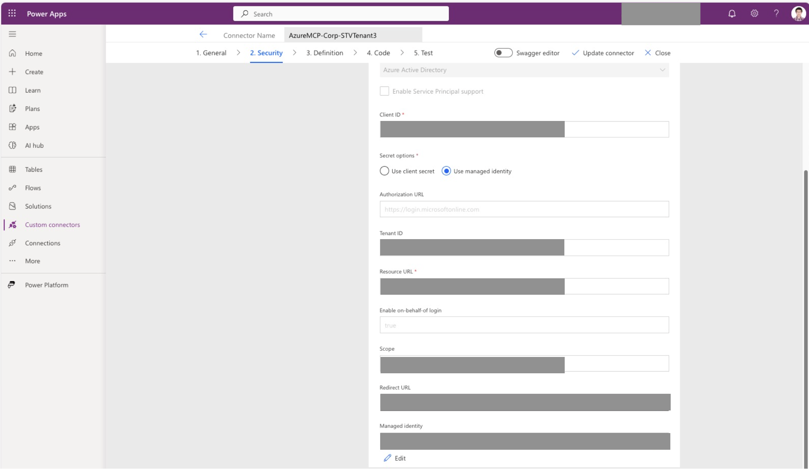
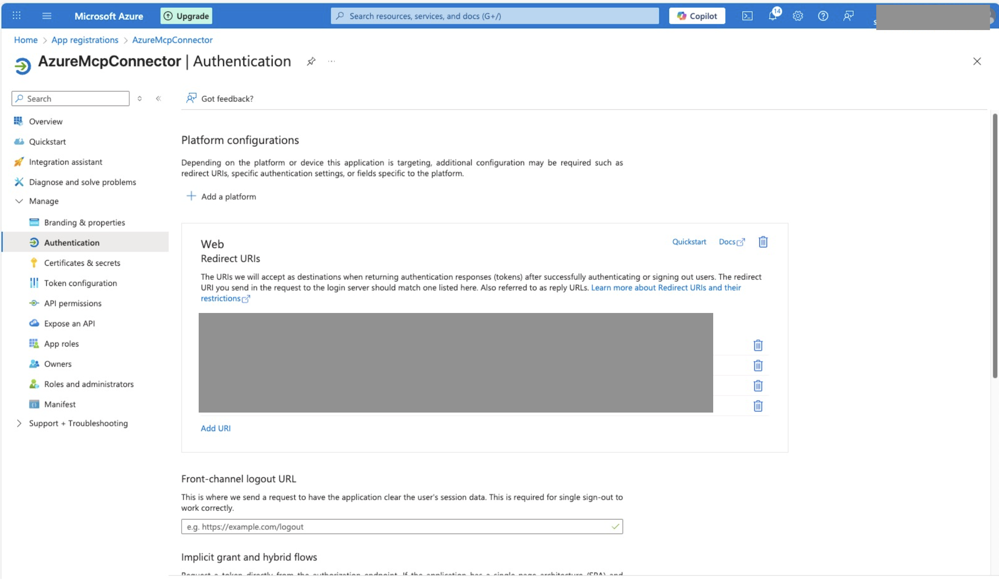
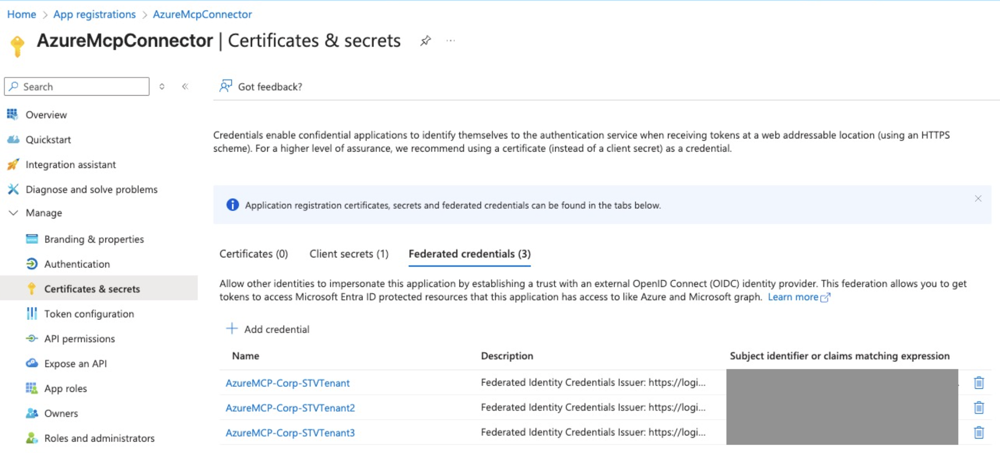
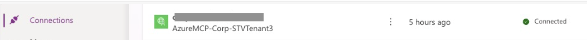
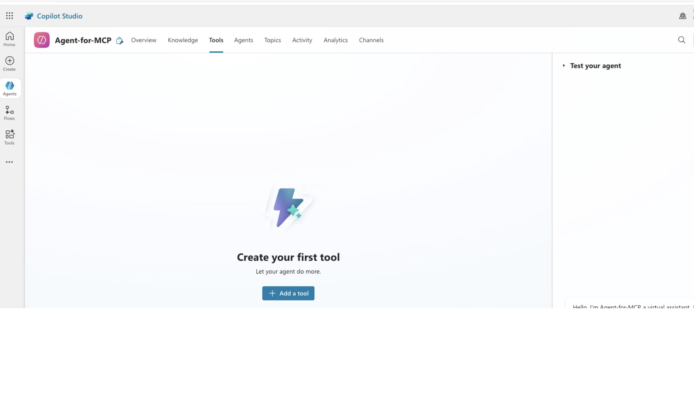
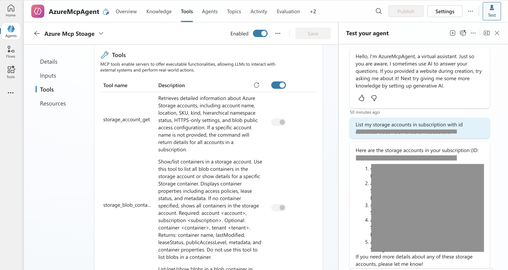

## Deploy a remote Azure MCP Server and connect to it using Copilot Studio

Deploy the [Azure MCP Server](https://mcr.microsoft.com/product/azure-sdk/azure-mcp) as a remote MCP server over HTTPS. This setup lets AI agents in [Azure AI Foundry](https://azure.microsoft.com/products/ai-foundry) and [Microsoft Copilot Studio](https://www.microsoft.com/microsoft-copilot/microsoft-copilot-studio) securely invoke MCP tool calls to perform Azure operations for you.

## Prerequisites

- License to use Power Platform features:
  - Copilot Studio
  - Power Apps
- Azure subscription with **Owner** or **User Access Administrator** permissions.
- [Azure Developer CLI (azd)](/azure/developer/azure-developer-cli/install-azd).
- Identify Azure MCP Server tool areas (namespaces) to enable (see [azmcp-commands.md](https://github.com/microsoft/mcp/blob/main/servers/Azure.Mcp.Server/docs/azmcp-commands.md)). These steps use the `storage` namespace.
- An [Azure Storage account](/azure/storage/common/storage-account-create).
- A [Microsoft Foundry project](/azure/ai-foundry/how-to/create-projects?tabs=ai-foundry).

## Azure MCP Server template

This article uses the [Azure MCP Server - ACA with Copilot Studio agent](https://github.com/Azure-Samples/azmcp-copilot-studio-aca-mi) `azd` template to deploy the server to Azure Container Apps with storage tools enabled and managed identity for secure access to Azure Storage. The Azure Developer CLI (`azd`) is an open source tool that speeds up setting up and deploying app resources on Azure. `azd` offers concise commands that align with key stages in your development workflow.

## Deploy the Azure MCP server

Deploy the Azure MCP server to Azure Container Apps:

1. Clone and initialize the `azmcp-copilot-studio-aca-mi` template using `azd`:

    ```bash
    azd init -t azmcp-copilot-studio-aca-mi
    ```

1. Run the template with the `azd up` command.

    ```bash
    azd up
    ```

    `azd` prompts you for the following:

    - **Storage Account Resource ID** - The Azure resource ID of the storage account the MCP server accesses.
    - **AI Foundry Project Resource ID** - The Azure resource ID of the AI Foundry project used for agent integration.

    `azd` provisions and applies the following resources and configurations:

- **Azure Container App** - Runs Azure MCP server and provides the storage namespace.
- **Microsoft Entra ID role assignments** - Grant the Azure Container App managed identity roles for outbound authentication to the storage account specified by the storage resource ID input:
  - Reader: Read-only access to storage account properties.
  - Storage Blob Data Reader: Read-only access to blob data.
- **Entra app registration** - Provides incoming OAuth 2.0 authentication for clients (for example, agents) with the `Mcp.Tools.ReadWrite.All` role. This role is assigned to the managed identity of the AI Foundry project specified by the AI Foundry resource ID input.
- **Application Insights** - Provides telemetry and monitoring.

### Deployment output

After deployment finishes, retrieve `azd` environment variables with the `azd env get-values` command:

```bash
azd env get-values
```

Example output:

```text
CONTAINER_APP_URL="https://azure-mcp-storage-server.wonderfulazmcp-a9561afd.eastus2.azurecontainerapps.io"
ENTRA_APP_CLIENT_ID="c3248eaf-3bdd-4ca7-9483-4fcf213e4d4d"
ENTRA_APP_IDENTIFIER_URI="api://c3248eaf-3bdd-4ca7-9483-4fcf213e4d4d"
ENTRA_APP_OBJECT_ID="a89055df-ccfc-4aef-a7c6-9561bc4c5386"
ENTRA_APP_ROLE_ID="3e60879b-a1bd-5faf-bb8c-cb55e3bfeeb8"
ENTRA_APP_SERVICE_PRINCIPAL_ID="31b42369-583b-40b7-a535-ad343f75e463"
```

## Calling tools from Copilot Studio Agent

Copilot Studio Agent connect to MCP servers via a custom connector.

### Configure a custom connector

Sign in to [Power Apps](https://make.powerapps.com) and select the environment to host the custom connector. Create a custom connector following the steps in the UI. Select **Create from blank**. To learn more about custom connector configuration, see [create custom connector from scratch](/connectors/custom-connectors/define-blank).

#### General

- Give a descriptive name and description for the custom connector.
- Set `Scheme` to be `HTTPS`.
- Set the `Host` to be the Container App URL from the CONTAINER_APP_URL output value.


#### Swagger editor

Skip the Security step for now and click the `Swagger editor` to enter the swagger editor view. In the swagger editor view

- Set the path such that a POST method is exposed at the root with a custom `x-ms-agentic-protocol: mcp-streamable-1.0` property. This custom property is necessary for the custom connector to interact with this API using the MCP protocol. Refer to [custom connector swagger example](https://github.com/JasonYeMSFT/mcp/blob/0db606283e45c29008e9b7a3777008526caea96e/servers/Azure.Mcp.Server/azd-templates/aca-copilot-studio-managed-identity/custom-connector-swagger-example.yaml) as an example.



#### Security

Go to the Security step.

- Select **OAuth 2.0** as the authentication type.
- Select **Azure Active Directory** as the identity provider.
- Set **Client ID** to the client app registration client ID (from `ENTRA_APP_CLIENT_CLIENT_ID`).
- Choose **Use client secret** or **Use managed identity** as the secret option.
  - If you choose a client secret, go to Azure portal and create a client secret under the client app registration. Copy the secret value and paste it into the client secret field.
  - If you choose managed identity, proceed with the remaining steps until the custom connector is created.
- Keep **Authorization URL** as `https://login.microsoftonline.com`.
- Set **Tenant ID** to the tenant ID of the client app registration (from `AZURE_TENANT_ID`).
- Set **Resource URL** to the server app registration client ID (from `ENTRA_APP_SERVER_CLIENT_ID`).
- Enable **On-behalf-of login**.
- Set **Scope** to `<server app registration client ID>/.default`.



#### Create the connector

- Select **Create connector** and wait for it to complete. After the custom connector is created, it outputs a redirect URL and optionally a managed identity if you chose managed identity.
- In Azure portal, add a redirect URI under the Web platform in the client app registration.
- If you chose managed identity, create a federated credential in the client app registration. Select **Other issuer** as the federated credential scenario. Copy the `issuer` and `subject` values from the custom connector into the credential creation fields. Provide a descriptive name and description, then select **Add**.




#### Test connection

- Open the created custom connector, select **Edit**, and go to the **Test** step.
- Select any operation and choose **New connection**.
- Sign in with the user account you plan to use to access the MCP tools. You might see a dialog requesting consent or an admin approval prompt. If you are unsure, see [Known issues](#known-issues).

If everything works fine, after signing into the user account, the UI should indicate a connection is created successfully. If you encounter any error message during the sign-in, please refer to the [known issues](#known-issues) section, troubleshoot with your tenant admin or let us know.



### Call Azure MCP tool in Copilot Studio test playground

- Sign in to [Copilot Studio](https://copilotstudio.microsoft.com) and select the environment to host the Copilot Studio Agent. Create a new agent or use an existing one.
- Open the agent details and select the **Tools** tab.
- Select **Add a tool**.
- Search for your custom connector name and add it.
- After you add the custom connector, the Copilot Studio Agent attempts to list the tools from the MCP server. If successful, you see the available tool list under the connector.
- Select **Test** to start a test playground session.
- Prompt the agent to call the MCP tools (for example, ask it to list storage accounts in the subscription).




## Clean up resources

If you no longer need the Azure resources created by this template, run this command to delete them.

```bash
azd down
```

If you need to clean up the Power Platform resources, use the Power Platform UI to delete the Copilot Studio Agent, Power Apps custom connector and connection.

## Template Structure

The `azd` template consists of the following Bicep modules:

- **`main.bicep`** - Orchestrates the deployment of all resources.
- **`aca-storage-managed-identity.bicep`** - Creates a user-assigned managed identity.
- **`aca-storage-subscription-role.bicep`** - Assigns an Azure RBAC role to the user-assigned managed identity (defaults to Subscription Reader).
- **`aca-infrastructure.bicep`** - Deploys Container App hosting the Azure MCP Server.
- **`entra-app.bicep`** - Creates Entra App registrations.
- **`application-insights.bicep`** - Deploys Application Insights for telemetry and monitoring (conditional deployment).

## Known issues

- Power Apps custom connector doesn't support authenticating users from multiple tenants. As a result, the client app registration must be configured to only accept users from its tenant.
- As a part of the authentication flow, the user/tenant admin needs to give explicit consent to grant the client app access to their data. To learn more about the consent experience, refer to [application consent experience](https://learn.microsoft.com/entra/identity-platform/application-consent-experience). There are multiple ways to give consent to the client app.
  - A user may give consent in the sign-in process just for this user. This may be prohibited by tenant security policy.
  - A tenant admin may give consent for all users in the tenant in the client app registration under the `API permissions` blade in Azure Portal.
  - The server app registration can add the client app registration as an pre-authorized client app under the `Expose an API` blade in Azure Portal.
- If the client app registration and server app registration are in different tenants, you may see the following error when trying to create the connection.
  - "The app is trying to access a service 'server_app_registration_client_id'(server_app_registration_display_name) that your organization 'client_app_registration_tenant' lacks a service principal for". In this case, a tenant admin of the client app registration must provision a service principal for the server app registration in that tenant. This can be done via an Azure CLI command `az ad sp create --id <server_app_registration_client_id>`. After the service principal is provisioned, trying to create the connection again should trigger the consent flow.
- If the Power Apps environment has tenant isolation policy, it will block the data flow if the client app registration or the server app registration are in different tenants. To learn more about how to add exception rules to allow these data flow, refer to [cross tenant restrictions](https://learn.microsoft.com/power-platform/admin/cross-tenant-restrictions).