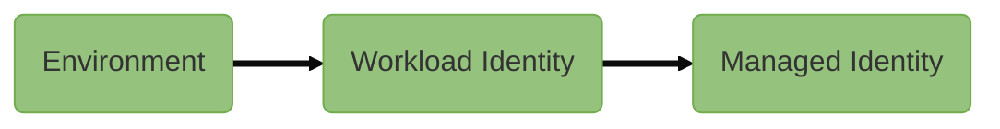

```mermaid
%% STEPS TO GENERATE IMAGE
%% =======================
%% 1. Install mermaid CLI v10.9.1 (see https://github.com/mermaid-js/mermaid-cli/blob/master/README.md):
%%    npm i -g @mermaid-js/mermaid-cli@10.9.1
%% 2. Run command: mmdc -i default-azure-credential-environment-variable-production.md -o ../../media/mermaidjs/default-azure-credential-environment-variable-production.svg
%%{
  init: {
    'theme': 'base',
    'themeVariables': {
      'tertiaryBorderColor': '#fff',
      'tertiaryColor': '#fff'
    }
  }
}%%
flowchart LR;
    A(Environment):::deployed ==> B(Workload Identity):::deployed ==> D(Managed Identity):::deployed;
    %% Define styles for credential type boxes
    classDef deployed fill:#95C37E, stroke:#71AD4C;
```
