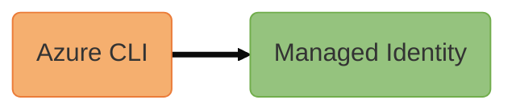

```mermaid
%% STEPS TO GENERATE IMAGE
%% =======================
%% 1. Install mermaid CLI v10.9.1 (see https://github.com/mermaid-js/mermaid-cli/blob/master/README.md):
%%    npm i -g @mermaid-js/mermaid-cli@10.9.1
%% 2. Run command: mmdc -i chained-token-credential-auth-flow.md -o chained-token-credential-auth-flow.svg

%%{
  init: {
    'theme': 'base',
    'themeVariables': {
      'tertiaryBorderColor': '#fff',
      'tertiaryColor': '#fff'
    }
  }
}%%

flowchart LR;
    direction LR;
    A(Azure CLI):::developer ==> B(Managed Identity):::deployed;

    %% Define styles for credential type boxes
    classDef deployed fill:#95C37E, stroke:#71AD4C;
    classDef developer fill:#F5AF6F, stroke:#EB7C39;
```
