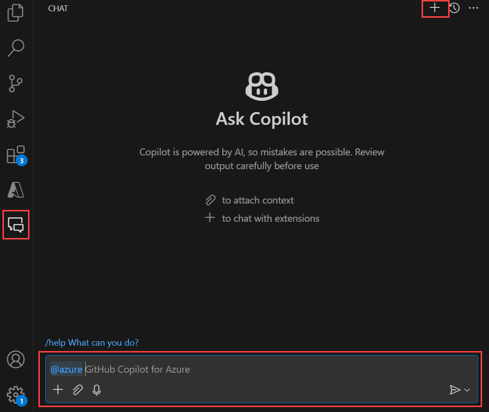

# Quickstart: Build and deploy your application with GitHub Copilot for Azure

In this quick start you will use GitHub Copilot for Azure to help you create and deploy a new web site into Azure. This will demonstrate one way to integrate GitHub Copilot for Azure into your development and deployment workflow.

## Pre-requisites

See the [Get started](get-started.md) article for complete setup instructions.

You will need:

- A GitHub Copilot account
- The GitHub Copilot extension for Visual Studio Code
- The GitHub Copilot for Azure extension for Visual Studio Code
- An Azure subscription (if you don't have one, GitHub Copilot for Azure can help)

## Create and deploy a website using GitHub Copilot for Azure

1. Create a new folder on your local computer where you can `git clone`.

2. Open Visual Studio Code. Open the Terminal window. Navigate to the new folder. 

3. Open the Chat window by selecting the Chat icon in Visual Studio Code's activity bar. This opens the Chat window.

4. Start a new chat session by select the plus icon + in the window's title bar to create a New Chat.



5. In the chat text box, enter the following prompt after `@azure` and select the Send icon or select Enter on your keyboard.

```prompt
Could you help me create and deploy a simple Flask website using Python?
```

After a moment, GitHub Copilot for Azure will likely suggest an azd template to use. The exact wording you see in your response will likely be different each time someone asks this prompt due to how Large Language Models generate responses.

You might see a response like:


6. If your answer provides you with a command that begins with `azd init` in a code fence, hover your mouse cursor over the code fence to reveal a small action popup on the right hand side.


Select `Insert into Terminal`. The command will be inserted into the Terminal.


7. Before executing the `azd init` command, you may have questions about what this will do to your local computer and to your Azure subscription.

Use the following prompt:

```prompt
Before I execute azd init, what does it do?
```
You may see a response that resembles the following screenshot.


8. Use the following prompt to learn more about the azd template:

```prompt
What resources are created with this template?
```
You may see a response that resembles the following screenshot.


9. Ask questions about the services that will be used with a prompt like:

```prompt
What is the purpose of a VNet?
```
You may see a response that resembles the following screenshot.


10. When you're satisfied, execute the `azd init` command in the Terminal. Answer its prompts. If you are unsure what to answer for a given prompt, ask GitHub Copilot for Azure for help.


11. Once the new project has been initialized, you can use `azd up` to deploy the application to your subscription. In the Terminal prompt execute per the instructions in the original prompt's reply:

```cmd
azd up
```

12. `azd up` asks for information about your subscription, where to deploy the resources, and more. If you are not sure how to answer, you can ask GitHub Copilot for Azure how to  For example, you might ask:

```prompt
azd up is asking me what location I want to deploy the website into. How should I respond?
```

You may see a response that resembles the following screenshot.


13. Continue to answer prompts from `azd up` asking GitHub Copilot for Azure questions as needed.

Depending on the azd template you are deploying and where you're doing it to, it might take 20 minutes or more to deploy. 

14. If `azd up` experiences errors, ask GitHub Copilot for Azure about the error and how you can resolve it.

15. Upon a successful deployment, you should be able to navitate a web browser to the new website, use the Azure portal to view the resources that were created.

### Cleaning up resources

16. You can ask GitHub Copilot for Azure how to remove all of the resources you created in the previous steps.

```prompt
How do I undeploy this web site?
```

You may see a response that resembles the following screenshot.


Use `azd down` to remove the website and all resources that were deployed to your Azure subscription.

## Next steps

- [Understand what is GitHub Copilot for Azure and how it works](introduction.md).
- [Get started](get-started.md) with GitHub Copilot for Azure by ensuring you have satisfied the pre-requisites, installed the software and write your first prompt.
- See example prompts for [learning more about Azure and understanding your Azure account, subscription and resources](learn-examples.md).
- See example prompts for [deploying your application to Azure](deploy-examples.md).
- See example prompts for [optimizing your applications in Azure](optimize-examples.md).
- See example prompts for [troubleshooting your Azure resources](troubleshoot-examples.md).

