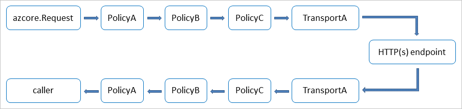

# Common usage patterns in Azure SDK for Go

The Azure Core (`azcore`) package in Azure SDK for Go implements several patterns that are applied throughout the SDK:

- The [HTTP pipeline flow](#http-pipeline-flow), which is the underlying HTTP mechanism used by the SDK's client libraries.
- [Pagination (methods that return collections)](#pagination-methods-that-return-collections).
- [Long-running operations (LROs)](#long-running-operations).

## Pagination (methods that return collections)

Many Azure services return collections of items. Because the number of items can be large, these client methods return a *Pager*, which allows your app to process one page of results at a time. These types are individually defined for various contexts but share common characteristics, like a `NextPage` method.

For example, suppose there's a `ListWidgets` method that returns a `WidgetPager`. You'd then use the `WidgetPager` as shown here:

```go
func (c *WidgetClient) ListWidgets(options *ListWidgetOptions) WidgetPager {
    // ...
}

pager := client.ListWidgets(options)

for pager.NextPage(ctx) {
    for _, w := range pager.PageResponse().Widgets {
        process(w)
    }
}

if pager.Err() != nil {
    // Handle error...
}
```

## Long-running operations

Some operations on Azure can take a long time to complete, anywhere from a few seconds to a few days. Examples of such operations include copying data from a source URL to a storage blob or training an AI model to recognize forms. These *long-running operations (LROs)* poorly suited to the standard HTTP flow of a relatively quick request and response.

By convention, methods that start an LRO are prefixed with "Begin" and return a *Poller*. The Poller is used to periodically poll the service until the operation finishes.

The following examples illustrate various patterns for handling LROs. You can also learn more from the [poller.go](https://github.com/Azure/azure-sdk-for-go/blob/main/sdk/azcore/internal/pollers/poller.go) source code in the SDK.

### Blocking call to PollUntilDone

`PollUntilDone` handles the entire span of a polling operation until a terminal state is reached. It then returns the final HTTP response for the polling operation with the content of the payload in the `respType` interface.

```go
resp, err := client.BeginCreate(context.Background(), "blue_widget", nil)

if err != nil {
    // Handle error...
}

w, err = resp.PollUntilDone(context.Background(), nil)

if err != nil {
    // Handle error...
}

process(w)
```

#### Customized poll loop

`Poll` sends a polling request to the polling endpoint and returns the response or an error.

```go
resp, err := client.BeginCreate(context.Background(), "green_widget")

if err != nil {
    // Handle error...
}

poller := resp.Poller

for {
    resp, err := poller.Poll(context.Background())

    if err != nil {
        // Handle error...
    }

    if poller.Done() {
        break
    }

    // Do other work while waiting.
}

w, err := poller.FinalResponse(ctx)

if err != nil {
    // Handle error...
}

process(w)
```

### Resume from a previous operation

Extract and save the resume token from an existing Poller.

To resume polling, maybe in another process or on another computer, create a new `PollerResponse` instance and then initialize it by calling its `Resume` method, passing it the previously saved resume token.

```go
poller := resp.Poller
tk, err := poller.ResumeToken()

if err != nil {
    // Handle error...
}

resp = WidgetPollerResponse()

// Resume takes the resume token as an argument.
err := resp.Resume(tk, ...)

if err != nil {
    // Handle error...
}

for {
    resp, err := poller.Poll(context.Background())

    if err != nil {
        // Handle error...
    }

    if poller.Done() {
        break
    }

    // Do other work while waiting.
}

w, err := poller.FinalResponse(ctx)

if err != nil {
    // Handle error...
}

process(w)
```

## HTTP pipeline flow

The various SDK clients provide an abstraction over an Azure's REST API to enable code completion and compile-time type safety so you don't have to deal with lower-level transport mechanics over HTTP. However, you can *customize* the transport mechanics (like retries and logging).

The SDK makes HTTP requests through an HTTP *pipeline*. The pipeline describes the sequence of steps performed for each HTTP request-response round trip.

The pipeline is composed of a transport together with any number of policies:

- The *transport* sends the request to the service and receives the response.
- Each *policy* completes a specific action in the pipeline.

The following diagram illustrates the flow of a pipeline:



All client packages share a *Core* package named `azcore`. This package constructs the HTTP pipeline with its ordered set of policies, ensuring that all client packages behave consistently.

When an HTTP request is sent, all policies run in the order in which they were added to the pipeline before the request is sent to the HTTP endpoint. These policies typically add request headers or log the outgoing HTTP request.

After the Azure service responds, all policies run in the reverse order before the response returns to your code. Most policies ignore the response, but the logging policy records the response. The retry policy might reissue the request, making your app more resilient to network failures.

Each policy is provided with the needed request or response data, together with any necessary context for running the policy. The policy completes its operation with the given data and then passes control to the next policy in the pipeline.

By default, each client package creates a pipeline configured to work with that specific Azure service. You can also define your own [custom policies](#custom-http-pipeline-policies) and insert them into the HTTP pipeline when you create a client.

### Core HTTP pipeline policies

The Core package provides three HTTP policies that are part of every pipeline:

- [Retry Policy](https://github.com/Azure/azure-sdk-for-go/tree/main/sdk/azcore/runtime/policy_retry.go)
- [Logging Policy](https://github.com/Azure/azure-sdk-for-go/tree/main/sdk/azcore/runtime/policy_logging.go)
- [Telemetry Policy](https://github.com/Azure/azure-sdk-for-go/tree/main/sdk/azcore/runtime/policy_telemetry.go)

### Custom HTTP pipeline policies

You can define your own custom policy to add capabilities beyond the contents of the Core package. For example, to see how your app deals with network or service failures, you could create a policy that injects fault when requests are made during testing. Or you could create a policy that mocks a service's behavior for testing.

To create a custom HTTP policy, define your own structure with a `Do` method that implements the [`Policy`](https://github.com/Azure/azure-sdk-for-go/blob/main/sdk/azcore/policy/policy.go#L20) interface: 

1. Your policy's `Do` method should perform operations as needed on the incoming [`policy.Request`](https://github.com/Azure/azure-sdk-for-go/blob/main/sdk/azcore/policy/policy.go#L27). Examples of operations include logging, injecting a failure, or modifying any of the request's URL, query parameters, or request headers.
1. The `Do` method forwards the (modified) request to the next policy in the pipeline by calling the request's `Next` method.
1. `Next` returns the `http.Response` and an error. Your policy can perform any necessary operation, like logging the response/error.
1. Your policy must return a response and error back to the previous policy in the pipeline.

> [!NOTE]
> Policies must be goroutine-safe. Goroutine safety allows multiple goroutines to access a single client object concurrently. It's common for a policy to be immutable after creation. This immutability ensures the goroutine is safe.


#### Custom policy template

The following code can be used as a starting point to define a custom policy.

```go
type MyPolicy struct {
    LogPrefix string
}

func (m *MyPolicy) Do(req *policy.Request) (*http.Response, error) {
	// Mutate/process request.
	start := time.Now()
	// Forward the request to the next policy in the pipeline.
	res, err := req.Next()
	// Mutate/process response.
	// Return the response & error back to the previous policy in the pipeline.
	record := struct {
		Policy   string
		URL      string
		Duration time.Duration
	}{
		Policy:   "MyPolicy",
		URL:      req.Raw().URL.RequestURI(),
		Duration: time.Duration(time.Since(start).Milliseconds()),
	}
	b, _ := json.Marshal(record)
	log.Printf("%s %s\n", m.LogPrefix, b)
	return res, err
}

func ListResourcesWithPolicy(subscriptionID string) error {
	cred, err := azidentity.NewDefaultAzureCredential(nil)
	if err != nil {
		return err
	}

	mp := &MyPolicy{
		LogPrefix: "[MyPolicy]",
	}
	options := &arm.ConnectionOptions{}
	options.PerCallPolicies = []policy.Policy{mp}
	options.Retry = policy.RetryOptions{
		RetryDelay: 20 * time.Millisecond,
	}

	con := arm.NewDefaultConnection(cred, options)
	if err != nil {
		return err
	}

	client := armresources.NewResourcesClient(con, subscriptionID)
	pager := client.List(nil)
	for pager.NextPage(context.Background()) {
		if err := pager.Err(); err != nil {
			log.Fatalf("failed to advance page: %v", err)
		}
		for _, r := range pager.PageResponse().ResourceListResult.Value {
			printJSON(r)
		}
	}
	return nil
}
```

### Custom HTTP transport

A transport sends an HTTP request and returns its response/error. The first policy to handle the request is also the last policy that handles the response before returning the response/error back to the pipeline's policies (in reverse order). The last policy in the pipeline invokes the transport.

By default, clients use the shared `http.Client` from Go's standard library.

You create a custom stateful or stateless transport in the same way that you create a custom policy. In the stateful case, you implement the `Do` method inherited from the [Transporter](https://github.com/Azure/azure-sdk-for-go/blob/main/sdk/azcore/policy/policy.go#L23) interface. In both cases, your function or `Do` method again receives an `azcore.Request`, returns an `azCore.Response`, and performs actions in the same order as a policy.

### How to delete a JSON field when you invoke an Azure operation

Operations like `JSON-MERGE-PATCH` send a JSON `null` to indicate a field should be deleted (along with its value):

```json
{
    "delete-me": null
}
```

This behavior conflicts with the SDK's default marshaling that specifies `omitempty` as a way to resolve the ambiguity between a field to be excluded and its zero-value.

```go
type Widget struct {
    Name *string `json:",omitempty"`
    Count *int `json:",omitempty"`
}
```

In the preceding example, `Name` and `Count` are defined as pointer-to-type to disambiguate between a missing value (`nil`) and a zero-value (0), which might have semantic differences.

In an HTTP PATCH operation, any fields with the value `nil` don't affect the value in the server's resource. When updating a Widget's `Count` field, specify the new value for `Count`, leaving `Name` as `nil`.

To fulfill the requirement for sending a JSON `null`, the `NullValue` function is used:

```go
w := Widget{
    Count: azcore.NullValue(0).(*int),
}
```

This code sets `Count` to an explicit JSON `null`. When the request is sent to the server, the resource's `Count` field is deleted.

## See also

- [Azure SDK for Go reference documentation](https://pkg.go.dev/github.com/Azure/azure-sdk-for-go)
- [Azure SDK for Go source code (GitHub)](https://github.com/Azure/azure-sdk-for-go/tree/main/sdk/azcore)
