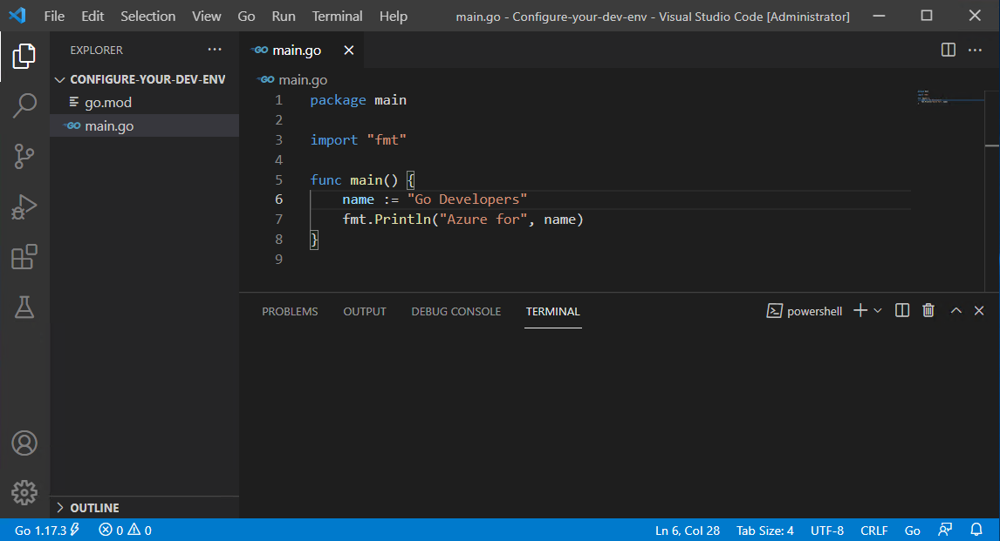
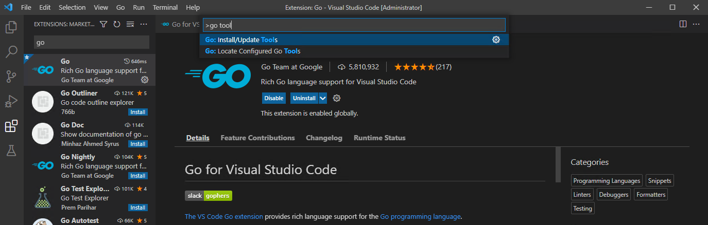
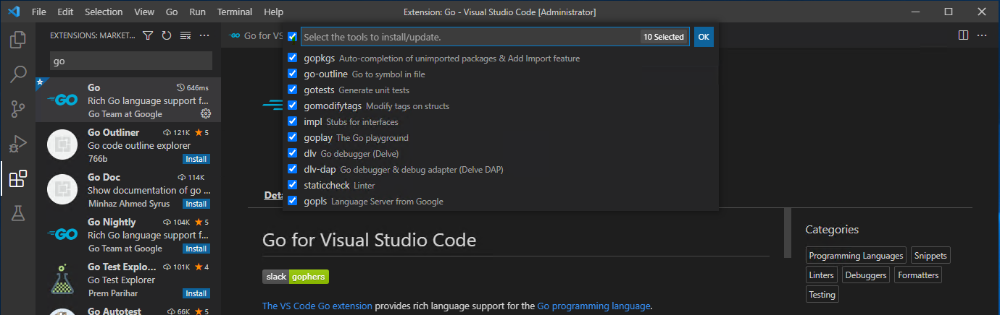
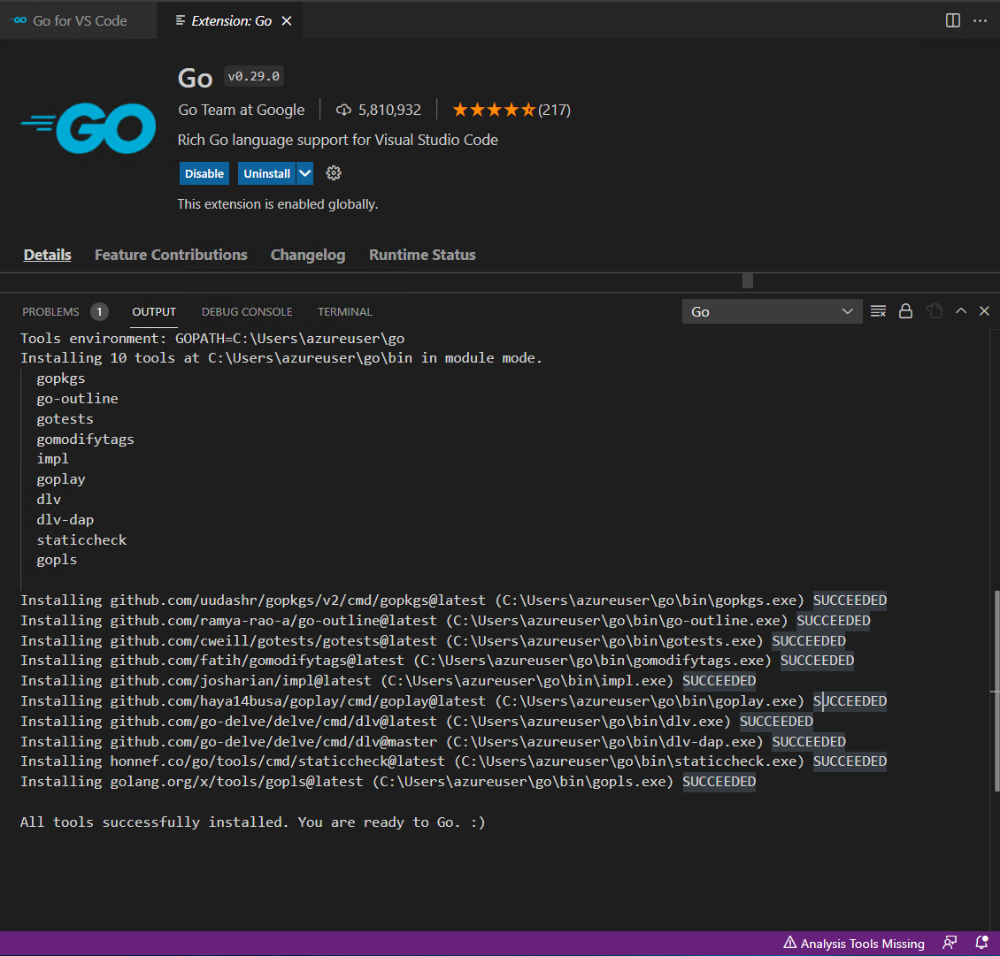

# Configure Visual Studio Code for Azure Development with Go

In this quickstart, you'll install and configure the [Go for Visual Studio Code](https://marketplace.visualstudio.com/items?itemName=golang.Go) extension.

In the [Go Developer Survey 2020 Results](https://go.dev/blog/survey2020-results), 41% of respondence chose Visual Studio Code as their most preferred editor for Go. Making Visual Studio Code the most popular editor for Go developers.

Visual Studio Code and the Go extension provide IntelliSense, code-navigation, and advanced debugging. In this quickstart, you'll configure Visual Studio Code then write, run, and debug and a sample Go program.



## 1. Download and Install Visual Studio Code

In a web browser:

1. Go to [code.visualstudio.com](https://code.visualstudio.com/)
1. Download the version for your operating system, supports Windows, Linux, and macOS.
1. Once downloaded, run the installer. This will only take a minute.

## 2. Install the Go extension

In Visual Studio Code:

| Instructions    | Screenshot |
|:----------------|-----------:|
| Bring up the Extensions view by clicking on the Extensions icon in the Activity Bar. Or use keyboard shortcut (Ctrl+Shift+X). | :::image type="content" source="./media/configure-vscode-for-go-development/search-extensions-240px.png" alt-text="A screenshot showing how search for the Go extension." lightbox="./media/configure-vscode-for-go-development/search-extensions.png"::: |
| Search for the Go extension, then click install. | :::image type="content" source="./media/configure-vscode-for-go-development/ install-go-extension-240px.png" alt-text="A screenshot showing how to use the search box in the top tool bar to find App Services in Azure." lightbox="./media/configure-vscode-for-go-development/install-go-extension.png"::: |

## 3. Update the Go tools

In Visual Studio Code:

1. Open the command pallet by going to *Help* > *Show All Commands*. Or use the keyboard shortcut (Ctrl+Shift+P).
1. Type `go tools` into the command pallet dialog box.
1. Select *Go: Install/Update Tools* to update all the Go tools.
    1.   
1. Select all tools, then click OK.
    1. 
1. Wait for the tools to update.
    1. 

## 4. Write a sample Go program

In Visual Studio code:

1. Open the root directory for your sample Go program by going to *File* > *Open Folder*.
1. From the integrated terminal type `go mod init sample-app`.
1. Next, create a new file named `main.go`.
1. Copy the following code into the `main.go` file.

    ```go
    package main

    import "fmt"

    func main() {
        name := "Go Developers"
        fmt.Println("Azure for", name)
    }
    ```

## 5. Run your Go program with the debugger

In Visual Studio code:

1. Create a break point on line 7 by left clicking to the left of the numbered line. Or place your cursor on line 7 and hit F9.
1. Bring up the Debug view by clicking on the debug icon in the Activity Bar on the side of Visual Studio Code. Or use keyboard shortcut (Ctrl+Shift+D).
1. Click *Run and Debug*, or hit F5 to run the debugger.
1. Hover over the variable `name` on line 7 to see its value.

<!-- make a table -->

## Next steps

> [!div class="nextstepaction"]
> [Key Azure Services for Go Developers](key-azure-services-for-go.md)
> [!div class="nextstepaction"]
> [Authenticate with the Azure SDK for Go](azure-sdk-authentication.md)
