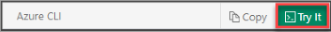

## Launch Azure Cloud Shell

The Azure Cloud Shell is an interactive shell that runs on Azure. It has common tools pre-installed and configured to use with your account. Select **Copy** to copy the code, paste it to the Cloud Shell, and then press Enter to run it.  

There are a few ways to launch the Cloud Shell:

:::row:::
   :::column span="":::
      Select **Try It** in the upper right corner of a code block.
   :::column-end:::
   :::column span="":::
      
   :::column-end:::
:::row-end:::
:::row:::
   :::column span="":::
      Open Cloud Shell in your browser. 
   :::column-end:::
   :::column span="":::
      
   :::column-end:::
:::row-end:::
:::row:::
   :::column span="":::
      Select the **Cloud Shell** button on the menu in the upper right of the [Azure portal](https://portal.azure.com).
   :::column-end:::
   :::column span="":::
      
   :::column-end:::
:::row-end:::
