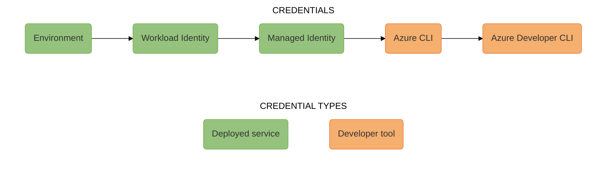

```mermaid
%% STEPS TO GENERATE IMAGE
%% =======================
%% 1. Install mermaid CLI v11.4.2 (see https://github.com/mermaid-js/mermaid-cli/blob/master/README.md):
%%    npm i -g @mermaid-js/mermaid-cli@11.4.2
%% 2. Run commands:
%%    mmdc -i default-azure-credential-auth-flow.md -o ../../media/mermaidjs/default-azure-credential-auth-flow-inline.svg
%%    mmdc -i default-azure-credential-auth-flow.md -o ../../media/mermaidjs/default-azure-credential-auth-flow-expanded.png -w 1156

%%{
  init: {
    'theme': 'base',
    'themeVariables': {
      'tertiaryBorderColor': '#ffffff',
      'tertiaryColor': '#ffffff'

    }
  }
}%%

flowchart LR;
    subgraph CREDENTIAL TYPES;
        direction LR;
        Deployed(Deployed service):::deployed ~~~ Developer(Developer tool):::developer;
    end;

    subgraph CREDENTIALS;
        direction LR
        A(Environment):::deployed --> B(Workload Identity):::deployed --> C(Managed Identity):::deployed --> D(Azure CLI):::developer --> E(Azure Developer CLI):::developer;
    end;

    %% Define styles for credential type boxes
    classDef deployed fill:#95C37E, stroke:#71AD4C;
    classDef developer fill:#F5AF6F, stroke:#EB7C39;

    %% Add API ref links to credential type boxes
    click A "https://pkg.go.dev/github.com/Azure/azure-sdk-for-go/sdk/azidentity#EnvironmentCredential" _blank;
    click B "https://pkg.go.dev/github.com/Azure/azure-sdk-for-go/sdk/azidentity#WorkloadIdentityCredential" _blank;
    click C "https://pkg.go.dev/github.com/Azure/azure-sdk-for-go/sdk/azidentity#ManagedIdentityCredential" _blank;
    click D "https://pkg.go.dev/github.com/Azure/azure-sdk-for-go/sdk/azidentity#AzureCLICredential" _blank;
    click E "https://pkg.go.dev/github.com/Azure/azure-sdk-for-go/sdk/azidentity#AzureDeveloperCLICredential" _blank;
```
