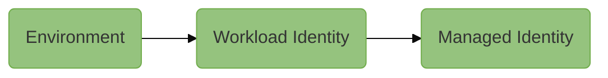

```mermaid
%% STEPS TO GENERATE IMAGE
%% =======================
%% 1. Install mermaid CLI v10.9.1 (see https://github.com/mermaid-js/mermaid-cli/blob/master/README.md):
%%    npm i -g @mermaid-js/mermaid-cli@10.9.1
%% 2. Run commands:
%%    mmdc -i default-azure-credential-env-var-prod.md -o ../../media/mermaidjs/default-azure-credential-env-var-prod.svg

%%{
  init: {
    'theme': 'base',
    'themeVariables': {
      'tertiaryBorderColor': '#ffffff',
      'tertiaryColor': '#ffffff'

    }
  }
}%%

flowchart LR;
    A(Environment):::deployed --> B(Workload Identity):::deployed --> C(Managed Identity):::deployed;

    %% Define styles for credential type boxes
    classDef deployed fill:#95C37E, stroke:#71AD4C;
```
