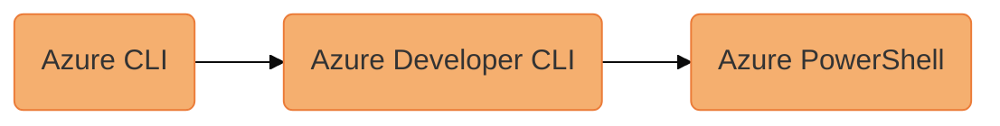

```mermaid
%% STEPS TO GENERATE IMAGE
%% =======================
%% 1. Install mermaid CLI v10.9.1 (see https://github.com/mermaid-js/mermaid-cli/blob/master/README.md):
%%    npm i -g @mermaid-js/mermaid-cli@10.9.1
%% 2. Run command:
%%    mmdc -i default-azure-credential-environment-variable-development.md -o ../media/mermaidjs/default-azure-credential-environment-variable-development.svg

%%{
  init: {
    'theme': 'base',
    'themeVariables': {
      'tertiaryBorderColor': '#ffffff',
      'tertiaryColor': '#ffffff'
    }
  }
}%%

flowchart LR;
    D(Azure CLI):::developer --> E(Azure Developer CLI):::developer --> F(Azure PowerShell):::developer;

    %% Define styles for credential type boxes
    classDef developer fill:#F5AF6F, stroke:#EB7C39;
```
