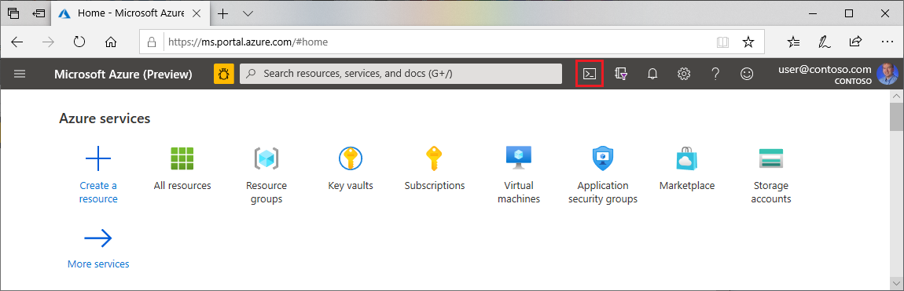

## Open Cloud Shell

1. Browse to the [Azure portal](https://portal.azure.com).

1. If you aren't already logged in, the Azure portal displays a list of available Microsoft accounts. Select a Microsoft account associated with one or more active Azure subscriptions and enter your credentials to continue.

1. Open Cloud Shell.

    

2. If you haven't previously used Cloud Shell, configure the environment and storage settings. This article uses the Bash environment.