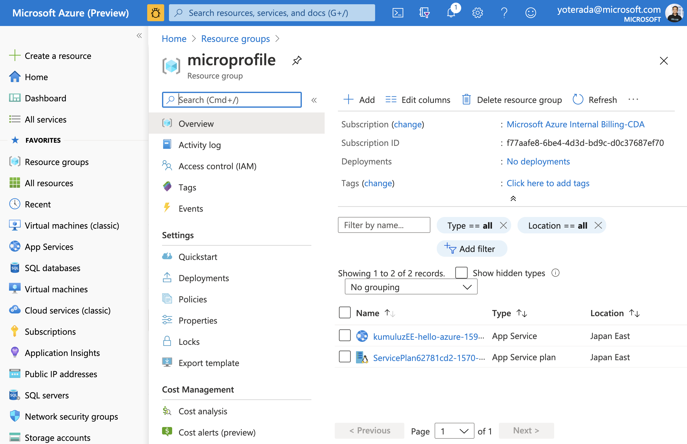
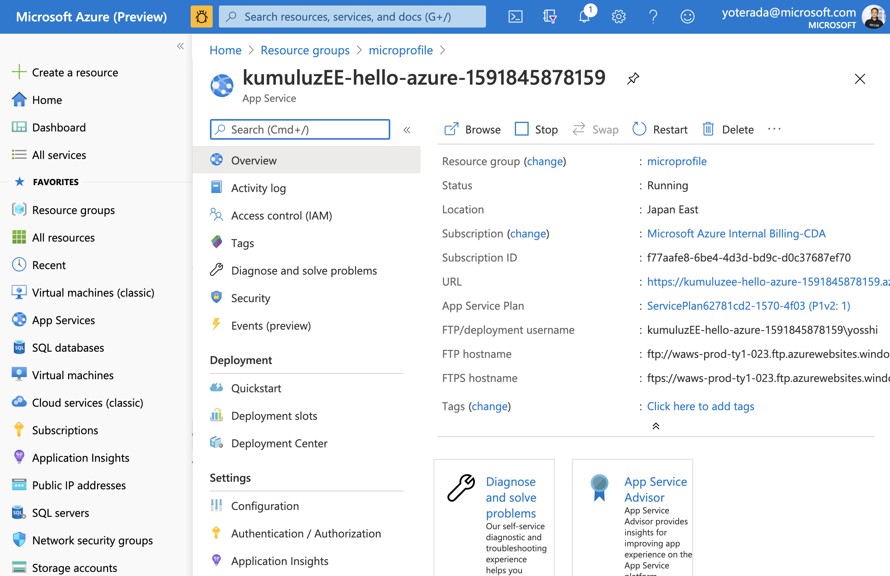

# Deploy a KumuluzEE Web App to Azure App Service with Maven

In this quickstart, you'll use the [Maven Plugin for Azure App Service Web Apps](/java/api/overview/azure/maven/azure-webapp-maven-plugin/readme) to deploy a KumuluzEE application to [Azure App Service on Linux](/azure/app-service/containers/). You'll want to choose Java SE deployment over [Tomcat and WAR files](/azure/app-service/containers/quickstart-java) when you want to consolidate your app's dependencies, runtime, and configuration into a single deployable artifact.

If you don’t have an Azure subscription, create a [free account](https://azure.microsoft.com/free/?WT.mc_id=A261C142F) before you begin.

## Prerequisites

To complete the steps in this tutorial, you'll need to have the following installed and configured:

* The [Azure CLI](/cli/azure/), either locally or through [Azure Cloud Shell](https://shell.azure.com).
* A supported Java Development Kit (JDK). For more information about the JDKs available for use when developing on Azure, see <https://aka.ms/azure-jdks>.
* Apache's [Maven](https://maven.apache.org/), Version 3).

## Install and sign in to Azure CLI

The simplest and easiest way to get the Maven Plugin deploying your KumuluzEE application is by using [Azure CLI](/cli/azure/).

Sign into your Azure account by using the Azure CLI:
   
   ```shell
   az login
   ```
   
Follow the instructions to complete the sign-in process.

## Create sample app from MicroProfile Starter

In this section, you will create a KumuluzEE application and test it locally.

### Create Java SE 8 base Project

1. Open Web Browser and acccess to the [MicroProfile Starter](https://start.microprofile.io/) site.


1. Input or Select the field like follows.  

	|  Input Field  |  Input/Select Value  |
	| ---- | ---- |
	|  groupId  |  com.microsoft.azure.samples.kumuluzee  |
	|  artifactId  |  kumuluzEE-hello-azure  |
	|  MicroProfile Version  |  MP 3.2  |
	|  Java SE Version  |  Javav 8  |
	|  MicroProfile Runtime  |  KumuluzEE  |
	|  Examples for Specifications  |  Metrics, OpenAPI  |

1. Download the project  
Push the `DOWNLOAD` button.

1. Unzip the archive file; for exaple:

   ```shell
   unzip kumuluzEE-hello-azure.zip
   ```

### Run the application in Local environment

1. Change directory to the completed project; for example:
   ```shell
   cd kumuluzEE-hello-azure/
   ```

1. Build the project using Maven; for example:

   ```shell
   mvn clean package
   ```

1. Run the Application using following command:

   ```shell
   java -jar target/kumuluzEE-hello-azure.jar
   ```


1. Test the web app by browsing to it locally using a web browser. For example, you could use the following command if you have curl available:

   ```shell
   curl http://localhost:8080/data/hello
   ```


1. You should see the following message displayed: **Hello World**.

## Configure Maven Plugin for Azure App Service

In this section, you will configure the KumuluzEE project `pom.xml` so that Maven can deploy the app to Azure App Service on Linux.

1. Open `pom.xml` in a code editor.

2. In the `<build>` section of the pom.xml, add the following `<plugin>` entry inside the `<plugins>` tag.

	```xml
	<build>
	  <finalName>kumuluzEE-hello-azure</finalName>
	  <plugins>
	    <plugin>
	      <groupId>com.microsoft.azure</groupId>
	      <artifactId>azure-webapp-maven-plugin</artifactId>
	      <version>1.9.1</version>
	    </plugin>
	  </plugins>
	</build>
	```

3. Then you can configure the deployment, run the following maven command in the Command Prompt and use the **number** to choose these options in the prompt:
    
   ```cmd
   mvn azure-webapp:config
   ```
	Options Parameter:  
	
	|  Inpungt Field  |  Input/Select Value  |
	| ---- | ---- |
	|  Define value for OS(Default: Linux):  | 1. linux  |
	|  Define value for javaVersion(Default: Java 8):   | 1. Java 8  |
	|  Confirm (Y/N) | y |
	
	You can configure with the following command:

   ```cmd
	$ mvn azure-webapp:config
	[INFO] Scanning for projects...
	[INFO] 
	[INFO] ----< com.microsoft.azure.samples.kumuluzee:kumuluzEE-hello-azure >-----
	[INFO] Building kumuluzEE-hello-azure 1.0-SNAPSHOT
	[INFO] --------------------------------[ jar ]---------------------------------
	[INFO] 
	[INFO] --- azure-webapp-maven-plugin:1.9.1:config (default-cli) @ kumuluzEE-hello-azure ---
	Define value for OS(Default: Linux): 
	1. linux [*]
	2. windows
	3. docker
	Enter index to use: 
	Define value for javaVersion(Default: Java 8): 
	1. Java 11
	2. Java 8 [*]
	Enter index to use: 
	Please confirm webapp properties
	AppName : kumuluzEE-hello-azure-1591845878159
	ResourceGroup : kumuluzEE-hello-azure-1591845878159-rg
	Region : westeurope
	PricingTier : PremiumV2_P1v2
	OS : Linux
	RuntimeStack : JAVA 8-jre8
	Deploy to slot : false
	Confirm (Y/N)? : y
	[INFO] Saving configuration to pom.
	[INFO] ------------------------------------------------------------------------
	[INFO] BUILD SUCCESS
	[INFO] ------------------------------------------------------------------------
	[INFO] Total time:  10.329 s
	[INFO] Finished at: 2020-06-11T12:24:45+09:00
	[INFO] ------------------------------------------------------------------------
   ```

4. Add the `<appSettings>` section to the `<configuration>` section of `PORT`,  `WEBSITES_PORT` and `WEBSITES_CONTAINER_START_TIME_LIMIT`.  
 Finally you can see the following XML entry for `azure-webapp-maven-plugin`.

   ```xml
      <plugin>
        <groupId>com.microsoft.azure</groupId>
        <artifactId>azure-webapp-maven-plugin</artifactId>
        <version>1.9.1</version>
        <configuration>
          <schemaVersion>V2</schemaVersion>
          <resourceGroup>microprofile</resourceGroup>
          <appName>kumuluzEE-hello-azure-1591845878159</appName>
          <pricingTier>P1v2</pricingTier>
          <region>japaneast</region>
          <runtime>
            <os>linux</os>
            <javaVersion>jre8</javaVersion>
            <webContainer>jre8</webContainer>
          </runtime>
          <appSettings>
            <property>
              <name>PORT</name>
              <value>8080</value>
            </property>
            <property>
              <name>WEBSITES_PORT</name>
              <value>8080</value>
            </property>
            <property>
              <name>WEBSITES_CONTAINER_START_TIME_LIMIT</name>
              <value>600</value>
            </property>
          </appSettings>
          <deployment>
            <resources>
              <resource>
                <directory>${project.basedir}/target</directory>
                <includes>
                  <include>*.jar</include>
                </includes>
              </resource>
            </resources>
          </deployment>
        </configuration>
      </plugin>
   ```


## Deploy the app to Azure

Once you have configured all of the settings in the preceding sections of this article, you are ready to deploy your web app to Azure. To do so, use the following steps:

1. From the command prompt or terminal window that you were using earlier, rebuild the JAR file using Maven if you made any changes to the *pom.xml* file; for example:

   ```shell
   mvn clean package
   ```

1. Deploy your web app to Azure by using Maven; for example:

   ```shell
   mvn azure-webapp:deploy
   ```

	If you succeeded the deployment, you can see the following message on console.

   ```shell
   mvn azure-webapp:deploy

	[INFO] Successfully deployed the artifact to https://kumuluzee-hello-azure-1591845878159.azurewebsites.net
	[INFO] ------------------------------------------------------------------------
	[INFO] BUILD SUCCESS
	[INFO] ------------------------------------------------------------------------
	[INFO] Total time:  02:28 min
	[INFO] Finished at: 2020-06-11T12:31:44+09:00
	[INFO] ------------------------------------------------------------------------
	```


	Maven will deploy your web app to Azure; if the web app or web app plan does not already exist, it will be created for you. It might take a few minutes before the web app is visible at the URL shown in the output. Navigate to the URL in a Web browser.  You should see the following screen.
	
	
	

When your web has been deployed, you will be able to manage it through the [Azure portal].

* Your web app will be listed in **microprofile** resource group:

   

* And you can access to your web app by click the `Browse` button in the **Overview** for your web app.  
Verify that the deployment was successful and Running. You should see the following screen displayed: 

   


## Clean up resources
When the Azure resources are no longer needed, clean up the resources you deployed by deleting the resource group.

- From the Azure portal, select Resource group from the left menu.
- Enter **microprofile** in the **Filter by name** field, the resource group created in this tutorial should have this prefix.
- Select the resource group created in this tutorial.
- Select Delete resource group from the top menu.

## Next steps

To learn more about MicroProfile and Azure, continue to the MicroProfile on Azure documentation center.

> [!div class="nextstepaction"]
> [MicroProfile on Azure](/azure/developer/java/spring-framework)

### Additional esources

For more information about the various technologies discussed in this article, see the following articles:

* [Maven Plugin for Azure Web Apps]

* [Create an Azure service principal with Azure CLI 2.0](/cli/azure/create-an-azure-service-principal-azure-cli)

* [Maven Settings Reference](https://maven.apache.org/settings.html)

<!-- URL List -->

[Azure Command-Line Interface (CLI)]: /cli/azure/overview
[Azure for Java Developers]: /azure/developer/java/
[Azure portal]: https://portal.azure.com/
[free Azure account]: https://azure.microsoft.com/pricing/free-trial/
[Git]: https://github.com/
[Working with Azure DevOps and Java]: /azure/devops/
[Maven]: http://maven.apache.org/
[MSDN subscriber benefits]: https://azure.microsoft.com/pricing/member-offers/msdn-benefits-details/
[Maven Plugin for Azure Web Apps]: /java/api/overview/azure/maven/azure-webapp-maven-plugin/readme

[Java Development Kit (JDK)]: https://aka.ms/azure-jdks
<!-- http://www.oracle.com/technetwork/java/javase/downloads/ -->

<!-- IMG List -->


[AP01]: media/deploy-spring-boot-java-app-with-maven-plugin/web-app-listed-azure-portal.png
[AP02]: media/deploy-spring-boot-java-app-with-maven-plugin/determine-web-app-url.png
