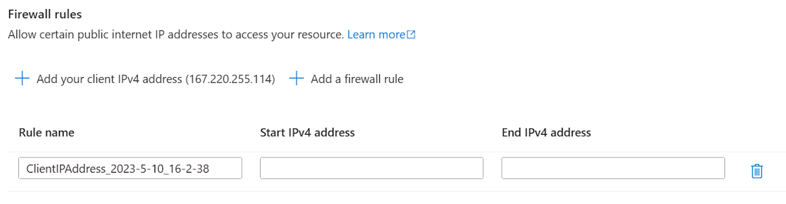

# Manually deploy a Java application with Open Liberty or WebSphere Liberty on an Azure Kubernetes Service (AKS) cluster

This article demonstrates how to:

* Run your Java, Java EE, Jakarta EE, or MicroProfile application on the Open Liberty or WebSphere Liberty runtime.
* Build the application Docker image using Liberty container images.
* Deploy the containerized application to an AKS cluster using the Open Liberty Operator.

The Open Liberty Operator simplifies the deployment and management of applications running on Kubernetes clusters. With the Open Liberty Operator, you can also perform more advanced operations, such as gathering traces and dumps.

For more information on Open Liberty, see [the Open Liberty project page](https://openliberty.io/). For more information on IBM WebSphere Liberty, see [the WebSphere Liberty product page](https://www.ibm.com/cloud/websphere-liberty).

This article is step-by-step manual guidance for running Open/WebSphere Liberty on Azure. For a more automated solution that accelerates your journey to AKS, see [Deploy a Java application with Open Liberty/WebSphere Liberty on an Azure Kubernetes Service (AKS) cluster](/azure/aks/howto-deploy-java-liberty-app).

[!INCLUDE [quickstarts-free-trial-note](../../includes/quickstarts-free-trial-note.md)]

## Prerequisites

* If running the commands in this guide locally (instead of Azure Cloud Shell):
  * Prepare a local machine with either Windows or Linux operation system installed.
  * Install a Java SE implementation (for example, [Eclipse Open J9](https://www.eclipse.org/openj9/)). The sample application requires Java 11.
  * Install [Maven](https://maven.apache.org/download.cgi) 3.5.0 or higher.
  * Install [Docker](https://docs.docker.com/get-docker/) for your OS.
* Make sure you've been assigned either the `Owner` role or the `Contributor` and `User Access Administrator` roles in the subscription. You can verify the assignment by following the steps in [List Azure role assignments using the Azure portal](/azure/role-based-access-control/role-assignments-list-portal).

[!INCLUDE [azure-cli-prepare-your-environment.md](~/../articles/reusable-content/azure-cli/azure-cli-prepare-your-environment-h3.md)]

* This article requires at least version 2.31.0 of Azure CLI. If using Azure Cloud Shell, the latest version is already installed. You may launch Azure CLI commands in either Bash or Azure PowerShell, either locally or in Azure Cloud Shell.


#### [In BASH](#tab/in-bash)

### Sign in to Azure

If you haven't done so already, sign in to your Azure subscription by using the [az login](/cli/azure/reference-index) command and follow the on-screen directions.

```azurecli-interactive
az login
```

> [!NOTE]
> If you have multiple Azure tenants associated with your Azure credentials, you must specify which tenant you want to sign in to. You can do this with the `--tenant` option. For example, `az login --tenant contoso.onmicrosoft.com`.

## Create a resource group

An Azure resource group is a logical group in which Azure resources are deployed and managed.

Create a resource group called *java-liberty-project* using the [az group create](/cli/azure/group#az-group-create) command in the *eastus* location. This resource group will be used later for creating the Azure Container Registry (ACR) instance and the AKS cluster.

```azurecli-interactive
export RESOURCE_GROUP_NAME=java-liberty-project
az group create --name $RESOURCE_GROUP_NAME --location eastus
```

## Create an ACR instance

Use the [az acr create](/cli/azure/acr#az-acr-create) command to create the ACR instance. The following example creates an ACR instance named *youruniqueacrname*. Make sure *youruniqueacrname* is unique within Azure.

```azurecli-interactive
export REGISTRY_NAME=youruniqueacrname
az acr create --resource-group $RESOURCE_GROUP_NAME --name $REGISTRY_NAME --sku Basic --admin-enabled
```

After a short time, you should see a JSON output that contains:

```output
  "provisioningState": "Succeeded",
  "publicNetworkAccess": "Enabled",
  "resourceGroup": "java-liberty-project",
```

### Connect to the ACR instance

You'll need to sign in to the ACR instance before you can push an image to it. If you choose to run commands locally, ensure the docker daemon is running, and run the following commands to verify the connection:

```azurecli-interactive
export LOGIN_SERVER=$(az acr show \
    --name $REGISTRY_NAME \
    --query 'loginServer' \
    --output tsv)
export USER_NAME=$(az acr credential show \
    --name $REGISTRY_NAME \
    --query 'username' \
    --output tsv)
export PASSWORD=$(az acr credential show \
    --name $REGISTRY_NAME \
    --query 'passwords[0].value' \
    --output tsv)

docker login $LOGIN_SERVER -u $USER_NAME -p $PASSWORD
```

You should see `Login Succeeded` at the end of command output if you've logged into the ACR instance successfully.

## Create an AKS cluster

Use the [az aks create](/cli/azure/aks#az-aks-create) command to create an AKS cluster. The following example creates a cluster named *myAKSCluster* with one node. This command will take several minutes to complete.

```azurecli-interactive
export CLUSTER_NAME=myAKSCluster
az aks create --resource-group $RESOURCE_GROUP_NAME --name $CLUSTER_NAME --node-count 1 --generate-ssh-keys --enable-managed-identity
```

After a few minutes, the command completes and returns JSON-formatted information about the cluster, including the following output:

```output
  "nodeResourceGroup": "MC_java-liberty-project_myAKSCluster_eastus",
  "privateFqdn": null,
  "provisioningState": "Succeeded",
  "resourceGroup": "java-liberty-project",
```

### Connect to the AKS cluster

To manage a Kubernetes cluster, you use [kubectl](https://kubernetes.io/docs/reference/kubectl/overview/), the Kubernetes command-line client. If you use Azure Cloud Shell, `kubectl` is already installed. To install `kubectl` locally, use the [az aks install-cli](/cli/azure/aks#az-aks-install-cli) command:

```azurecli-interactive
az aks install-cli
```

To configure `kubectl` to connect to your Kubernetes cluster, use the [az aks get-credentials](/cli/azure/aks#az-aks-get-credentials) command. This command downloads credentials and configures the Kubernetes CLI to use them.

```azurecli-interactive
az aks get-credentials --resource-group $RESOURCE_GROUP_NAME --name $CLUSTER_NAME --overwrite-existing --admin
```

> [!NOTE]
> The above command uses the default location for the [Kubernetes configuration file](https://kubernetes.io/docs/concepts/configuration/organize-cluster-access-kubeconfig/), which is `~/.kube/config`. You can specify a different location for your Kubernetes configuration file using `--file`.

To verify the connection to your cluster, use the [kubectl get]( https://kubernetes.io/docs/reference/generated/kubectl/kubectl-commands#get) command to return a list of the cluster nodes.

```azurecli-interactive
kubectl get nodes
```

The following example output shows the single node created in the previous steps. Make sure that the status of the node is *Ready*:

```output
NAME                                STATUS   ROLES   AGE     VERSION
aks-nodepool1-xxxxxxxx-yyyyyyyyyy   Ready    agent   76s     v1.23.8
```

## Create an Azure SQL Database

The steps in this section guide you through creating an Azure SQL Database single database for use with your app.

1. Create a single database in Azure SQL Database by following the `Azure CLI` steps in: [Quickstart: Create an Azure SQL Database single database](/azure/azure-sql/database/single-database-create-quickstart). Return to this document after creating and configuring the database server.

   > [!NOTE]
   >
   > * Write down all variables in the **Variable block**, including **location**, **resourceGroup**,**database**, ***server**.database.windows.net*, **login** admin user and **password**. The database **resourceGroup** will be referred to as `<db-resource-group>` later in this article.
   > * After creating the database server, in the **Networking** blade, under the **Connectivity** tab, set the **Minimum TLS version** to **TLS 1.0**.
   >   
   >   In the **Networking** blade, under the **Public access** tab, ensure **Allow Azure services and resources to access this server** is checked.
   >   
   >   If you want to test the application locally, ensure your client IPv4 address is in the allow list of **Firewall rules**
   >   

Now that the database and AKS cluster have been created, we can proceed to preparing AKS to host Open Liberty.

## Install Open Liberty Operator

After creating and connecting to the cluster, install the Open Liberty Operator.

Install the [Open Liberty Operator](https://github.com/OpenLiberty/open-liberty-operator/tree/main/deploy/releases/0.8.0#option-2-install-using-kustomize) by running the following commands.

```azurecli-interactive
# Install Open Liberty Operator
export OPERATOR_VERSION=0.8.2
mkdir -p overlays/watch-all-namespaces
wget https://raw.githubusercontent.com/OpenLiberty/open-liberty-operator/main/deploy/releases/${OPERATOR_VERSION}/kustomize/overlays/watch-all-namespaces/olo-all-namespaces.yaml -q -P ./overlays/watch-all-namespaces
wget https://raw.githubusercontent.com/OpenLiberty/open-liberty-operator/main/deploy/releases/${OPERATOR_VERSION}/kustomize/overlays/watch-all-namespaces/cluster-roles.yaml -q -P ./overlays/watch-all-namespaces
wget https://raw.githubusercontent.com/OpenLiberty/open-liberty-operator/main/deploy/releases/${OPERATOR_VERSION}/kustomize/overlays/watch-all-namespaces/kustomization.yaml -q -P ./overlays/watch-all-namespaces
mkdir base
wget https://raw.githubusercontent.com/OpenLiberty/open-liberty-operator/main/deploy/releases/${OPERATOR_VERSION}/kustomize/base/kustomization.yaml -q -P ./base
wget https://raw.githubusercontent.com/OpenLiberty/open-liberty-operator/main/deploy/releases/${OPERATOR_VERSION}/kustomize/base/open-liberty-crd.yaml -q -P ./base
wget https://raw.githubusercontent.com/OpenLiberty/open-liberty-operator/main/deploy/releases/${OPERATOR_VERSION}/kustomize/base/open-liberty-operator.yaml -q -P ./base
kubectl apply -k overlays/watch-all-namespaces
```

The output should be a series of lines following the format `<object type> created`. If you see any lines that don't conform to that format, troubleshoot and resolve the reason before continuing.


## Configure and build the application image

To deploy and run your Liberty application on the AKS cluster, containerize your application as a Docker image using [Open Liberty container images](https://github.com/OpenLiberty/ci.docker) or [WebSphere Liberty container images](https://github.com/WASdev/ci.docker).

Follow the steps in this section to deploy the sample application on the Liberty runtime. These steps use Maven.

### Check out the application

Clone the sample code for this guide. The sample is on [GitHub](https://github.com/Azure-Samples/open-liberty-on-aks). There are a few samples in the repository. We'll use *java-app*. Here's the file structure of the application.

```
java-app
├─ src/main/
│  ├─ aks/
│  │  ├─ db-secret.yaml
│  │  ├─ openlibertyapplication.yaml
│  ├─ docker/
│  │  ├─ Dockerfile
│  │  ├─ Dockerfile-wlp
│  ├─ liberty/config/
│  │  ├─ server.xml
│  ├─ java/
│  ├─ resources/
│  ├─ webapp/
├─ pom.xml
```

The directories *java*, *resources*, and *webapp* contain the source code of the sample application. The code declares and uses a data source named `jdbc/JavaEECafeDB`.

In the *aks* directory, we placed two deployment files. *db-secret.xml* is used to create [Kubernetes Secrets](https://kubernetes.io/docs/concepts/configuration/secret/) with DB connection credentials. The file *openlibertyapplication.yaml* is used to deploy the application image. In the *docker* directory, there are two files to create the application image with either Open Liberty or WebSphere Liberty.

In directory *liberty/config*, the *server.xml* is used to configure the DB connection for the Open Liberty and WebSphere Liberty cluster.

### Build project

Now that you've gathered the necessary properties, you can build the application. The POM file for the project reads many variables from the environment. As part of the Maven build, these variables are used to populate values in the YAML files located in *src/main/aks*. You can do something similar for your application outside Maven if you prefer.

```bash
cd <path-to-your-repo>/java-app

# The following variables will be used for deployment file generation into target/
export LOGIN_SERVER=${LOGIN_SERVER}
export REGISTRY_NAME=${REGISTRY_NAME}
export USER_NAME=${USER_NAME}
export PASSWORD=${PASSWORD}
export DB_SERVER_NAME=<Server name>.database.windows.net
export DB_NAME=<Database name>
export DB_USER=<Server admin login>@<Server name>
export DB_PASSWORD=<Server admin password>

mvn clean install
```

### (Optional) Test your project locally

You can now run and test the project locally before deploying to Azure. For convenience, we use the `liberty-maven-plugin`. To learn more about the `liberty-maven-plugin`, see [Building a web application with Maven](https://openliberty.io/guides/maven-intro.html). For your application, you can do something similar using any other mechanism such as your local IDE. You can also consider using the `liberty:devc` option intended for development with containers. You can read more about `liberty:devc` in the [Liberty docs](https://openliberty.io/docs/latest/development-mode.html#_container_support_for_dev_mode).

> [!NOTE]
> If you selected a "serverless" database deployment, verify that your SQL database has not entered pause mode. One way to do this is to log in to the database query editor as described in [Quickstart: Use the Azure portal query editor (preview) to query Azure SQL Database](/azure/azure-sql/database/connect-query-portal).

1. Start the application using `liberty:run`. `liberty:run` will also use the environment variables defined in the previous step.

   ```bash
   cd <path-to-your-repo>/java-app
   mvn liberty:run
   ```

2. Verify the application works as expected. You should see a message similar to `[INFO] [AUDIT] CWWKZ0003I: The application javaee-cafe updated in 1.930 seconds.` in the command output if successful. Go to `http://localhost:9080/` in your browser to verify the application is accessible and all functions are working.

3. Press <kbd>Ctrl</kbd>+<kbd>C</kbd> to stop.

### Build image for AKS deployment

> [!NOTE]
> If you selected to use the Bash environment in Azure Cloud Shell, use `az acr build` command to build and push image from a Docker file, see [Quickstart: Build and run a container image using Azure Container Registry Tasks](/azure/container-registry/container-registry-quickstart-task-cli#build-and-push-image-from-a-dockerfile). After that, go directly to [deploy application on the AKS cluster](#deploy-application-on-the-aks-cluster). If you selected to run commands locally, you may follow the guidance below.

You can now run the `docker build` command to build the image.

```bash
cd <path-to-your-repo>/java-app/target

# If you are running with Open Liberty
docker build -t javaee-cafe:v1 --pull --file=Dockerfile .

# If you are running with WebSphere Liberty
docker build -t javaee-cafe:v1 --pull --file=Dockerfile-wlp .
```

### (Optional) Test the Docker image locally

You can now use the following steps to test the Docker image locally before deploying to Azure.

1. Run the image using the following command. Note we're using the environment variables defined previously.

   ```bash
   docker run -it --rm -p 9080:9080 \
       -e DB_SERVER_NAME=${DB_SERVER_NAME} \
       -e DB_NAME=${DB_NAME} \
       -e DB_USER=${DB_USER} \
       -e DB_PASSWORD=${DB_PASSWORD} \
       javaee-cafe:v1
   ```

2. Once the container starts, go to `http://localhost:9080/` in your browser to access the application.

3. Press <kbd>Ctrl</kbd>+<kbd>C</kbd> to stop.

### Upload image to ACR

Now, we upload the built image to the ACR created in the previous steps.

If you haven't already done so, log in to the container registry.

```bash
docker login -u ${USER_NAME} -p ${PASSWORD} ${LOGIN_SERVER}
```

Tag and push the container image.

```bash
docker tag javaee-cafe:v1 ${LOGIN_SERVER}/javaee-cafe:v1
docker push ${LOGIN_SERVER}/javaee-cafe:v1
```

## Deploy application on the AKS cluster

Follow steps below to deploy the Liberty application on the AKS cluster.

1. Attach the ACR instance to the AKS cluster so that the AKS cluster is authenticated to pull image from the ACR instance.

   ```azurecli-interactive
   az aks update \
       --resource-group $RESOURCE_GROUP_NAME \
       --name $CLUSTER_NAME \
       --attach-acr $REGISTRY_NAME
   ```

2. Apply the DB secret and deployment file by running the following commands:

   ```bash
   cd <path-to-your-repo>/java-app/target

   # Apply DB secret
   kubectl apply -f db-secret.yaml

   # Apply deployment file
   kubectl apply -f openlibertyapplication.yaml
   ```

3. Check if the OpenLibertyApplication instance is created by running the following command.

   ```bash
   kubectl get openlibertyapplication javaee-cafe-cluster
   ```

   You should see output like the following.

   ```output
   NAME                        IMAGE                                                   EXPOSED   RECONCILED   AGE
   javaee-cafe-cluster         youruniqueacrname.azurecr.io/javaee-cafe:1.0.25         True         59s
   ```

4. Check if the deployment created by the Operator is ready by running the following command.

   ```bash
   kubectl get deployment javaee-cafe-cluster --watch
   ```

   You should see output like the following.

   ```output
   NAME                        READY   UP-TO-DATE   AVAILABLE   AGE
   javaee-cafe-cluster         0/3     3            0           20s
   ```

5. Wait until you see `3/3` under the `READY` column and `3` under the `AVAILABLE` column, then use <kbd>Ctrl</kbd>+<kbd>C</kbd> to stop the `kubectl` watch process.

### Test the application

When the application runs, a Kubernetes load balancer service exposes the application front end to the internet. This process can take a while to complete.

To monitor progress, use the [kubectl get service](https://kubernetes.io/docs/reference/generated/kubectl/kubectl-commands#get) command with the `--watch` argument.

```azurecli-interactive
kubectl get service javaee-cafe-cluster --watch
```

You should see output like the following.

```output
NAME                        TYPE           CLUSTER-IP     EXTERNAL-IP     PORT(S)          AGE
javaee-cafe-cluster         LoadBalancer   10.0.251.169   52.152.189.57   80:31732/TCP     68s
```

Once the *EXTERNAL-IP* address changes from *pending* to an actual public IP address, use <kbd>Ctrl</kbd>+<kbd>C</kbd> to stop the `kubectl` watch process.

If some time has passed between executing the steps in this section and the preceding one, ensure the database is active, if necessary. See the note above regarding database pause.

Open a web browser to the external IP address of your service (`52.152.189.57` for the above example) to see the application home page. You should see the pod name of your application replicas displayed at the top-left of the page. Wait for a few minutes and refresh the page to see a different pod name displayed due to load balancing provided by the AKS cluster.

:::image type="content" source="./media/howto-deploy-java-liberty-app/deploy-succeeded.png" alt-text="Java liberty application successfully deployed on AKS.":::

>[!NOTE]
> Currently the application is not using HTTPS. We recommend that you [ENABLE TLS with your own certificates](/azure/aks/ingress-tls).

## Clean up the resources

To avoid Azure charges, you should clean up unnecessary resources. When the cluster is no longer needed, use the [az group delete](/cli/azure/group#az-group-delete) command to remove the resource group, container service, container registry, and all related resources.

```azurecli-interactive
az group delete --name $RESOURCE_GROUP_NAME --yes --no-wait
az group delete --name <db-resource-group> --yes --no-wait
```

#### [In PowerShell](#tab/in-powershell)

### Sign in to Azure

If you haven't done so already, sign in to your Azure subscription by using the [az login](/cli/azure/reference-index) command and follow the on-screen directions.

```azurepowershell-interactive
az login
```

> [!NOTE]
> If you have multiple Azure tenants associated with your Azure credentials, you must specify which tenant you want to sign in to. You can do this with the `--tenant` option. For example, `az login --tenant contoso.onmicrosoft.com`.

## Create a resource group

An Azure resource group is a logical group in which Azure resources are deployed and managed.

Create a resource group called *java-liberty-project* using the [az group create](/cli/azure/group#az-group-create) command in the *eastus* location. This resource group will be used later for creating the Azure Container Registry (ACR) instance and the AKS cluster.

```azurepowershell-interactive
$Env:RESOURCE_GROUP_NAME = "java-liberty-project"
az group create --name $Env:RESOURCE_GROUP_NAME --location eastus
```

## Create an ACR instance

Use the [az acr create](/cli/azure/acr#az-acr-create) command to create the ACR instance. The following example creates an ACR instance named *youruniqueacrname*. Make sure *youruniqueacrname* is unique within Azure.

```azurepowershell-interactive
$Env:REGISTRY_NAME = "youruniqueacrname"
az acr create --resource-group $Env:RESOURCE_GROUP_NAME --name $Env:REGISTRY_NAME --sku Basic --admin-enabled
```

After a short time, you should see a JSON output that contains:

```output
  "provisioningState": "Succeeded",
  "publicNetworkAccess": "Enabled",
  "resourceGroup": "java-liberty-project",
```

### Connect to the ACR instance

You'll need to sign in to the ACR instance before you can push an image to it. If you choose to run commands locally, ensure the docker daemon is running, and run the following commands to verify the connection:

```azurepowershell-interactive
$Env:LOGIN_SERVER = $(az acr show -n $Env:REGISTRY_NAME --query 'loginServer' -o tsv)
$Env:USER_NAME=$(az acr credential show -n $Env:REGISTRY_NAME --query 'username' -o tsv)
$Env:PASSWORD=$(az acr credential show -n $Env:REGISTRY_NAME --query 'passwords[0].value' -o tsv)

docker login $Env:LOGIN_SERVER -u $Env:USER_NAME -p $Env:PASSWORD
```

You should see `Login Succeeded` at the end of command output if you've logged into the ACR instance successfully.

## Create an AKS cluster

Use the [az aks create](/cli/azure/aks#az-aks-create) command to create an AKS cluster. The following example creates a cluster named *myAKSCluster* with one node. This command will take several minutes to complete.

```azurepowershell-interactive
$Env:CLUSTER_NAME = "myAKSCluster"
az aks create --resource-group $Env:RESOURCE_GROUP_NAME --name $Env:CLUSTER_NAME --node-count 1 --generate-ssh-keys --enable-managed-identity
```

After a few minutes, the command completes and returns JSON-formatted information about the cluster, including the following output:

```output
  "nodeResourceGroup": "MC_java-liberty-project_myAKSCluster_eastus",
  "privateFqdn": null,
  "provisioningState": "Succeeded",
  "resourceGroup": "java-liberty-project",
```

### Connect to the AKS cluster

To manage a Kubernetes cluster, you use [kubectl](https://kubernetes.io/docs/reference/kubectl/overview/), the Kubernetes command-line client. If you use Azure Cloud Shell, `kubectl` is already installed. To install `kubectl` locally, use the [az aks install-cli](/cli/azure/aks#az-aks-install-cli) command:

```azurepowershell-interactive
az aks install-cli
```

To configure `kubectl` to connect to your Kubernetes cluster, use the [az aks get-credentials](/cli/azure/aks#az-aks-get-credentials) command. This command downloads credentials and configures the Kubernetes CLI to use them.

```azurepowershell-interactive
az aks get-credentials --resource-group $Env:RESOURCE_GROUP_NAME --name $Env:CLUSTER_NAME --overwrite-existing --admin
```

> [!NOTE]
> The above command uses the default location for the [Kubernetes configuration file](https://kubernetes.io/docs/concepts/configuration/organize-cluster-access-kubeconfig/), which is `~/.kube/config`. You can specify a different location for your Kubernetes configuration file using `--file`.

To verify the connection to your cluster, use the [kubectl get]( https://kubernetes.io/docs/reference/generated/kubectl/kubectl-commands#get) command to return a list of the cluster nodes.

```azurepowershell-interactive
kubectl get nodes
```

The following example output shows the single node created in the previous steps. Make sure that the status of the node is *Ready*:

```output
NAME                                STATUS   ROLES   AGE     VERSION
aks-nodepool1-xxxxxxxx-yyyyyyyyyy   Ready    agent   76s     v1.23.8
```

## Create an Azure SQL Database

The steps in this section guide you through creating an Azure SQL Database single database for use with your app.

1. Create a single database in Azure SQL Database by following the `Azure CLI` steps in: [Quickstart: Create an Azure SQL Database single database](/azure/azure-sql/database/single-database-create-quickstart). Return to this document after creating and configuring the database server.

   > [!NOTE]
   >
   > * Write down all variables in the **Variable block**, including **location**, **resourceGroup**,**database**, ***server**.database.windows.net*, **login** admin user and **password**. The database **resourceGroup** will be referred to as `<db-resource-group>` later in this article.
   > * After creating the database server, in the **Networking** blade, under the **Connectivity** tab, set the **Minimum TLS version** to **TLS 1.0**.
   >   
   >   In the **Networking** blade, under the **Public access** tab, ensure **Allow Azure services and resources to access this server** is checked.
   >   
   >   If you want to test the application locally, ensure your client IPv4 address is in the allow list of **Firewall rules**
   >   

Now that the database and AKS cluster have been created, we can proceed to preparing AKS to host Open Liberty.

## Install Open Liberty Operator

After creating and connecting to the cluster, install the Open Liberty Operator.

Install the [Open Liberty Operator](https://github.com/OpenLiberty/open-liberty-operator/tree/main/deploy/releases/0.8.0#option-2-install-using-kustomize) by running the following commands.

```azurepowershell-interactive
# Install Open Liberty Operator
$Env:OPERATOR_VERSION = "0.8.2"
mkdir -p overlays/watch-all-namespaces
Invoke-WebRequest https://raw.githubusercontent.com/OpenLiberty/open-liberty-operator/main/deploy/releases/$Env:OPERATOR_VERSION/kustomize/overlays/watch-all-namespaces/olo-all-namespaces.yaml -OutFile ./overlays/watch-all-namespaces/olo-all-namespaces.yaml
Invoke-WebRequest https://raw.githubusercontent.com/OpenLiberty/open-liberty-operator/main/deploy/releases/$Env:OPERATOR_VERSION/kustomize/overlays/watch-all-namespaces/cluster-roles.yaml -OutFile ./overlays/watch-all-namespaces/cluster-roles.yaml
Invoke-WebRequest https://raw.githubusercontent.com/OpenLiberty/open-liberty-operator/main/deploy/releases/$Env:OPERATOR_VERSION/kustomize/overlays/watch-all-namespaces/kustomization.yaml -OutFile ./overlays/watch-all-namespaces/kustomization.yaml
mkdir base
Invoke-WebRequest https://raw.githubusercontent.com/OpenLiberty/open-liberty-operator/main/deploy/releases/$Env:OPERATOR_VERSION/kustomize/base/kustomization.yaml -OutFile ./base/kustomization.yaml
Invoke-WebRequest https://raw.githubusercontent.com/OpenLiberty/open-liberty-operator/main/deploy/releases/$Env:OPERATOR_VERSION/kustomize/base/open-liberty-crd.yaml -OutFile ./base/open-liberty-crd.yaml
Invoke-WebRequest https://raw.githubusercontent.com/OpenLiberty/open-liberty-operator/main/deploy/releases/$Env:OPERATOR_VERSION/kustomize/base/open-liberty-operator.yaml -OutFile ./base/open-liberty-operator.yaml
kubectl apply -k overlays/watch-all-namespaces
```

The output should be a series of lines following the format `<object type> created`. If you see any lines that don't conform to that format, troubleshoot and resolve the reason before continuing.

## Configure and build the application image

To deploy and run your Liberty application on the AKS cluster, containerize your application as a Docker image using [Open Liberty container images](https://github.com/OpenLiberty/ci.docker) or [WebSphere Liberty container images](https://github.com/WASdev/ci.docker).

Follow the steps in this section to deploy the sample application on the Liberty runtime. These steps use Maven.

### Check out the application

Clone the sample code for this guide. The sample is on [GitHub](https://github.com/Azure-Samples/open-liberty-on-aks). There are a few samples in the repository. We'll use *java-app*. Here's the file structure of the application.

```
java-app
├─ src/main/
│  ├─ aks/
│  │  ├─ db-secret.yaml
│  │  ├─ openlibertyapplication.yaml
│  ├─ docker/
│  │  ├─ Dockerfile
│  │  ├─ Dockerfile-wlp
│  ├─ liberty/config/
│  │  ├─ server.xml
│  ├─ java/
│  ├─ resources/
│  ├─ webapp/
├─ pom.xml
```

The directories *java*, *resources*, and *webapp* contain the source code of the sample application. The code declares and uses a data source named `jdbc/JavaEECafeDB`.

In the *aks* directory, we placed two deployment files. *db-secret.xml* is used to create [Kubernetes Secrets](https://kubernetes.io/docs/concepts/configuration/secret/) with DB connection credentials. The file *openlibertyapplication.yaml* is used to deploy the application image. In the *docker* directory, there are two files to create the application image with either Open Liberty or WebSphere Liberty.

In directory *liberty/config*, the *server.xml* is used to configure the DB connection for the Open Liberty and WebSphere Liberty cluster.

### Build project

Now that you've gathered the necessary properties, you can build the application. The POM file for the project reads many variables from the environment. As part of the Maven build, these variables are used to populate values in the YAML files located in *src/main/aks*. You can do something similar for your application outside Maven if you prefer.

```azurepowershell-interactive
cd <path-to-your-repo>/java-app

# The following variables will be used for deployment file generation into target/
$Env:LOGIN_SERVER = $Env:LOGIN_SERVER
$Env:REGISTRY_NAME = $Env:REGISTRY_NAME
$Env:USER_NAME = $Env:USER_NAME
$Env:PASSWORD = $Env:PASSWORD
$Env:DB_SERVER_NAME = "<Server name>.database.windows.net"
$Env:DB_NAME = "<Database name>"
$Env:DB_USER = "<Server admin login>@<Server name>"
$Env:DB_PASSWORD = "<Server admin password>"

mvn clean install
```

### (Optional) Test your project locally

You can now run and test the project locally before deploying to Azure. For convenience, we use the `liberty-maven-plugin`. To learn more about the `liberty-maven-plugin`, see [Building a web application with Maven](https://openliberty.io/guides/maven-intro.html). For your application, you can do something similar using any other mechanism such as your local IDE. You can also consider using the `liberty:devc` option intended for development with containers. You can read more about `liberty:devc` in the [Liberty docs](https://openliberty.io/docs/latest/development-mode.html#_container_support_for_dev_mode).

> [!NOTE]
> If you selected a "serverless" database deployment, verify that your SQL database has not entered pause mode. One way to do this is to log in to the database query editor as described in [Quickstart: Use the Azure portal query editor (preview) to query Azure SQL Database](/azure/azure-sql/database/connect-query-portal).

1. Start the application using `liberty:run`. `liberty:run` will also use the environment variables defined in the previous step.

   ```azurepowershell-interactive
   cd <path-to-your-repo>/java-app
   mvn liberty:run
   ```

2. Verify the application works as expected. You should see a message similar to `[INFO] [AUDIT] CWWKZ0003I: The application javaee-cafe updated in 1.930 seconds.` in the command output if successful. Go to `http://localhost:9080/` in your browser to verify the application is accessible and all functions are working.

3. Press <kbd>Ctrl</kbd>+<kbd>C</kbd> to stop.

### Build image for AKS deployment

> [!NOTE]
> If you selected to use the Bash environment in Azure Cloud Shell, use `az acr build` command to build and push image from a Docker file, see [Quickstart: Build and run a container image using Azure Container Registry Tasks](/azure/container-registry/container-registry-quickstart-task-cli#build-and-push-image-from-a-dockerfile). After that, go directly to [deploy application on the AKS cluster](#deploy-application-on-the-aks-cluster). If you selected to run commands locally, you may follow the guidance below.

You can now run the `docker build` command to build the image.

```azurepowershell-interactive
cd <path-to-your-repo>/java-app/target

# If you are running with Open Liberty
docker build -t javaee-cafe:v1 --pull --file=Dockerfile .

# If you are running with WebSphere Liberty
docker build -t javaee-cafe:v1 --pull --file=Dockerfile-wlp .
```

### (Optional) Test the Docker image locally

You can now use the following steps to test the Docker image locally before deploying to Azure.

1. Run the image using the following command. Note we're using the environment variables defined previously.

   ```azurepowershell-interactive
   docker run -it --rm -p 9080:9080 -e DB_SERVER_NAME=$Env:DB_SERVER_NAME -e DB_NAME=$Env:DB_NAME -e DB_USER=$Env:DB_USER -e DB_PASSWORD=$Env:DB_PASSWORD javaee-cafe:v1
   ```

2. Once the container starts, go to `http://localhost:9080/` in your browser to access the application.

3. Press <kbd>Ctrl</kbd>+<kbd>C</kbd> to stop.

### Upload image to ACR

Now, we upload the built image to the ACR created in the previous steps.

If you haven't already done so, log in to the container registry.

```azurepowershell-interactive
docker login -u $Env:USER_NAME -p $Env:PASSWORD $Env:LOGIN_SERVER
```

Tag and push the container image.

```azurepowershell-interactive
docker tag javaee-cafe:v1 $Env:LOGIN_SERVER/javaee-cafe:v1
docker push $Env:LOGIN_SERVER/javaee-cafe:v1
```

## Deploy application on the AKS cluster

Follow steps below to deploy the Liberty application on the AKS cluster.

1. Attach the ACR instance to the AKS cluster so that the AKS cluster is authenticated to pull image from the ACR instance.

   ```azurepowershell-interactive
   az aks update -n $Env:CLUSTER_NAME -g $Env:RESOURCE_GROUP_NAME --attach-acr $Env:REGISTRY_NAME
   ```

2. Apply the DB secret and deployment file by running the following commands:

   ```azurepowershell-interactive
   cd <path-to-your-repo>/java-app/target

   # Apply DB secret
   kubectl apply -f db-secret.yaml

   # Apply deployment file
   kubectl apply -f openlibertyapplication.yaml
   ```
3. Check if the OpenLibertyApplication instance is created by running the following command.

   ```azurepowershell-interactive
   kubectl get openlibertyapplication javaee-cafe-cluster
   ```

   You should see output like the following.

   ```output
   NAME                        IMAGE                                                   EXPOSED   RECONCILED   AGE
   javaee-cafe-cluster         youruniqueacrname.azurecr.io/javaee-cafe:1.0.25         True         59s
   ```
4. Check if the deployment created by the Operator is ready by running the following command.

   ```azurepowershell-interactive
   kubectl get deployment javaee-cafe-cluster --watch
   ```

   You should see output like the following.

   ```output
   NAME                        READY   UP-TO-DATE   AVAILABLE   AGE
   javaee-cafe-cluster         0/3     3            0           20s
   ```
5. Wait until you see `3/3` under the `READY` column and `3` under the `AVAILABLE` column, then use <kbd>Ctrl</kbd>+<kbd>C</kbd> to stop the `kubectl` watch process.

### Test the application

When the application runs, a Kubernetes load balancer service exposes the application front end to the internet. This process can take a while to complete.

To monitor progress, use the [kubectl get service](https://kubernetes.io/docs/reference/generated/kubectl/kubectl-commands#get) command with the `--watch` argument.

```azurepowershell-interactive
kubectl get service javaee-cafe-cluster --watch
```

You should see output like the following.

```output
NAME                        TYPE           CLUSTER-IP     EXTERNAL-IP     PORT(S)          AGE
javaee-cafe-cluster         LoadBalancer   10.0.251.169   52.152.189.57   80:31732/TCP     68s
```

Once the *EXTERNAL-IP* address changes from *pending* to an actual public IP address, use <kbd>Ctrl</kbd>+<kbd>C</kbd> to stop the `kubectl` watch process.

If some time has passed between executing the steps in this section and the preceding one, ensure the database is active, if necessary. See the note above regarding database pause.

Open a web browser to the external IP address of your service (`52.152.189.57` for the above example) to see the application home page. You should see the pod name of your application replicas displayed at the top-left of the page. Wait for a few minutes and refresh the page to see a different pod name displayed due to load balancing provided by the AKS cluster.

:::image type="content" source="./media/howto-deploy-java-liberty-app/deploy-succeeded.png" alt-text="Java liberty application successfully deployed on AKS.":::

>[!NOTE]
> Currently the application is not using HTTPS. We recommend that you [ENABLE TLS with your own certificates](/azure/aks/ingress-tls).

## Clean up the resources

To avoid Azure charges, you should clean up unnecessary resources. When the cluster is no longer needed, use the [az group delete](/cli/azure/group#az-group-delete) command to remove the resource group, container service, container registry, and all related resources.

```azurepowershell-interactive
az group delete --name $Env:RESOURCE_GROUP_NAME --yes --no-wait
az group delete --name <db-resource-group> --yes --no-wait
```


---

## Next steps

You can learn more from references used in this guide:

* [Azure Kubernetes Service](https://azure.microsoft.com/free/services/kubernetes-service/)
* [Open Liberty](https://openliberty.io/)
* [Open Liberty Operator](https://github.com/OpenLiberty/open-liberty-operator)
* [Open Liberty Server Configuration](https://openliberty.io/docs/ref/config/)
* [Liberty Maven Plugin](https://github.com/OpenLiberty/ci.maven#liberty-maven-plugin)
* [Open Liberty Container Images](https://github.com/OpenLiberty/ci.docker)
* [WebSphere Liberty Container Images](https://github.com/WASdev/ci.docker)
