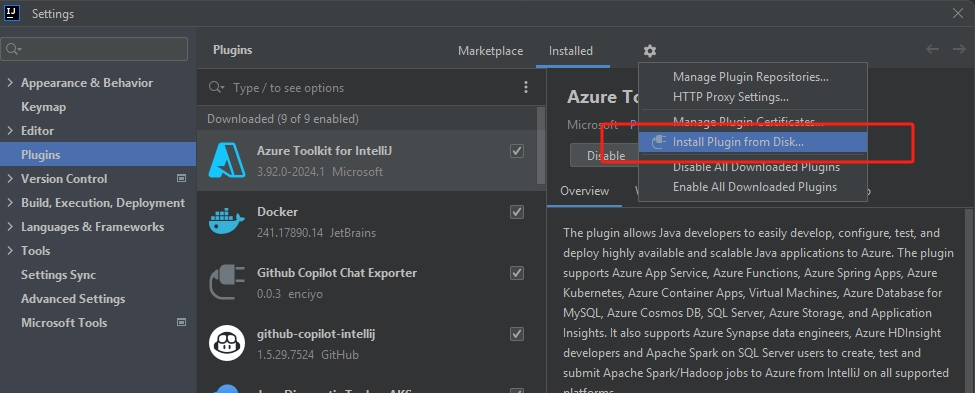
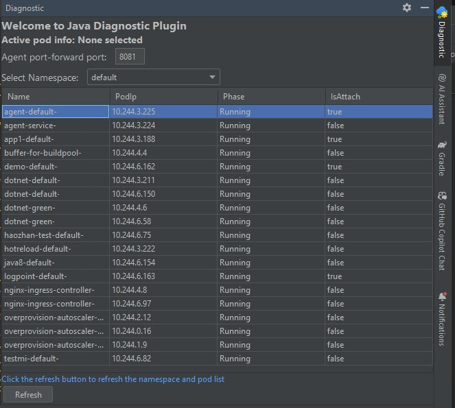
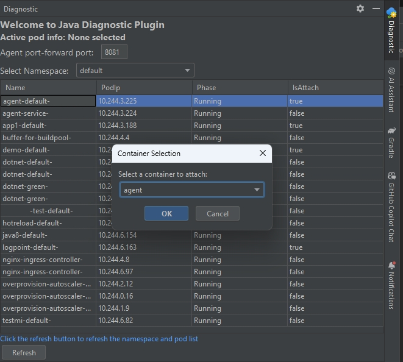
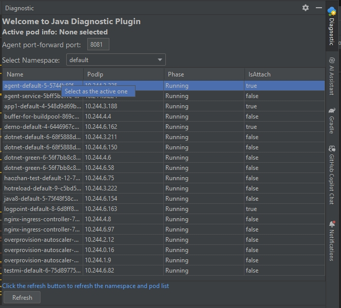
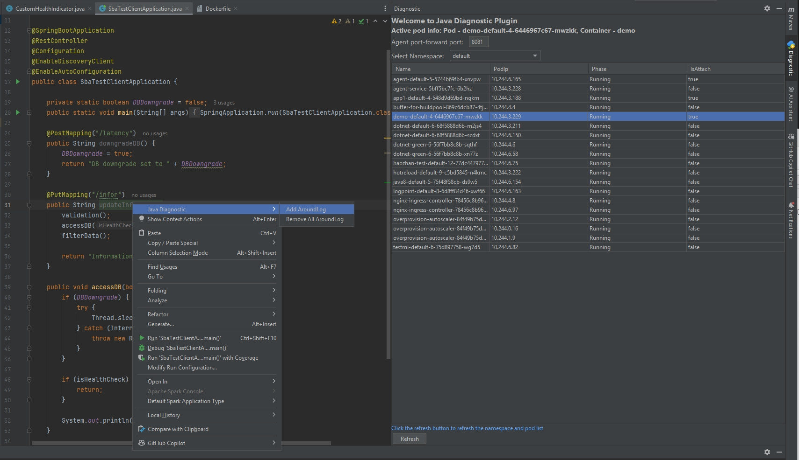
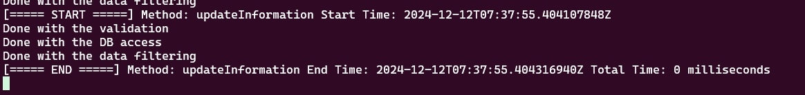

# Get Started with Java Diagnostic Agent
Java Diagnostic Agent is a java agent for throubleshooting Java process. It doesn't need to rebuild, redeploy or restart the application. Currently, it support add logs around a function in Java class, once the function is called, the log will be printed and calculate the total time consumed.

## Prerequisites
- [Install diag4j in Your Cluster](java-diagnostic-tools-sba-quickstart.md#steps)
- Install [intellij idea](https://www.jetbrains.com/idea/download) in your environment
- Support Java LTS version: 11,17,21

## Steps
- Port Forwarding to the agent service
  ```
    kubectl port-forward svc/diag4j-agent-service -n {namespace} {port}:8080
  ```

- Work with [Java Diagnostic Tool on AKS plugin](#java-diagnostic-tool-on-aks-plugin).

### Java Diagnostic Tool on AKS plugin
This plugin is used to attach Java diagnostic agent to the Java application which running in a pod container on Azure Kubernetes Service (AKS) cluster.
 
After Attach, it allows to do some troubleshooting like add logs around a class function, to test if the function is executed and calculate the total cost of the function

It's useful when locate the performance bottleneck of the Java application.

## How to use Intellij Idea plugin
### [Prerequisites](#prerequisites)
  - download the Intellij Idea [plugin](https://github.com/microsoft/diag4j/releases) and install it locally through Settings > Plugins > Install Plugin from Disk.
    
  
  - java applications to troubleshoot with. If you need help to deploy your Java application to AKS, please refer to this guide to deploy a sample Java app to your AKS: [Deploy an app on AKS](../spring-framework/deploy-spring-boot-java-app-on-kubernetes.md)

### Agent Overview Dashboard
  - you can configure your port which forward to the agent service in local 
  - the pods show in the table are listed with kubeconfig in local environment
  - click "Refresh" button to fresh the pod table, once you switch cluster, should click refresh to load the pods in new cluster
    
  

### Attach Agent
> The pod container should have /tmp folder, and it should have write permission to /tmp folder
> 
> Should enable attach in the JVM, like don't add "-XX:+DisableAttachMechanism" in the JVM options
> 
> The backend diagnostic server will be closed after 6 hours 

  - click the pod you want to attach the agent and select the container, only one container in the pod can be attached
  - wait the attachment process to complete
  
  

### Set active pod container
 Once attach the agent successfully, we can use the agent to help do some troubleshooting. Because there may be existed multiple pods inject the agent, so we should set an active one first. Later operations on the code in IDE will be based on the active pod container.

 

### Add log around a class function
> The configured log will be removed after the 30 minutes automatically
> 
> It supports to add logs around a class function in your source code, not include interface, constructure, etc.

- select the class and function you want to add log, then click the "Add AroundLog" button. In below example, after add log, then call "{host}/infor", you can see the log print before and after the function called





### Remove all configured logs
- click the "Remove All AroundLogs" button, all the logs added by the agent will be removed


## Note
- The backend Java agent is used by ephemeral container in the pod, Once the pod restart, the agent will be removed

## Trouble Shooting
- Attach agent timeout sometimes
  - if you attach the agent to a pod which running on a node that never has a pod enable the feature before, 
  it may take a longer time than others because it will pull the agent image to the node first. click the refresh button to see if it finally attached or try it again.
- Attach failed
  - if the attach operation failed, you can check detail logs in the ephemeral container, name as `diagnostic-container-{hashcode}`.
- See more logs `diag4j-agent-service-{hashcode}` pod about the operations in the plugin

## Next Steps

- Explore spring boot admin component of diag4j tool [Quick Start Guide](java-diagnostic-tools-sba-quickstart.md)