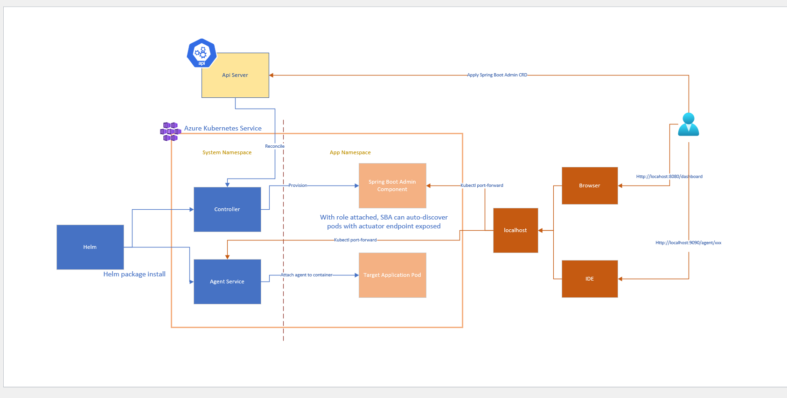

# Java Diagnostic Tool (diag4j) on Azure Kubernetes Service (AKS)

## Overview

The Java Diagnostic Tool for AKS is a lightweight, non-intrusive monitoring and diagnostic solution for Java applications running on Azure Kubernetes Service.

### Key Benefits
- **Lightweight & Non-Invasive**: By leveraging Spring Boot Admin (SBA) and Java Attach Agent, this tool is resource-efficient and does not require deep modifications to applications.
- **Automatic Kubernetes Integration**: The tool auto-discovers pods with exposed actuator endpoints, listing them on the SBA dashboard.
- **Real-Time Metrics & Diagnostics**: It displays real-time application metrics, GC status, and environment variables. Developers can also adjust log levels dynamically for deeper insights into specific issues.
- **Advanced Diagnostics**: This tool offers enhanced diagnostic features, such as stack trace inspection, viewing local variables, generating heap and thread dumps, and injecting logs dynamically for troubleshooting.
- **IDE Compatibility**: Integrates with IDEs to enable debugging without needing to rebuild or redeploy the application, allowing for streamlined troubleshooting.

## Architecture
The diag4j tool is composed of two main components: the Spring Boot Admin server and the Agent Service. 
- The Spring Boot Admin server is equipped with a read-only role within its namespace to automatically discover and monitor pods exposing actuator endpoints.
- The Java Attach Agent is a lightweight Java agent that attaches to running Java processes, enabling diagnostic capabilities without restarting the application.

### Access
To maintain security during the current milestone, both components are not exposed publicly. Developers can access the tool via the `kubectl port-forward` command.

> Note: SBA stands for Spring Boot Admin server.

## Demonstration Video
Explore how to use diag4j on AKS through this demo video:
[Watch the video](https://youtu.be/srysxWp2tak)

## Next Steps

- Explore spring boot admin component of diag4j tool [Quick Start Guide](java-diagnostic-tools-sba-quickstart.md)
- Explore diagnostic agent of diag4j tool [Quick Start Guide](java-diagnostic-tools-jda-quickstart.md)
