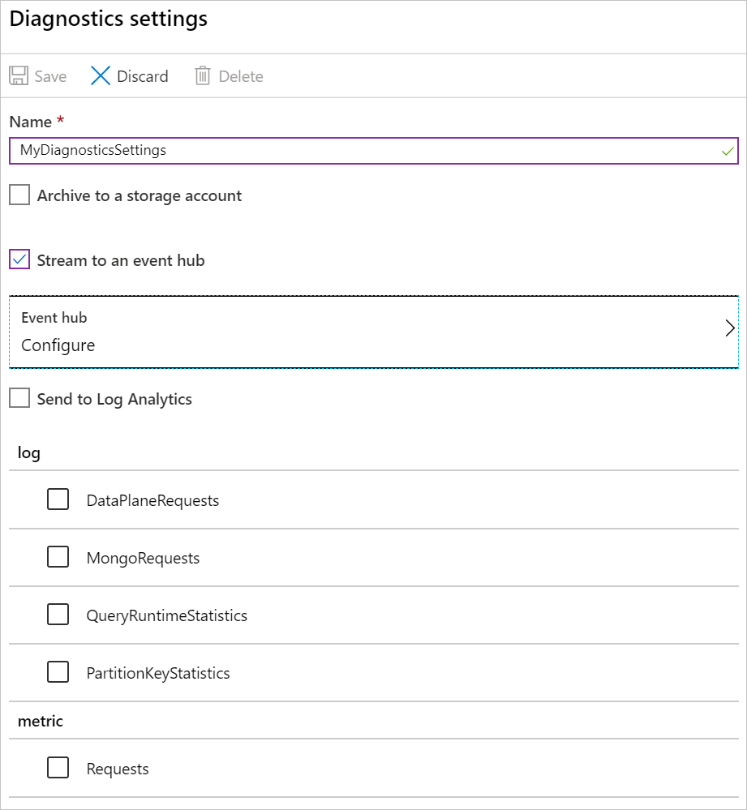

# Tutorial: Getting started with monitoriing logs and metrics using Elasticsearch Service for Java developers running on Azure

This tutorial shows you how to provision an Elasticsearch Service cluster on Microsoft Azure for analyzing and troubleshooting Azure Monitor logs and metrics. This will provide a full monitoring solution, utilizing a combination of Elasticsearch, Logstash, and Kibana for visualizations.

<!--- NEEDS MODIFICATION
This tutorial assumes you're using Log4J or Logback. These libraries are the two most widely used for logging in Java, so the tutorial should work for most applications running on Azure. If you're already using the Elastic stack to monitor your Java application, this tutorial shows you how to reconfigure to target the Logz.io endpoint.
--->

In this tutorial, you'll learn how to:

> [!div class="checklist"]
> * Deploy an Elasticsearch Service cluster on Microsoft Azure.
> * Setup logs and metrics to flow from Azure Monitor.
> * Enable troubleshooting by utilizing Kibana visualizations

## Prerequisites
<!--- NEEDS MODIFICATION
* [Java Developer Kit](https://aka.ms/azure-jdks), version 8 or greater
* A Logz.io account from the [Azure Marketplace](https://azuremarketplace.microsoft.com/marketplace/apps/logz.logzio-elk-as-a-service-pro)
* An existing Java application that uses Log4J or Logback
--->

## Deploy a hosted Elasticsearch cluster on Microsoft Azure

From the Azure Marketplace, search for Elasticsearch Service. You will see a link to a trial, where you will enter an email to get started. 

    

Next, Create your first deployment

### Get your Logz.io access token

To get your token, log in to your Logz.io account, select the cog icon in the right-hand corner, then select **Settings > General**. Copy the access token displayed in your account settings so you can use it later.

### Install and configure the Logz.io library for Log4J or Logback

The Logz.io Java library is available on Maven Central, so you can add it as a dependency to your app configuration. Check the version number on Maven Central and use the latest version in the following configuration settings.

If you're using Maven, add the following dependency to your `pom.xml` file:

**Log4J:**

```xml
<dependency>
    <groupId>io.logz.log4j2</groupId>
    <artifactId>logzio-log4j2-appender</artifactId>
    <version>1.0.11</version>
</dependency>
```

**Logback:**

```xml
<dependency>
    <groupId>io.logz.logback</groupId>
    <artifactId>logzio-logback-appender</artifactId>
    <version>1.0.22</version>
</dependency>
```

If you're using Gradle, add the following dependency to your build script:

**Log4J:**

```
implementation 'io.logz.log4j:logzio-log4j-appender:1.0.11'
```

**Logback:**

```
implementation 'io.logz.logback:logzio-logback-appender:1.0.22'
```

Next, update your Log4J or Logback configuration file:

**Log4J:**

```xml
<Appenders>
    <LogzioAppender name="Logzio">
        <logzioToken><your-logz-io-token></logzioToken>
        <logzioType>java-application</logzioType>
        <logzioUrl>https://<your-logz-io-listener-host>:8071</logzioUrl>
    </LogzioAppender>
</Appenders>

<Loggers>
    <Root level="info">
        <AppenderRef ref="Logzio"/>
    </Root>
</Loggers>
```

**Logback:**

```xml
<configuration>
    <!-- Use shutdownHook so that we can close gracefully and finish the log drain -->
    <shutdownHook class="ch.qos.logback.core.hook.DelayingShutdownHook"/>
    <appender name="LogzioLogbackAppender" class="io.logz.logback.LogzioLogbackAppender">
        <token><your-logz-io-token></token>
        <logzioUrl>https://<your-logz-io-listener-host>:8071</logzioUrl>
        <logzioType>java-application</logzioType>
        <filter class="ch.qos.logback.classic.filter.ThresholdFilter">
            <level>INFO</level>
        </filter>
    </appender>

    <root level="debug">
        <appender-ref ref="LogzioLogbackAppender"/>
    </root>
</configuration>
```

Replace the `<your-logz-io-token>` placeholder with your access token and the `<your-logz-io-listener-host>` placeholder with your region’s listener host (for example, listener.logz.io). For more information on finding your account’s region, see [Account region](https://docs.logz.io/user-guide/accounts/account-region.html).

The `logzioType` element refers to a logical field in Elasticsearch that is used to separate different documents from one another. It's essential to configure this parameter properly to get the most out of Logz.io.

A Logz.io "Type" is your log format (for example: Apache, NGinx, MySQL) and not your source (for example: server1, server2, server3). For this tutorial, we are calling the type `java-application` because we are configuring Java applications, and we expect those applications will all have the same format.

For advanced usage, you could group your Java applications into different types, which all have their own specific log format (configurable with Log4J and Logback). For example, you could have a "spring-boot-monolith" type and a "spring-boot-microservice" type.

### Test your configuration and log analysis on Logz.io

After the Logz.io library is configured, your application should now send logs directly to it. To test that everything works correctly, go to the Logz.io console, select the **Live tail** tab, then select **run**. You should see a message similar to the following, telling you the connection is working:

```output
Requesting Live Tail access...
Access granted. Opening connection...
Connected. Tailing...
````

Next, start your application, or use it in order to produce some logs. The logs should appear directly on your screen. For example, here are the first startup messages of a Spring Boot application:

```output
2019-09-19 12:54:40.685Z Starting JavaApp on javaapp-default-9-5cfcb8797f-dfp46 with PID 1 (/workspace/BOOT-INF/classes started by cnb in /workspace)
2019-09-19 12:54:40.686Z The following profiles are active: prod
2019-09-19 12:54:42.052Z Bootstrapping Spring Data repositories in DEFAULT mode.
2019-09-19 12:54:42.169Z Finished Spring Data repository scanning in 103ms. Found 6 repository interfaces.
2019-09-19 12:54:43.426Z Bean 'spring.task.execution-org.springframework.boot.autoconfigure.task.TaskExecutionProperties' of type [org.springframework.boot.autoconfigure.task.TaskExecutionProperties] is not eligible for getting processed by all BeanPostProcessors (for example: not eligible for auto-proxying)
```

Now that your logs are processed by Logz.io, you can benefit from all the platform's services.

## Send Azure services data to Logz.io

Next you'll learn how to send logs and metrics from your Azure resources to Logz.io.

### Deploy the template

The first step is to deploy the Logz.io - Azure integration template. The integration is based on a ready-made Azure deployment template that sets up all the necessary building blocks of the pipeline. The template creates an Event Hub namespace, an Event Hub, two storage blobs, and all the correct permissions and connections required. The resources set up by the automated deployment can collect data for a single Azure region and ship that data to Logz.io.

Find the **Deploy to Azure** button displayed in the [first step of the repo’s readme](https://github.com/logzio/logzio-azure-serverless).

When you select **Deploy to Azure**, the **Custom Deployment** page in the Azure portal will appear with a list of pre-filled fields.

You can leave most of the fields as-is but be sure to enter the following settings:

* **Resource group**: Either select an existing group or create a new one.
* **Logzio Logs/Metrics Host**: Enter the URL of the Logz.io listener. If you’re not sure what this URL is, check your login URL. If it’s app.logz.io, use listener.logz.io (which is the default setting). If it’s app-eu.logz.io, use listener-eu.logz.io.
* **Logzio Logs/Metrics Token**: Enter the token of the Logz.io account you want to ship Azure logs or metrics to. You can find this token on the account page in the Logz.io UI.

Agree to the terms at the bottom of the page, and select **Purchase**. Azure will then deploy the template, which may take a minute or two. You'll eventually see the "Deployment succeeded" message at the top of the portal.

You can visit the defined resource group to review the deployed resources.

To learn how to configure logzio-azure-serverless to back up data to Azure Blob Storage, see [Ship Azure activity logs](https://docs.logz.io/shipping/log-sources/azure-activity-logs.html).

### Stream Azure logs and metrics to Logz.io

Now that you’ve deployed the integration template, you’ll need to configure Azure to stream diagnostic data to the Event Hub you just deployed. When data comes into the Event Hub, the function app will then forward that data to Logz.io.

1. In the search bar, type “Diagnostic”, then select **Diagnostic settings**.

2. Choose a resource from the list of resources, then select **Add diagnostic setting** to open the **Diagnostics settings** panel for that resource.

    

3. Give your diagnostic settings a **Name**.

4. Select **Stream to an event hub**, then select **Configure** to open the **Select Event Hub** panel.

5. Choose your Event Hub:

    * **Select event hub namespace**: Choose the namespace that starts with **Logzio** (`LogzioNS6nvkqdcci10p`, for example).
    * **Select event hub name**: For logs choose **insights-operational-logs** and for metrics choose **insights-operational-metrics**.
    * **Select event hub policy name**: Choose **LogzioSharedAccessKey**.

6. Select **OK** to return to the **Diagnostics settings** panel.

7. In the Log section, select the data you want to stream, then select **Save**.

The selected data will now stream to the Event Hub.

### Visualize your data

Next, give your data some time to get from your system to Logz.io, and then open Kibana. You should see data (with the type _eventhub_) filling up your dashboards. For more information on how to create dashboards, see [Creating the Perfect Kibana Dashboard](https://logz.io/blog/perfect-kibana-dashboard/).

From there, you can query for specific data in the **Discover** tab, or create Kibana objects to visualize your data in the **Visualize** tab.

## Clean up resources

When you're finished with the Azure resources you created in this tutorial, you can delete them using the following command:

```azurecli-interactive
az group delete --name <resource group>
```

## Next steps

In this tutorial, you learned how to configure your Java application and Azure services to send logs and metrics to Logz.io.

Next, learn more about using Event Hub to monitor your application:

> [!div class="nextstepaction"]
> [Stream Azure monitoring data to an Event Hub for consumption by an external tool](/azure/azure-monitor/platform/stream-monitoring-data-event-hubs)
