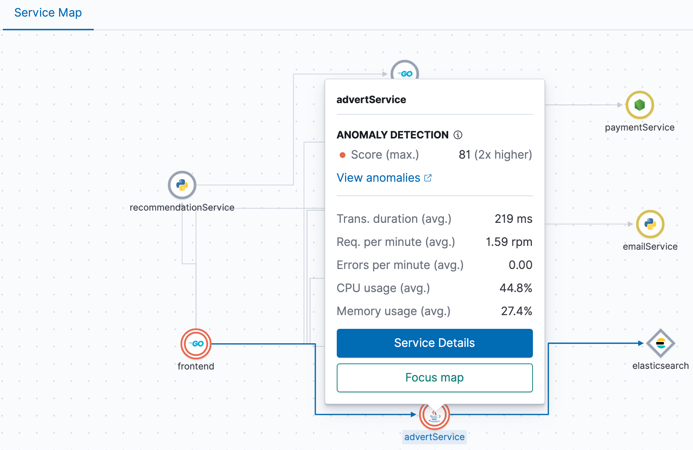

# Tutorial: Getting Started with Elasticsearch Service for Java developers running on Azure

This tutorial shows you how to provision an Elasticsearch Service cluster on Microsoft Azure. We have chosen to walk you through deploying a hosted Elasticsearch Service on Azure, rather than deploying a self-managed environment, as it is the quickest way of spinning up an Elasticsearch cluster.

If you are already familiar with deploying an Elasticsearch cluster, this tutorial still covers very useful information to even more experienced users. It identifies and articulates various benefits applicable for Java developers. At various times, details around the various out-of-the-box solutions are discussed, such as how to ingest data and how Kibana can provide insight into the environment both during development and at run-time..

## Audience

This tutorial is focused for those who wish to deploy Elasticsearch clusters on a hosted platform on Microsoft Azure. This document’s intentions are to assist both Java developers and general practitioners with some of the out-of-the-box tools they can take advantage of with little additional configuration.

This tutorial is focused on helping a Java developer get started with Elasticsearch on Microsoft Azure, but is by no means the only audience that can benefit from it. In addition, this tutorial provides guidance to get started with Elasticsearch, and is in no way meant to be exhaustive to what features exist by utilizing Elasticsearch SaaS hosted on Microsoft Azure.

## Overview

In this tutorial, you'll learn how to:

> * Deploy an Elasticsearch Service cluster on Microsoft Azure.
> * Configure an Elastic APM Java Agent to capture JVM and Java application metrics.
> * Configure an Elastic Filebeat for capturing server system and application logs.
> * Use Kibana for visualizing relevant APM, logs and metrics data.

## Prerequisites
> * An application server, and optionally a Java development environment to work with live data.
> * Optionally check out the various [Getting Started](https://www.elastic.co/videos/) videos to spark your curiosity and to have some expectations while embarking on the Elasticsearch journey.

## Getting Started

From the [Azure Marketplace](https://azuremarketplace.microsoft.com), search for and click on **Elasticsearch Service**. You will see a link to sign up with a free Elasticsearch Service trial along being able to read about the usefulness, depicted under the **Key Features** section. This page is a great starting point for those wishing to embark on the Elasticsearch journey.

## Create a deployment in just minutes on Microsoft Azure

Once an [Elastic Cloud](https://cloud.elastic.co) account is active, after you have signed up, login and click **Create Deployment**. The following process should take just enough time to grab a snack or cup of coffee or tea.

Enter a name for the deployment, such as **azessdemo**

Select **Azure** cloud platform.  

Select a region closest to you.

Optionally choose an **Elastic Stack version**.

> [!TIP]
> The latest version available is always displayed, though can be altered. Keep in mind that updating versions at a later time is trouble free, with little to no downtime and is coordinated by the Elasticsearch services. Additionally, if you have been running the self-managed deployment on Azure, then there are easy ways to migrate depicted on this page.

Choose the **I/O Template** as the type of deployment to use.

### Choosing the right deployment type

Deployment templates are what Elasticsearch provides you, to get up and running on the Elastic Cloud quickly. To get started, there is no need to determine how many nodes are needed, nor how much memory or storage each should have.

Every deployment template includes a set of components called **instances** which are appropriately sized based on the type of workload selected. These instances include Elasticsearch data, ingest, as well as Kibana for every deployment, but there are additional instances one can include at the time of deployment, or later, such as a machine learning (ML) node, dedicated monitoring nodes, an Application Performance Monitoring (APM) server, or when ingesting data from an expansive environment, a coordinating node. Instance configurations map to [Azure instance types](https://www.elastic.co/guide/en/cloud/current/ec-reference-hardware.html#ec_azure).

At Elastic, we understand there is never a one-size-fits all deployment type, and that is why we provide various templates which have customization options, if you should choose. Elasticsearch Service on Microsoft Azure provides stability, consistent performance, and greater flexibility, ensuring you always have whatever resources you need, where and when you need them.

For most general search use cases, the **I/O Template** would be suitable, however, for more specific uses cases, there are other templates which may be more suitable. For example, **hot-warm** templates are typically used for logging use cases. [Hot-Warm Architecture](https://www.elastic.co/guide/en/cloud/current/ec-getting-started-templates-hot-warm.html) configures different tiers of data nodes, with hot data nodes optimised for indexing and high search throughput and warm data nodes optimised for cost effective storage. Index Lifecycle Management Policies ensure that the numerous logs that no longer need to be frequently queried get moved to the **warm data nodes**.

> [!div class="nextstepaction"]
> [Read more about deployment templates](https://www.elastic.co/guide/en/cloud/current/ec-getting-started-templates.html)

## Elastic Observability
The **I/O Optimized** template enables, by default, Elastic APM, an application performance monitoring system. This makes it an ideal deployment template for developers. Elastic APM is one service making up the [Elastic Observability](https://www.elastic.co/observability) solution of apps. Others include Elastic Logs, Elastic Metrics and Elastic Uptime.

Elastic Observability is not just for the development perspective, nor just for helping with break-fix scenarios. Elastic Observability drives intelligent operational decisions based on gaining an insight as to whom may have been impacted, how they may have reacted, how much money may have been lost, and more. Utilizing machine learning, an optionally enabled service offered through the Platinum [Elastic Cloud managed service pricing plan(https://www.elastic.co/pricing), to detect anomalies that can also help prevent unforeseen circumstances in a more proactive manner.

The APM Server ingests data from agents, the open source libraries that sit on your application host which instrument the code and collect performance data and errors at run-time. The APM Java Agent can help Java developers by capturing data to help determine the root cause for perhaps a web transaction timing out because a server has run out of cache, a result of seeing anomalies in the heap usage.

This is possible because Kibana brings together the relevant logs and metrics, into one centralized location. The various APM agents capture [instrumented application events](https://www.elastic.co/guide/en/apm/get-started/7.8/apm-data-model.html) such as spans, transactions, errors and metrics.

> [!div class="nextstepaction"]
> [Read more about Elastic’s APM system](https://www.elastic.co/guide/en/apm/get-started/7.8/overview.html)

> [!TIP]
> Optionally explore additional customization options by clicking **Customize deployment**, and remember to click the **Learn more** links for additional reading.

Click **Create deployment**. Remember to make a note of the password that gets created for the `elastic` user (don’t worry if you forget to take a note of it - you can easily [reset](https://www.elastic.co/guide/en/cloud/current/ec-password-reset.html) the password)

## Launching Kibana

The I/O Template will deploy an instance of Kibana by default. Kibana is [Your window into the Elastic Stack](https://www.elastic.co/kibana) where
building and exploring dashboards gives you the ability, and freedom, to bring insights into the hands who need them. Remember the age old saying, “a picture says a thousand words?” Well, Kibana is that same picture, “worth a thousand log lines.”

To launch Kibana, select the **‘Launch**’ link within your Deployment page next to Kibana (alternatively, the link is available within the Kibana sub-section under your deployment). To begin with, you can login with your `elastic` username and password (created when you first created your deployment).

Getting started looking at real world data is as simple as clicking the **Try our sample data**, which not only loads the sample data but also sample dashboards and more. This option is great to get familiar with Kibana and its features, and immediately see the power of Kibana, where everyone can see the benefits in creating, customizing and utilizing all the amazing dashboards containing histograms, graphs, pie charts, maps and more!

Check out this wonderful [Getting Started with Kibana](https://www.elastic.co/webinars/getting-started-kibana) video!

The purpose of this tutorial is to get you ingesting your own data to be searched and visualized in Kibana, and that is what we will proceed with doing.

## Ingesting your data into Elasticsearch and visualizing it in Kibana

Assuming you had taken the advice and watched some of the great Getting Started videos, especially the Getting Started with Kibana video, and got excited about what you saw. We can get you looking at your own data in the same way, by following the rest of this tutorial.

What kinds of data matters to you? Are you more interested in the performance metrics for the application, JVM, container, or cloud platform? Do you need to analyze thousands of lines of log files from many different kinds of sources, all in one location just to find out why your users cannot connect, or why an app is running slow, or not running at all?

The answers are centralized in Kibana.


> [!TIP]
> It helps to have specific goals in mind when setting up Elasticsearch, so start with some of the basics. Since deploying the **I/O Template** comes with the [Elastic APM](https://www.elastic.co/guide/en/apm/get-started/7.8/index.html) app, you can take advantage of it for your Java development environment with minimal configuration.

### Elastic APM Java Agent

For a Java developer, there is nothing easier than utilizing the [Elastic APM Java Agent](https://www.elastic.co/guide/en/apm/agent/java/1.x/index.html) to get relevant data into Kibana. The APM Java Agent is an out-of-the-box bytecode instrumentation tool leveraging the JVM to automatically measure the performance of applications, including support for popular frameworks such as Servlet API, Spring MVC, and Spring Boot. There is also an API enabling an unlimited number of custom instrumentations.

Getting relevant data into Kibana begins by installing the **APM Java Agent** through the Kibana interface.

From the Home screen, simply click **Add APM** where you will see a number of APM Agents available.

> [!NOTE]
> If you had selected a different template where the APM Server was not enabled by default, there will be a note explaining what to do, which is simply to enable it in the deployment settings, i.e. edit the deployment where you created it originally and where you launched Kibana. Same can be said if you wish to enable machine learning.

Select the **Java** agent tab.

Deploying agents through Kibana means that you have all the necessary instructions, in one place, making the deployment and configuration straightforward and simple.

You will download the agent jar from Maven Central, onto your application host, and then start it with a properties script, similar to what is depicted below. Don’t forget to change the service name **my-application** which Kibana will pickup and use as the named service within Kibana, as well as the root application package **org.example** if applicable, as well as the actual compiled jar file name.

> [!TIP]
> There are helpful links throughout the interface providing more instructions should you need. The connectivity url and token have already been correctly added for you, ensuring the connection to the cloud deployment of Elasticsearch is successful. The only thing that you need to ensure, is that the agent monitors the correct service.


```Agent configuration example
java -javaagent:/path/to/elastic-apm-agent-<version>.jar \
    -Delastic.apm.service_name=my-application \
    -Delastic.apm.server_urls=https://ffca87c25.apm.eastus2.azure.elastic-cloud.com:443 \
    -Delastic.apm.secret_token=yHWPquEpa3x0bruhqP \
    -Delastic.apm.application_packages=org.example \
    -jar my-application.jar
```

> [!TIP]
> Rather than pasting this entire configuration example into your command line, you can use a configuration file named **elasticapm.properties**. Please refer to the [APM Java Agent configuration reference](https://www.elastic.co/guide/en/apm/agent/java/1.x/configuration.html)  for more details.

Once the application and agent have been started, click **Load Kibana objects** and then **Launch APM**.

There are main tabs are Services, Traces, and a Service Map where you can visually see how services are connected, and also see which may be having issues depicted by alert colors. In the case of the following screenshot, an anomaly detection alert, established through machine learning features, detected unusual behavior in the average transaction duration.



Clicking a java agent service will allow you to analyze a number of metrics, such as transaction details, error details including the actual error message, and JVM performance data, such as heap usage and thread counts, as seen in the following screenshot.


### Ingesting logs

Throughout your environment, we can assume there are tons of threads in logs, spread across many different applications, servers, and locations with different format types and even possibly languages that a person in your position must analyze. It is not practical, nor scalable, to try and analyze them by logging onto each system and to parse through those 10s of thousands of lines of text. Rather, there is a much more efficient method to analyze such large amounts of log file data, provided at no additional cost. One in particular is [Filebeat](https://www.elastic.co/beats/filebeat), Elastic’s lightweight data shippers for logs.


Filebeat is one of the many open platform [Beats](https://www.elastic.co/beats) Elastic offers out-of-the-box. Beats are designed by Elastic to understand your applications, sending relevant the data directly into Elasticsearch, or to [Logstash](https://www.elastic.co/logstash) for further processing. With Logstash, you can apply many data manipulation techniques, such as applying transformations, to data before beingit is indexed in Elasticsearch. There is also a large amount of [community Beats](https://www.elastic.co/guide/en/beats/libbeat/7.8/community-beats.html) which means that most likely, anything you may need has already been developed, or offers a great starting point to build off of.

Configuring Filebeat, as with the APM Java Agent, begins within Kibana where clear instructions are depicted. The setup depends on your system, but essentially consists of downloading, configuring the **filebeat.yml** file, which essentially consists of setting what to collect, and where they need to go, and then running the setup commands. The process generally takes under five minutes.

Additionally, you may want to enable modules relevant to your environment, such as if you are running Nginx or MySQL. There is also a **Systems Logs module** which you can enable upon installing Filebeat. Check out all the out-of-the-box types of [Elastic Integrations](https://www.elastic.co/integrations). Many come with pre-built dashboards and visualizations, getting you up and running even faster!  

> [!NOTE]
> Filebeat guarantees at-least-once delivery and from then on keeps track of the last lines sent by utilizing [harvesters](https://www.elastic.co/guide/en/beats/filebeat/7.8/how-filebeat-works.html#harvester). There is a *registry* which rebuilds the state should Filebeat get restarted. If that registry gets corrupted or deleted, then all the logs will need to be re-sent to Elasticsearch.

We will install Filebeat along with adding a system log monitoring module. Once Filebeat is installed, any of the modules that ship with it can be enabled by running a few simple commands. For more detailed instructions, please visit the [Getting Started with Filebeat](https://www.elastic.co/guide/en/beats/filebeat/7.8/filebeat-getting-started.html) reference guide.

Click **Add log data** from the Kibana homemain page.

Choose **System logs**.


Choose your application host’s operating system to follow the instructions.

> [!IMPORTANT]
> During the second step, we will want to make one additional configuration change to the *filebeat.yml* file in order to also collect the relevant log datafiles you wish to import into Kibana.

In order to make athe connection between the application server and Elasticsearch, you must set two variables, the `cloud.id`, which has been provided, and the `cloud.auth`, requiring you to just modify the &lt;password&gt;.

> [!IMPORTANT]
> That password is the same one used to launch Kibana, so if you change that password, all agents and modules will need to be updated.

While the filebeat.yml file is still open, at the top you will see a section called `filebeat.inputs`. This is where you will point to your logs, or log directories, for Filebeat to ship to Elasticsearch. Please follow the embedded instructions within that file or use the [Filebeat configuration reference guide](https://www.elastic.co/guide/en/beats/filebeat/7.1/filebeat-configuration.html), and don't forget to enable it!

```Sample filebeat.yml log input configuration
filebeat.inputs:
- type: log
 enabled: true
 paths:
   - /var/log/*.log
```
Notice that `enabled` must be set to `true`.

Finish by following the steps depicted in Kibana.

## Viewing the ingested data in Kibana

### Logs

A developer will be very interested in data log analysis, during the development process as well as during run-time. On the left navigation menu, click **Logs** under Observability. This is one area where logs are centralized and visualized, and can even be streamed in real time by clicking on **Stream live** in the upper right side of the screen. Query terms can be searched and/or highlighted, and the Timepicker can be customized.

Please start by searching for a particular event, such as errors, by entering **mozilla** in the query bar. Notice the log histogram on the right side, an indication of when log entries were ingested. This can be helpful to see from a high level, when a large number of events took place.

View more details by clicking the **Log line details**.


### Discover

Discover is the perfect app Kibana has to offer users who wish to begin creating relevant visualizations which represent the message data alone in its raw format cannot. Before using Discover an [index pattern](https://www.elastic.co/guide/en/kibana/7.8/index-patterns.html) must be created. Fortunately for us, Filebeat provides a basic indexing pattern we can build off of, so we are not having to start from scratch.

> [!TIP]
> To get started with Discover and other visualizations, you can take advantage of the [sample data set](https://www.elastic.co/guide/en/kibana/7.8/getting-started.html#get-data-in) that comes with extensive index patterns, visualizations and dashboards.

Within Discover you can see an ingest of data


### System logs

Please do notice the various visualizations that come out-of-the-box in dashboards for Syslog, Sudo commands, SSH logins and New users and groups. To visualize from the Kibana Homemain page, click on *Dashboards** and search for *sys*. Try it out by running a few sudo commands on your system with Filebeat configured, or connecting with SSH including throwing in a bad credential, looking at their respective dashboards.

> [!TIP]
> Don’t see anything new, be sure to click **Refresh** in the upper right side of the screen, or set the refresh rate by clicking the calendar icon just to the left of the refresh button.

## Enable some useful troubleshooting graphs and logs in Kibana
