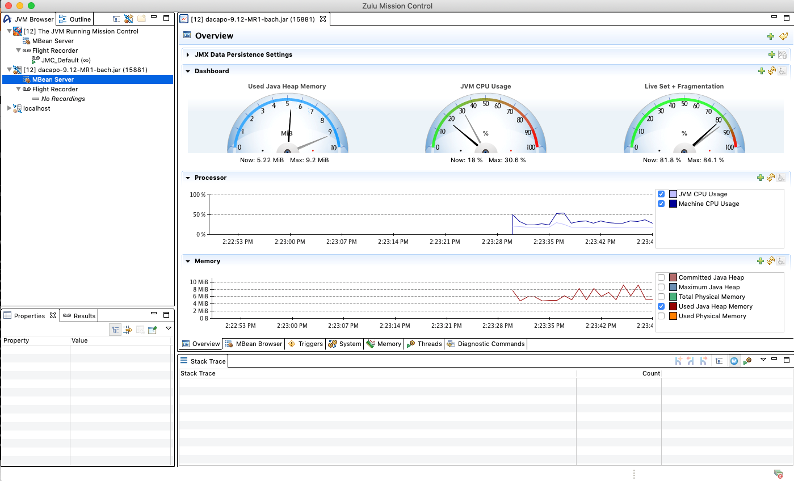
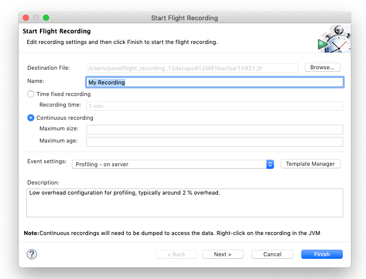

# Monitor and manage Java workloads with Zulu Flight Recorder and Zulu Mission Control

This article shows you how to monitor and manage Java workloads with Zulu Flight Recorder and Zulu Mission Control.

Zulu Mission Control is a fully tested build of JDK Mission Control. Oracle open-sourced Mission Control in 2018, and it's managed as a project under the OpenJDK umbrella. Coupled with Flight Recorder, Mission Control delivers low-overhead, interactive monitoring and management capabilities for Java workloads.

Zulu Mission Control is compatible with the following JDKs/JREs:

* Zulu 12.1 and later
* Zulu 11.0 and later
* Zulu 8u202 (8.36) and later
* Oracle OpenJDK 11+15 and later
* Oracle Java 11.0 and later
* Oracle Java 8.0 and later

Follow the steps below to install Zulu Mission Control, connect to a Java Virtual Machine (JVM), and gain real-time visibility into all aspects of a running application.

1. [Install a Zulu Mission Control compatible JDK/JRE](java-jdk-install.md).

2. Download Zulu Mission Control from [the Azul download site](https://www.azul.com/products/zulu-mission-control/), choose the appropriate version for your system, save it locally, and change to that directory.

3. Expand the downloaded file.

    **Linux:**

    ```cli
    tar -xzvf zmc7.0.0-EA-linux_x64.tar.gz
    ```

    **Windows:**

    ```cli
    unzip -zxvf zmc7.0.0-EA-win_x64.zip
    ```

    **macOS:**

    ```cli
    tar -xzvf zmc7.0.0-EA-macosx_x64.tar.gz
    ```

4. Start your Java application using one of the compatible JDKs. For example:

    ```cli
    $JAVA_HOME/bin/java -jar MyApplication.jar
    ```

5. Start Zulu Mission Control

    **Linux:**

    ```cli
    zmc7.0.0-EA-linux_x64/zmc
    ```

    **Windows:**

    ```cli
    zmc7.0.0-EA-win_x64\zmc.exe
    ```

    **macOS:**

    ```cli
    zmc7.0.0-EA-macosx_x64/Zulu\ Mission\ Control.app/Contents/MacOS/zmc
    ```

6. Switch the JVM installation for Mission Control (optional).

    On Windows, *zmc.exe* will use the default JVM installation configured in the registry. You must launch Zulu Mission Control from a full JDK so you can detect local JVM instances automatically. If you use a JRE, you will see the following warning:

    > [!div class="mx-imgBorder"]
    

    To change the JVM used by Mission Control, follow these steps:

    1. Open the *zmc.ini* configuration file, located in the same directory as *zmc.exe*.

    2. Before the line `-vmargs`, add two lines:

        * On the first line, write `–vm`.
        * On the second line, write the path to your JDK installation. (For example, `C:\Program Files\Java\jdk1.8.0_212\bin\javaw.exe`).

7. Locate the JVM running your application.

    1. In the upper left pane of the Zulu Mission Control window, select the tab labeled **JVM Browser**.

    2. Select and expand the list item in the upper left for the JVM instance running your application.

    > [!div class="mx-imgBorder"]
    

8. Start a Flight Recording, if necessary.

    1. If the Flight Recorder displays "No Recordings", start one. To start a recording, right-click on the Flight Recorder line in the JVM Browser tab and then select **Start Flight Recording**.

    2. Select either a fixed duration recording or a continuous recording, and either a Profiling configuration (fine-grained) or a Continuous configuration (lower overhead), then select **Finish**.

    > [!div class="mx-imgBorder"]
    

9. Dump the Flight Recording.

    1. A Flight Recording should appear below the Flight Recorder line in the JVM Browser. Right-click on the line representing the Flight Recording and select **Dump whole recording**.

    2. A new tab will appear in the large pane on the right side of the Zulu Mission Control window. This pane represents the Flight Recording just dumped from the JVM running your application.

10. Examine the Flight Recording using Zulu Mission Control
    1. If not already activated, select the tab labeled **Outline** in the left pane of the Zulu Mission Control Window. This tab contains different views of the data collected in the Flight Recording.

    > [!div class="mx-imgBorder"]
    

## Resources

We've also prepared a [demonstration video](https://www.azul.com/presentation/azul-webinar-open-source-flight-recorder-and-mission-control-managing-and-measuring-openjdk-8-performance/) narrated by Azul Systems Deputy CTO Simon Ritter. The video walks you through the configuration and setup of both Flight Recorder and Zulu Mission Control. The Flight Recorder discussion starts at 31:30.
