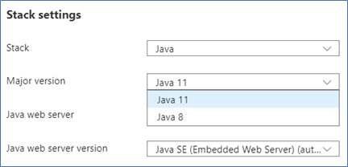

# Transition from Java 7 to Java 8

This article provides high-level guidance on migrating your application from Java 7 to Java 8. The usage of Java 8 features isn't covered.

There's no one-size-fits-all solution to transition code from Java 7 to Java 8.
Moving from Java 7 to Java 8 is typically a small amount of work. Potential issues
include a handful of changed APIs, tightening of type inference in javac, changes to class loaders,
and changes to *permgen* (part of garbage collection).

In general, the best approach is to try to run on Java 8 without recompiling first.
This approach will get your application up and running as quickly as possible.
For a library, your goal will be to publish an artifact that's compiled and tested with JDK 8.

## Java 7 End of Life (EOL)

Community support will end when Java 7 reaches End Of Life on 29 July 2022.
Any applications running on Java 7 will continue to run, but Java 7 itself won't receive updates or security patches.
To minimize risk and potential security vulnerabilities, upgrade your applications to
Java 8 or 11 depending on your workload requirements.

The canonical guide to follow is the [Oracle JDK Migration Guide](https://www.oracle.com/java/technologies/javase/jdk8-adoption-guide.html). The migration guide covers all of the [incompatibilities in the Java specification](https://www.oracle.com/java/technologies/javase/8-compatibility-guide.html#A999198) and
[incompatibilities in the JDK implementation](https://www.oracle.com/java/technologies/javase/8-compatibility-guide.html#A999387). Most of these incompatibilities are edge cases, and you should investigate when you see a warning or experience an error.

## Running on Java 8

Most applications should run on Java 8 without modification. The first thing to try
is to run on Java 8 without recompiling the code. The point of just running is to
see what warnings and errors come out of the execution. This approach gets an  
application to run on Java 8 more quickly by focusing on the minimum work that needs
to be done.

You can resolve most of the problems you may come across without having to recompile code.
If you have to fix an issue in the code, then make the fix, but continue to compile
with JDK 7. If possible, work on getting the application to *run* with `java`
version 8 before *compiling* with JDK 8.

## Compiling with Java 8

Compiling with JDK 8 may require updates to build scripts, tools, test frameworks,
and included libraries. Use the `-Xlint:unchecked` option for `javac` to get the
details on the use of JDK internal API and other warnings.

## Migration off Java 7 for Azure App Service

To migrate your App Services from Java 7 to Java 8 or 11, sign in to Azure portal, navigate to the web app(s) you want to update,
then go to **Configuration** > **Settings** > **Stack Settings**. You'll see dropdowns for the Java major and minor
versions, and the Tomcat version if you're using Tomcat. Select Java 8 or 11. Remember, you can make this configuration change in a deployment slot to safely test the configuration change, then swap the new environment into production. (Java 7 may be hidden to keep customers from taking dependencies on old runtimes.) For more information, see [Set up staging environments in Azure App Service](/azure/app-service/deploy-staging-slots).

You can use the `JAVA_TOOLS` app setting if you need to specify any new runtime options, and they'll be applied when your application starts. For more information, see [Configure a Java app for Azure App Service](/azure/app-service/configure-language-java?pivots=platform-linux). For more information about support policies for runtimes on App Service, see the [Built-in languages and frameworks](/azure/app-service/overview#built-in-languages-and-frameworks) section of the [App Service overview](/azure/app-service/overview).

## Next steps

After you get your application to run on Java 8, we recommend following the Java modernization path to Java 11 using
the following guides.

* [Reasons to move to Java 11](./reasons-to-move-to-java-11.md).
* [Transition from Java 8 to Java 11](./transition-from-java-8-to-java-11.md).
