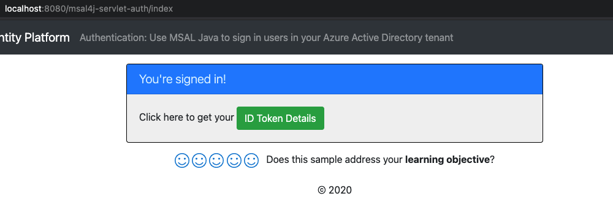

# Enable your Java Tomcat web app to sign in users to your Microsoft Entra ID tenant with the Microsoft identity platform

This article demonstrates a Java Tomcat web app that signs in users to your Microsoft Entra ID tenant using the [Microsoft Authentication Library (MSAL) for Java](https://github.com/AzureAD/microsoft-authentication-library-for-java).

[!INCLUDE [enable-java-servlet-webapp-authn-entra-id.md](includes/enable-java-servlet-webapp-authn-entra-id.md)]

#### Deploying the Sample

TODO: update this with the actual steps or a link to the specific guidance

Our samples can be deployed to a number of application servers, such as Tomcat, WebLogic, or Webshpere, and MSAL Java itself can generally be integrated into existing applications without changes to your existing deployment set up.

You can find instructions for deploying our samples [here on MSAL Java's Github wiki](https://github.com/AzureAD/microsoft-authentication-library-for-java/wiki/Deployment-Instructions-for-MSAL-Java-Samples).

[!INCLUDE [enable-java-servlet-webapp-authn-entra-id-explore.md](includes/enable-java-servlet-webapp-authn-entra-id-explore.md)]