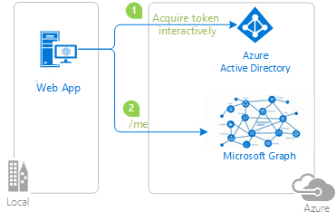

# Enable your Java Jboss EAP web app to sign in users and access resources on Microsoft Graph

This sample demonstrates a Java Jboss EAP web app that signs in users and obtains an access token for calling [Microsoft Graph](https://docs.microsoft.com/graph/overview). It uses the [Microsoft Authentication Library (MSAL) for Java](https://github.com/AzureAD/microsoft-authentication-library-for-java).

[!INCLUDE [enable-java-servlet-webapp-authorization-entra-id.md](includes/enable-java-servlet-webapp-authorization-entra-id.md)]

#### Deploying the Sample

Before you can deploy to JBoss, you will need to make some configuration changes in the sample itself and (re)build the package:

1. In the sample there is likely an application.properties or authentication.properties file where you configured the client ID, tenant, redirect URL, etc.

2. In the above mentioned steps, changed references to localhost:8080 or localhost:8443 to the URL/port JBoss will run on, which by default should be localhost:9990

3. You will also need to make the same change in the Azure app registration, where you set it as the 'Redirect URI' in the 'Authentication' tab

To deploy the sample to JBoss EAP via the web console:

1. Start the JBoss server with %JBOSS_HOME%\bin\standalone.bat

2. Navigate to the JBoss web console in your browser, http://localhost:9990

3. Go to Deployments, click Add, and upload the .war you built

4. Most of the default settings should be fine except that you should name the application to match the 'Redirect URI' you set in sample configuration/Azure app registration, i.e. if the redirect URI is http://localhost:9990/msal4j-servlet-auth/ then you should name the application 'msal4j-servlet-auth'

5. Select the .war file you uploaded, click En/Disable, and Confirm to start the application

6. Once the application starts, navigate to http://localhost:9990/{whatever you named the application}/, and you should be able to access the application

[!INCLUDE [enable-java-servlet-webapp-authorization-entra-id-explore.md](includes/enable-java-servlet-webapp-authorization-entra-id-explore.md)]