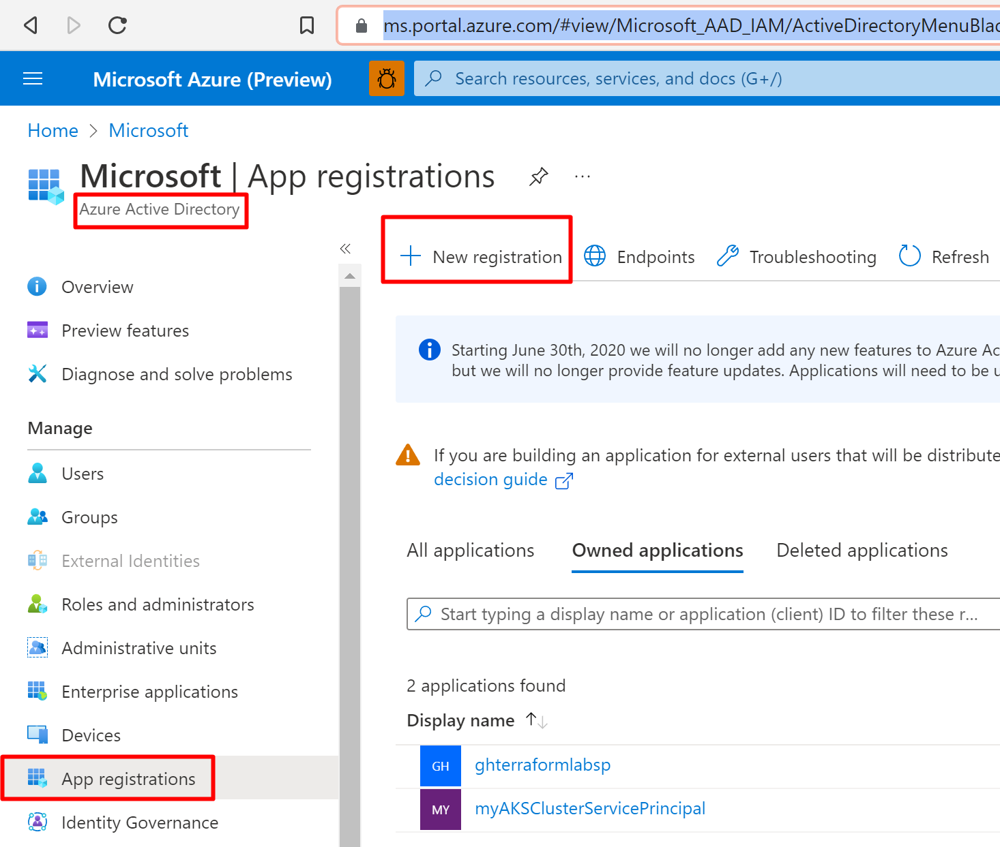
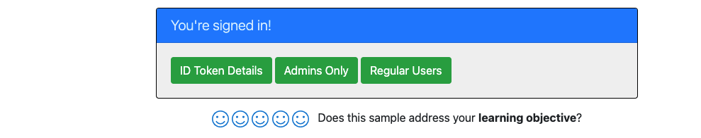

# Add authorization using app roles & roles claims to Java servlet Web app that signs-in users with the Microsoft identity platform

This article shows you how to restrict access to routes using app roles with the Microsoft Identity Platform and Azure Active Directory. 

The [sample code snippets](https://github.com/Azure-Samples/ms-identity-msal-java-samples/tree/main/4.%20Spring%20Framework%20Web%20App%20Tutorial/3-Authorization-II/roles) are available in GitHub as runnable Java files.

[Package (maven))](https://mvnrepository.com/artifact/com.microsoft.identity.client/msal) | [Samples](https://github.com/Azure-Samples/ms-identity-msal-java-samples) | [API reference](https://javadoc.io/doc/com.microsoft.azure/msal4j/latest/index.html) | [Library source code](https://github.com/AzureAD/microsoft-authentication-library-for-java) | [Give Feedback](https://github.com/AzureAD/microsoft-authentication-library-for-java/issues)


## Prerequisites

- Azure subscription - [create one for free](https://azure.microsoft.com/free/)
- [JDK Version 15](https://jdk.java.net/15/). This sample has been developed on a system with Java 15 but may be compatible with other versions.
- [Maven 3](https://maven.apache.org/download.cgi)
- [Java Extension Pack for Visual Studio Code](https://marketplace.visualstudio.com/items?itemName=vscjava.vscode-java-pack) is recommended for running this sample in VSCode.
- An **Azure AD** tenant. For more information see: [How to get an Azure AD tenant](https://docs.microsoft.com/azure/active-directory/develop/quickstart-create-new-tenant)
- A user account in your **Azure AD** tenant. This sample will not work with a **personal Microsoft account**. Therefore, if you signed in to the [Azure portal](https://portal.azure.com) with a personal account and have never created a user account in your directory before, you need to do that now.

## Overview

This sample shows how a Java servlet web app that uses [OpenID Connect](https://docs.microsoft.com/azure/active-directory/develop/v1-protocols-openid-connect-code) to sign in users and use [**Azure AD Application Roles (app roles)**](https://docs.microsoft.com/azure/active-directory/develop/howto-add-app-roles-in-azure-ad-apps) for authorization. App roles, along with Security groups are popular means to implement authorization.

This application implements RBAC using Azure AD's Application Roles & Role Claims feature. Another approach is to use Azure AD Groups and Group Claims. Azure AD Groups and Application Roles are by no means mutually exclusive; they can be used in tandem to provide even finer grained access control.

Using RBAC with Application Roles and Role Claims, developers can securely enforce authorization policies with minimal effort on their part.

- A Microsoft Identity Platform Office Hours session covered Azure AD App roles and security groups, featuring this scenario and this sample. A recording of the session is is provided in this video [Using Security Groups and Application Roles in your apps](https://www.youtube.com/watch?v=LRoc-na27l0)

For more information about how the protocols work in this scenario and other scenarios, see [Authentication Scenarios for Azure AD](http://go.microsoft.com/fwlink/?LinkId=394414).

## Scenario

1. This web application uses [**MSAL for Java (MSAL4J)**](https://github.com/AzureAD/microsoft-authentication-library-for-java) to sign in a user and obtain an [ID Token](https://docs.microsoft.com/azure/active-directory/develop/id-tokens) from **Azure AD**:

This sample first leverages the  **MSAL for Java (MSAL4J)** to sign in the user. On the home page it displays an option for the user to view the claims in their ID Tokens. This web application also allows the users to view a **privileged admin page** or a **regular user page** depending on the app role they have been assigned to. The idea is to provide an example of how, within an application, access to certain functionality/page is restricted to subsets of users depending on which role they belong to.

This kind of authorization is implemented using role-based access control (RBAC). When using RBAC, an administrator grants permissions to roles, not to individual users or groups. The administrator can then assign roles to different users and groups to control who has then access to certain content and functionality.  

This sample application defines the following two *Application Roles*:

- `PrivilegedAdmin`: Authorized to access the `Admins Only` and the `Regular Users` pages.
- `RegularUser`: Authorized to access the `Regular Users` page.

These application roles are defined in the [Azure portal](https://portal.azure.com) in the application's registration manifest.  When a user signs into the application, Azure AD emits a `roles` claim for each role that the user has been granted individually to the user in the from of role membership.  Assignment of users and groups to roles can be done through the portal's UI, or programmatically using the [Microsoft Graph](https://graph.microsoft.com) and [Azure AD PowerShell](https://docs.microsoft.com/powershell/module/azuread/?view=azureadps-2.0).  In this sample, application role management is done through the Azure portal or using PowerShell.

⚠️NOTE: Role claims will not be present for guest users in a tenant if the `https://login.microsoftonline.com/common/` endpoint is used as the authority to sign in users. You need to sign-in a user to a tenanted endpoint like 'https://login.microsoftonline.com/tenantid'

## Setup

### Clone or download this repository

From your shell or command line:

```console
git clone https://github.com/Azure-Samples/ms-identity-java-servlet-webapp-authentication.git
cd 3-Authorization-II/roles
```

or download and extract the repository .zip file.

> :warning: To avoid file path length limitations on Windows, clone the repository into a directory near the root of your hard drive.

## Register the sample application with your Azure Active Directory tenant

There is one project in this sample. To register the app on the portal, you can:

- either follow manual configuration steps below
- or use PowerShell scripts that:
  - **automatically** creates the Azure AD applications and related objects (passwords, permissions, dependencies) for you.
  - modify the projects' configuration files.
  - by default, the automation scripts set up an application that works with **accounts in your organizational directory only**.

<details>
  <summary>Expand this section if you want to use PowerShell automation.</summary>

1. On Windows, run PowerShell and navigate to the root of the cloned directory
1. In PowerShell run:

   ```PowerShell
   Set-ExecutionPolicy -ExecutionPolicy RemoteSigned -Scope Process -Force
   ```

1. Run the script to create your Azure AD application and configure the code of the sample application accordingly.
1. In PowerShell run:

   ```PowerShell
   cd .\AppCreationScripts\
   .\Configure.ps1
   ```

   > Other ways of running the scripts are described in [App Creation Scripts](./AppCreationScripts/AppCreationScripts.md)
   > The scripts also provide a guide to automated application registration, configuration and removal which can help in your CI/CD scenarios.

</details>

### Choose the Azure AD tenant where you want to create your applications

As a first step you'll need to:

1. Sign in to the [Azure portal](https://portal.azure.com).
1. If your account is present in more than one Azure AD tenant, select your profile at the top right corner in the menu on top of the page, and then **switch directory** to change your portal session to the desired Azure AD tenant.

### Register the web app (java-servlet-webapp-roles)



[Register a new web app](https://docs.microsoft.com/azure/active-directory/develop/quickstart-register-app) in the [Azure Portal](https://portal.azure.com).
Following this guide, you must:

1. Navigate to the Microsoft identity platform for developers [App registrations](https://go.microsoft.com/fwlink/?linkid=2083908) page.
1. Select **New registration**.
1. In the **Register an application page** that appears, enter your application's registration information:
   - In the **Name** section, enter a meaningful application name that will be displayed to users of the app, for example `java-servlet-webapp-roles`.
   - Under **Supported account types**, select an option.
     - Select **Accounts in this organizational directory only** if you're building an application for use only by users in your tenant (**single-tenant**).
   - In the **Redirect URI** section, select **Web** in the combo-box and enter the following redirect URI: `http://localhost:8080/msal4j-servlet-roles/auth/redirect`.
1. Select **Register** to create the application.
1. In the app's registration screen, find and note the **Application (client) ID**. You use this value in your app's configuration file(s) later in your code.
1. Select **Save** to save your changes.
1. In the app's registration screen, click on the **Certificates & secrets** blade in the left to open the page where we can generate secrets and upload certificates.
1. In the **Client secrets** section, click on **New client secret**:
   - Type a key description (for instance `app secret`),
   - Select one of the available key durations (**In 1 year**, **In 2 years**, or **Never Expires**) as per your security concerns.
   - The generated key value will be displayed when you click the **Add** button. Copy the generated value for use in the steps later.
   - You'll need this key later in your code's configuration files. This key value will not be displayed again, and is not retrievable by any other means, so make sure to note it from the Azure portal before navigating to any other screen or blade.

#### Define the Application Roles

1. Still on the same app registration, select the **App roles** blade to the left.
1. Select **Create app role**:
    - For **Display name**, enter a suitable name, for instance **PrivilegedAdmin**.
    - For **Allowed member types**, choose **User**.
    - For **Value**, enter **PrivilegedAdmin**.
    - For **Description**, enter **PrivilegedAdmins who can view the Admin Page**.
1. Select **Create app role**:
    - For **Display name**, enter a suitable name, for instance **RegularUser**.
    - For **Allowed member types**, choose **User**.
    - For **Value**, enter **RegularUser**.
    - For **Description**, enter **RegularUsers who can view the User Page**.
1. Select **Apply** to save your changes.

#### Assign users to the Application roles

 To add users to the app role defined earlier, follow the guidelines here: [Assign users and groups to roles.](https://docs.microsoft.com/azure/active-directory/develop/howto-add-app-roles-in-azure-ad-apps#assign-users-and-groups-to-roles)

### Configure the web app (java-servlet-webapp-roles) to use your app registration

```ini
aad.clientId={enter-your-client-id-here}
aad.secret={enter-your-client-secret-here}
aad.authority=https://login.microsoftonline.com/{enter-your-tenant-id-here}
aad.scopes=openid profile offline_access

## TODO: use aad.instance instead of authority
## TODO: build authority from instance+tenant
## TODO: also baseURL for graph should be configurable (graph.us, graph.cn, etc.)

aad.signOutEndpoint=/oauth2/v2.0/logout/
aad.postSignOutFragment=?post_logout_redirect_uri=

# app.homePage is by default set to dev server address and app context path on the server
# for apps deployed to azure, use https://your-sub-domain.azurewebsites.net
app.homePage=http://localhost:8080/msal4j-servlet-roles

# endpoint for AAD redirect. Configure this to be the same as the URL pattern for AADRedirectServlet.java
app.redirectEndpoint=/auth/redirect

# app's state value validity in seconds
app.stateTTL=600

# where to store session variables related to MSAL
app.sessionParam=msalAuth
# protect these endpoints by checking authenticated
app.protect.authenticated=/token_details

#local short names for app roles - e.g., sets admin to mean PrivilegedAdmin (useful for long rule sets defined in the next key, app.protect.roles)
app.roles=admin PrivilegedAdmin, user RegularUser

# A list of protected routes and its corresponding <space-separated> role(s) that can view it; the start of the next route & its role(s) is delimited by a <comma-and-space-separator>
# # this says: /admins_only can be accessed by PrivilegedAdmin, /regular_user can be accessed by PrivilegedAdmin role and the RegularUser role
app.protect.roles=/admin_only admin, /regular_user admin user
```

Open the project in your IDE to configure the code.

> In the steps below, "ClientID" is the same as "Application ID" or "AppId".

1. Open the `./src/main/resources/authentication.properties` file
2. Find the string `{enter-your-tenant-id-here}`. Replace the existing value with your Azure AD tenant ID.
3. Find the string `{enter-your-client-id-here}` and replace the existing value with the application ID (clientId) of the `java-servlet-webapp-call-graph` application copied from the Azure portal.
4. Find the string `{enter-your-client-secret-here}` and replace the existing value with the key you saved during the creation of the `java-servlet-webapp-roles` app, in the Azure portal.
5. Find the key `app.roles` and make sure the value is set to `app.roles=admin PrivilegedAdmin, user RegularUser` (or substitute the names of your specific roles).

## Run the sample

#### Build .war File Using Maven

1. Navigate to the directory containing the pom.xml file for this sample (the same directory as this README), and run the following Maven command:
    ```
    mvn clean package
    ```
1. This should generate a `.war` file which can be run on a variety of application servers

#### Deploying the Sample

Our samples can be deployed to a number of application servers, such as Tomcat, WebLogic, or Webshpere, and MSAL Java itself can generally be integrated into existing applications without changes to your existing deployment set up.

You can find instructions for deploying our samples [here on MSAL Java's Github wiki](https://github.com/AzureAD/microsoft-authentication-library-for-java/wiki/Deployment-Instructions-for-MSAL-Java-Samples).



## Explore the sample
- Note the signed-in or signed-out status displayed at the center of the screen.
- Click the context-sensitive button at the top right (it will read `Sign In` on first run)
- Follow the instructions on the next page to sign in with an account in the Azure AD tenant.
- On the consent screen, note the scopes that are being requested.
- Note the context-sensitive button now says `Sign out` and displays your username to its left.
- The middle of the screen now has an option to click for **ID Token Details**: click it to see some of the ID token's decoded claims.
- Click the **Admins Only** button to view the `/admin_only`. Only users with app role **PrivilegedAdmin** will be able to view this page. Otherwise an authorization failure message will be displayed.
- Click the **Regular Users** button to view the `/regular_user` page. Only users with app role **RegularUser** or **PrivilegedAdmin** will be able to view this page. Otherwise an authorization failure message will be displayed.
- You can also use the button on the top right to sign out.

> :information_source: Did the sample not work for you as expected? Did you encounter issues trying this sample? Then please reach out to us using the [GitHub Issues](../../../../issues) page.


##  Processing Roles claim in the ID token

The name of the the roles that the signed in user is assigned to is returned in the `roles` claim of the token.

```JSON
{
  ...
  "roles": [
    "Role1",
    "Role2",]
  ...
}
```

## About the code

This sample uses **MSAL for Java (MSAL4J)** to sign a user in and obtain an ID token that may contain the roles claim. Based on the roles claim present, the signed-in user will be able to access none, one, or both of the protected pages, `Admins Only` and `Regular Users`.

If you want to replicate this sample's behavior, you may choose to copy the `pom.xml` file, and the contents of the `helpers` and `authservlets` packages in the `src/main/java/com/microsoft/azuresamples/msal4j` package. You'll also need the [authentication.properties file](src/main/resources/authentication.properties). These classes and files contain generic code that can be used in a wide array of applications. The rest of the sample may be copied as well, but the other classes and files are built specifically to address this sample's objective.

A **ConfidentialClientApplication** instance is created in the [AuthHelper.java](src/main/java/com/microsoft/azuresamples/authentication/AuthHelper.java) class. This object helps craft the AAD authorization URL and also helps exchange the authentication token for an access token.

```Java
// getConfidentialClientInstance method
IClientSecret secret = ClientCredentialFactory.createFromSecret(SECRET);
confClientInstance = ConfidentialClientApplication
                    .builder(CLIENT_ID, secret)
                    .authority(AUTHORITY)
                    .build();
```

The following parameters need to be provided upon instantiation:

- The **Client ID** of the app
- The **Client Secret**, which is a requirement for Confidential Client Applications
- The **Azure AD Authority**, which includes your AAD tenant ID.

In this sample, these values are read from the [authentication.properties](src/main/resources/authentication.properties) file using a properties reader in the class [Config.java](src/main/java/com/microsoft/azuresamples/authentication/Config.java).

### Step-by-step walkthrough

1. The first step of the sign-in process is to send a request to the `/authorize` endpoint on for our Azure Active Directory Tenant. Our MSAL4J `ConfidentialClientApplication` instance is leveraged to construct an authorization request URL. Our app redirects the browser to this URL, which is where the user will sign in.

    ```Java
    final ConfidentialClientApplication client = getConfidentialClientInstance();
    AuthorizationRequestUrlParameters parameters = AuthorizationRequestUrlParameters.builder(Config.REDIRECT_URI, Collections.singleton(Config.SCOPES))
            .responseMode(ResponseMode.QUERY).prompt(Prompt.SELECT_ACCOUNT).state(state).nonce(nonce).build();

    final String authorizeUrl = client.getAuthorizationRequestUrl(parameters).toString();
    contextAdapter.redirectUser(authorizeUrl);
    ```

    - **AuthorizationRequestUrlParameters**: Parameters that must be set in order to build an AuthorizationRequestUrl.
    - **REDIRECT_URI**: Where AAD will redirect the browser (along with auth code) after collecting user credentials. It must match the redirect URI in the  Azure AD app registration on [Azure Portal](https://portal.azure.com)
    - **SCOPES**: [Scopes](https://docs.microsoft.com/azure/active-directory/develop/access-tokens#scopes) are permissions requested by the application.
      - Normally, the three scopes `openid profile offline_access` suffice for receiving an ID Token response.
      - Full list of scopes requested by the app can be found in the [authentication.properties file](./src/main/resources/authentication.properties). You can add more scopes like User.Read and so on.

2. The user is presented with a sign-in prompt by Azure Active Directory. If the sign-in attempt is successful, the user's browser is redirected to our app's redirect endpoint. A valid request to this endpoint will contain an [**authorization code**](https://docs.microsoft.com/azure/active-directory/develop/v2-oauth2-auth-code-flow).
3. Our ConfidentialClientApplication instance then exchanges this authorization code for an ID Token and Access Token from Azure Active Directory.

    ```Java
    // First, validate the state, then parse any error codes in response, then extract the authCode. Then:
    // build the auth code params:
    final AuthorizationCodeParameters authParams = AuthorizationCodeParameters
            .builder(authCode, new URI(Config.REDIRECT_URI)).scopes(Collections.singleton(Config.SCOPES)).build();

    // Get a client instance and leverage it to acquire the token:
    final ConfidentialClientApplication client = AuthHelper.getConfidentialClientInstance();
    final IAuthenticationResult result = client.acquireToken(authParams).get();
    ```

    - **AuthorizationCodeParameters**: Parameters that must be set in order to exchange the Authorization Code for an ID and/or access token.
    - **authCode**: The authorization code that was received at the redirect endpoint.
    - **REDIRECT_URI**: The redirect URI used in the previous step must be passed again.
    - **SCOPES**: The scopes used in the previous step must be passed again.

4. If `acquireToken` is successful, the token claims are extracted. If the nonce check passes, the results are placed in `context` (an instance of `IdentityContextData`) and saved to the session. The application can then instantiate this from the session (by way of an instance of `IdentityContextAdapterServlet`) whenever it needs access to it:

    ```java
    // parse IdToken claims from the IAuthenticationResult:
    // (the next step - validateNonce - requires parsed claims)
    context.setIdTokenClaims(result.idToken());

    // if nonce is invalid, stop immediately! this could be a token replay!
    // if validation fails, throws exception and cancels auth:
    validateNonce(context);

    // set user to authenticated:
    context.setAuthResult(result, client.tokenCache().serialize());
    ```

### Protecting the routes

See `AuthenticationFilter.java` for how the sample app filters access to routes. In the `authentication.properties` file, the key `app.protect.authenticated` contains the comma-separated routes that are to be accessed by authenticated users only.

```ini
# e.g., /token_details requires any user to be signed in and does not require special roles claim(s)
app.protect.authenticated=/token_details
```

Any of the routes listed in the comma-separated rule sets under the `app.protect.roles` are also off-limits to non-authenticated authenticated users.

However, these routes also contain a space-separated list of app role memberships: only users having at least one of the corresponding roles will be able to access these routes after authenticating.

```ini
#local short names for app roles - e.g., sets admin to mean PrivilegedAdmin (useful for long rule sets defined in the next key, app.protect.roles)
app.roles=admin PrivilegedAdmin, user RegularUser

# A route and its corresponding <space-separated> role(s) that can access it; the start of the next route & its role(s) is delimited by a <comma-and-space-separator>
# this says: /admins_only can be accessed by PrivilegedAdmin, /regular_user can be accessed by PrivilegedAdmin role and the RegularUser role
app.protect.roles=/admin_only admin, /regular_user admin user
```

### Scopes

- [Scopes](https://docs.microsoft.com/azure/active-directory/develop/v2-permissions-and-consent) tell Azure AD the level of access that the application is requesting.
- Based on the requested scopes, Azure AD presents a consent dialogue to the user upon signing in.
- If the user consents to one or more scopes and obtains a token, the scopes-consented-to are encoded into the resulting `access_token`.
- Note the scopes requested by the application by referring to [authentication.properties](./src/main/resources/authentication.properties). These three scopes are requested by MSAL and given by Azure Active Directory by default.

### See also

- [Microsoft Authentication Library \(MSAL\) for Java](https://github.com/AzureAD/microsoft-authentication-library-for-java)
- [Microsoft identity platform (Azure Active Directory for developers)](https://docs.microsoft.com/azure/active-directory/develop/)
- [Quickstart: Register an application with the Microsoft identity platform (Preview)](https://docs.microsoft.com/azure/active-directory/develop/quickstart-register-app)
- [Understanding Azure AD application consent experiences](https://docs.microsoft.com/azure/active-directory/develop/application-consent-experience)
- [Understand user and admin consent](https://docs.microsoft.com/azure/active-directory/develop/howto-convert-app-to-be-multi-tenant#understand-user-and-admin-consent)
- [MSAL code samples](https://docs.microsoft.com/azure/active-directory/develop/sample-v2-code)
- [How to: Add app roles to your application and receive them in the token](https://docs.microsoft.com/azure/active-directory/develop/howto-add-app-roles-in-azure-ad-apps)
- [Manage user assignment for an app in Azure Active Directory](https://docs.microsoft.com/en-us/azure/active-directory/manage-apps/assign-user-or-group-access-portal#assign-a-user-to-an-app---portal)