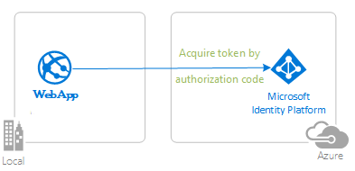

# Tutorial: Enable your Java Spring MVC web app to sign users in, protect endpoints, call APIs with the Microsoft identity platform

The [Microsoft identity platform](https://learn.microsoft.com/entra/identity-platform/v2-overview), along with [Microsoft Entra ID](https://learn.microsoft.com/entra/fundamentals/whatis) and [Azure Azure Active Directory B2C](https://docs.microsoft.com/azure/active-directory-b2c/overview) (Azure AD B2C) are central to the **Azure** cloud ecosystem. This tutorial aims to take you through the fundamentals of modern authentication using the [Microsoft Entra ID Spring Boot Starter client library for Java](https://github.com/Azure/azure-sdk-for-java/tree/main/sdk/spring/spring-cloud-azure-starter-active-directory).

We recommend following the chapters in successive order. However, the code samples are self-contained, so feel free to pick samples by topics that you may need at the moment.

## Prerequisites

- Java 8. This sample has been developed on Java 8 but should be compatible with some higher versions.
- [Maven 3](https://maven.apache.org/download.cgi)
- [Java Extension Pack for Visual Studio Code](https://marketplace.visualstudio.com/items?itemName=vscjava.vscode-java-pack) is recommended for running this sample in VSCode.
- [Visual Studio Code](https://code.visualstudio.com/download)
- [VS Code Azure Tools Extension](https://marketplace.visualstudio.com/items?itemName=ms-vscode.vscode-node-azure-pack)

Please refer to each chapter's README for sample-specific prerequisites.

## Recommendations

- Some familiarity with the [Spring Framework](https://spring.io/)
- Some familiarity with Linux/OSX terminal or Windows PowerShell
- [jwt.ms](https://jwt.ms) for inspecting your tokens.
- [Fiddler](https://www.telerik.com/fiddler) for monitoring your network activity and troubleshooting.
- Follow the [Microsoft Entra ID Blog](https://techcommunity.microsoft.com/t5/microsoft-entra-blog/bg-p/Identity) to stay up-to-date with the latest developments.

Please refer to each sample's README for sample-specific recommendations.

## Contents

### Chapter 1: Enable your web application to sign in users

|               |               |
|---------------|---------------|
|  | [**1.1 Sign-in with Microsoft Entra ID**](./enable-spring-boot-webapp-authentication-entra-id.md)   Sign your users in with **Microsoft Entra ID** and learn to work with **ID Tokens**.  |
|  | [**1.2 Sign-in with Azure AD B2C**](./enable-spring-boot-webapp-authentication-azure-ad-b2c.md)   Sign your customers in with **Azure AD B2C**. Learn to integrate with **external social identity providers**. Learn how to use **user-flows** and **custom policies**. |

### Chapter 2: Get an Access Token and call Microsoft Graph

|                |               |
|----------------|---------------|
|  | [**2.1 Acquire an Access Token from Microsoft Entra ID and call Microsoft Graph**](./enable-spring-boot-webapp-authorization-entra-id.md)   Enable your web app to acquire an Access Token to Authorize it to call **Microsoft Graph API**. |

### Chapter 3: Restrict access to routes based on group and / or role membership

|                |               |
|----------------|---------------|
|  | [**3.1 Acquire an ID Token with the roles claim**](./enable-spring-boot-webapp-authz-role-entra-id.md)   Enable your web app to acquire an ID Token with the **Roles** claim. Filter access to routes based on the role membership. |
|  | [**3.2 Acquire an ID Token with the Groups claim**](./enable-spring-boot-webapp-authorization-group-entra-id.md)   Enable your web app to acquire an ID Token with a **Groups** claim. Filter access to routes based on the role membership. Learn how to call Graph to handle edge cases where the user is a member of too many groups to fit into an ID Token. |

### Chapter 4: Deploy your app to Azure

|                 |               |
|-----------------|---------------|
|  | [**4.1 Deploy to Azure Spring Apps**](https://learn.microsoft.com/azure/spring-apps/how-to-launch-from-source)   Prepare your app for deployment to Azure SPring Apps. Learn how to package and upload files, configure parameters and use various Azure services for managing your operations. |

## More information

Learn more about the **Microsoft identity platform**:

- [Microsoft identity platform](https://learn.microsoft.com/entra/identity-platform/)
- [Azure Active Directory B2C](https://docs.microsoft.com/azure/active-directory-b2c/)
- [Overview of Microsoft Authentication Library (MSAL)](https://learn.microsoft.com/entra/identity-platform/msal-overview)
- [Application types for Microsoft identity platform](https://learn.microsoft.com/entra/identity-platform/v2-app-types)
- [Understanding Microsoft Entra ID application consent experiences](https://learn.microsoft.com/entra/identity-platform/application-consent-experience)
- [Understand user and admin consent](https://learn.microsoft.com/entra/identity-platform/howto-convert-app-to-be-multi-tenant#understand-user-and-admin-consent-and-make-appropriate-code-changes)
- [Application and service principal objects in Microsoft Entra ID](https://learn.microsoft.com/entra/identity-platform/app-objects-and-service-principals)
- [Microsoft identity platform best practices and recommendations](https://learn.microsoft.com/entra/identity-platform/identity-platform-integration-checklist)

See more code samples:

- [MSAL code samples](https://learn.microsoft.com/entra/identity-platform/sample-v2-code?tabs=framework#java)
- [MSAL B2C code samples](https://docs.microsoft.com/azure/active-directory-b2c/code-samples)

