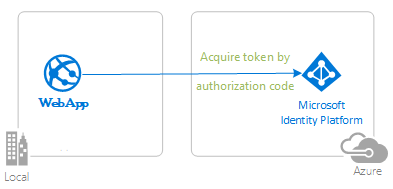

# Enable your Java Spring Boot web app to restrict access to routes using app roles with the Microsoft identity platform

This sample demonstrates a Java Spring Boot web app that uses the [Microsoft Entra ID Spring Boot Starter client library for Java](https://github.com/Azure/azure-sdk-for-java/tree/main/sdk/spring/spring-cloud-azure-starter-active-directory) for authentication, authorization, and token acquisition with the [OpenID Connect](https://learn.microsoft.com/entra/identity-platform/v2-protocols-oidc) protocol to sign in users, and restricts access to some routes using [**Microsoft Entra ID Application Roles (app roles)**](https://learn.microsoft.com/entra/identity-platform/howto-add-app-roles-in-apps) for authorization.

App roles, along with Security groups are popular means to implement authorization. Using Role-based Access Control (RBAC) with Application Roles and Role Claims, developers can securely enforce authorization policies with minimal effort on their part. Another approach is to use Microsoft Entra ID Groups and Group Claims. Microsoft Entra ID Groups and Application Roles are by no means mutually exclusive; they can be used in tandem to provide even finer grained access control.

A Microsoft Identity Platform Office Hours session covered Microsoft Entra ID App roles and security groups, featuring a similar scenario. A recording of the session is provided in this video [Using Security Groups and Application Roles in your apps](https://www.youtube.com/watch?v=LRoc-na27l0)

For more information about how the protocols work in this scenario and other scenarios, see [Authentication Scenarios for Microsoft Entra ID](http://go.microsoft.com/fwlink/?LinkId=394414).



## Scenario

1. This Java Spring MVC web app leverages the **Microsoft Entra ID Spring Boot Starter client library for Java** to sign in a user and obtain an [ID Token](https://learn.microsoft.com/entra/identity-platform/id-tokens) from **Microsoft Entra ID**.
1. The **ID Token** token contains the **roles** claim. The application inspects the value of this claim to determine which pages the user is authorized to access.

This kind of authorization is implemented using role-based access control (RBAC). When using RBAC, an administrator grants permissions to roles, not to individual users or groups. The administrator can then assign roles to different users and groups to control who has then access to certain content and functionality.  

This sample application defines the following two *Application Roles*:

- `PrivilegedAdmin`: Authorized to access the `Admins Only` and the `Regular Users` pages.
- `RegularUser`: Authorized to access the `Regular Users` page.

These application roles are defined in the [Azure portal](https://portal.azure.com) in the application's registration manifest.  When a user signs into the application, Microsoft Entra ID emits a `roles` claim for each role that the user has been granted individually to the user in the from of role membership.  Assignment of users and groups to roles can be done through the portal's UI, or programmatically using the [Microsoft Graph](https://graph.microsoft.com) and [Azure AD PowerShell](https://docs.microsoft.com/powershell/module/azuread/?view=azureadps-2.0). In this sample, application role management is done through the Azure portal or using PowerShell.

⚠️NOTE: Role claims will not be present for guest users in a tenant if the `https://login.microsoftonline.com/common/` endpoint is used as the authority to sign in users. You need to sign-in a user to a tenanted endpoint like 'https://login.microsoftonline.com/tenantid'

## Contents

| File/folder       | Description                                |
|-------------------|--------------------------------------------|
| `AppCreationScripts/`                                                               | Scripts to automatically configure Microsoft Entra ID app registrations.                              |
| `pom.xml`                                                                           | Application dependencies.                                                                   |
| `src/main/resources/templates/`                                                     | Thymeleaf Templates for UI.                                                                 |
| `src/main/resources/application.yml`                                                | Application and Microsoft Entra ID Boot Starter Library Configuration.                                |
| `src/main/java/com/microsoft/azuresamples/msal4j/msidentityspringbootwebapp/`       | This directory contains the main application entry point, controller, and config classes.   |
| `.../MsIdentitySpringBootWebappApplication.java`                                    | Main class.                                                                                 |
| `.../SampleController.java`                                                         | Controller with endpoint mappings.                                                          |
| `.../SecurityConfig.java`                                                           | Security Configuration (e.g., which routes require authentication?).                        |
| `.../Utilities.java`                                                                | Utility Class (e.g., filter ID token claims)                                                |
| `CHANGELOG.md`                                                                      | List of changes to the sample.                                                              |
| `CONTRIBUTING.md`                                                                   | Guidelines for contributing to the sample.                                                  |
| `LICENSE`                                                                           | The license for the sample.                                                                 |

## Prerequisites

- [JDK Version 15](https://jdk.java.net/15/). This sample has been developed on a system with Java 15 but may be compatible with other versions.
- [Maven 3](https://maven.apache.org/download.cgi)
- [Java Extension Pack for Visual Studio Code](https://marketplace.visualstudio.com/items?itemName=vscjava.vscode-java-pack) is recommended for running this sample in VSCode.
- An **Microsoft Entra ID** tenant. For more information see: [How to get an Microsoft Entra ID tenant](https://learn.microsoft.com/entra/identity-platform/quickstart-create-new-tenant)
- A user account in your **Microsoft Entra ID** tenant. This sample will not work with a **personal Microsoft account**. Therefore, if you signed in to the [Azure portal](https://portal.azure.com) with a personal account and have never created a user account in your directory before, you need to do that now.

## Setup

### Clone or download this repository

From your shell or command line:

```console
    git clone https://github.com/Azure-Samples/ms-identity-java-spring-tutorial.git
    cd ms-identity-java-spring-tutorial
    cd 3-Authorization-II/roles
```

or download and extract the repository .zip file.

> :warning: To avoid path length limitations on Windows, we recommend cloning into a directory near the root of your drive.

### Register the sample application with your Azure Active Directory tenant

There is one project in this sample. To register it, you can:

- follow the steps below for manually register your apps
- or use PowerShell scripts that:
  - **automatically** creates the Microsoft Entra ID applications and related objects (passwords, permissions, dependencies) for you.
  - modify the projects' configuration files.

<details>

  <summary>Expand this section if you want to use this automation:</summary>

> :warning: If you have never used **Azure AD Powershell** before, we recommend you go through the [App Creation Scripts](./AppCreationScripts/AppCreationScripts.md) once to ensure that your environment is prepared correctly for this step.

1. On Windows, run PowerShell as **Administrator** and navigate to the root of the cloned directory
1. If you have never used Azure AD Powershell before, we recommend you go through the [App Creation Scripts](./AppCreationScripts/AppCreationScripts.md) once to ensure that your environment is prepared correctly for this step.
1. In PowerShell run:

   ```PowerShell
   Set-ExecutionPolicy -ExecutionPolicy RemoteSigned -Scope Process -Force
   ```

1. Run the script to create your Microsoft Entra ID application and configure the code of the sample application accordingly.
1. In PowerShell run:

   ```PowerShell
   cd .\AppCreationScripts\
   .\Configure.ps1
   ```

   > Other ways of running the scripts are described in [App Creation Scripts](./AppCreationScripts/AppCreationScripts.md)
   > The scripts also provide a guide to automated application registration, configuration and removal which can help in your CI/CD scenarios.

</details>

### Choose the Microsoft Entra ID tenant where you want to create your applications

As a first step you'll need to:

1. Sign in to the [Azure portal](https://portal.azure.com).
1. If your account is present in more than one Microsoft Entra ID tenant, select your profile at the top right corner in the menu on top of the page, and then **switch directory** to change your portal session to the desired Microsoft Entra ID tenant.

### Register the web app (java-spring-webapp-roles)

1. Navigate to the [Azure portal](https://portal.azure.com) and select the **Microsoft Entra ID** service.
1. Select the **App Registrations** blade on the left, then select **New registration**.
1. In the **Register an application page** that appears, enter your application's registration information:
   - In the **Name** section, enter a meaningful application name that will be displayed to users of the app, for example `java-spring-webapp-roles`.
   - Under **Supported account types**, select **Accounts in this organizational directory only**.
   - In the **Redirect URI (optional)** section, select **Web** in the combo-box and enter the following redirect URI: `http://localhost:8080/login/oauth2/code/`.
1. Select **Register** to create the application.
1. In the app's registration screen, find and note the **Application (client) ID**. You use this value in your app's configuration file(s) later in your code.
1. Select **Save** to save your changes.
1. In the app's registration screen, select the **Certificates & secrets** blade in the left to open the page where we can generate secrets and upload certificates.
1. In the **Client secrets** section, select **New client secret**:
   - Type a key description (for instance `app secret`),
   - Select one of the available key durations (**In 1 year**, **In 2 years**, or **Never Expires**) as per your security posture.
   - The generated key value will be displayed when you select the **Add** button. Copy the generated value for use in the steps later.
   - You'll need this key later in your code's configuration files. This key value will not be displayed again, and is not retrievable by any other means, so make sure to note it from the Azure portal before navigating to any other screen or blade.

#### Define the app Roles

1. Still on the same app registration, select the **App roles** blade to the left.
1. Select **Create app role**:
    - For **Display name**, enter a suitable name, for instance **PrivilegedAdmin**.
    - For **Allowed member types**, choose **User**.
    - For **Value**, enter **PrivilegedAdmin**.
    - For **Description**, enter **PrivilegedAdmins who can view the Admin Page**.
1. Select **Create app role**:
    - For **Display name**, enter a suitable name, for instance **RegularUser**.
    - For **Allowed member types**, choose **User**.
    - For **Value**, enter **RegularUser**.
    - For **Description**, enter **RegularUsers who can view the User Page**.
1. Select **Apply** to save your changes.

#### Assign users to app roles

 To add users to the app role defined earlier, follow the guidelines here: [Assign users and groups to roles.](https://learn.microsoft.com/entra/identity-platform/howto-add-app-roles-in-apps#assign-users-and-groups-to-microsoft-entra-roles)

#### Configure the web app (java-spring-webapp-roles) to use your app registration

Open the project in your IDE (like Visual Studio or Visual Studio Code) to configure the code.

> In the steps below, "ClientID" is the same as "Application ID" or "AppId".

1. Open the `src\main\resources\application.yml` file.
1. Find the key `Enter_Your_Tenant_ID_Here` and replace the existing value with your Microsoft Entra tenant ID.
1. Find the key `Enter_Your_Client_ID_Here` and replace the existing value with the application ID (clientId) of `java-spring-webapp-roles` app copied from the Azure portal.
1. Find the key `Enter_Your_Client_Secret_Here` and replace the existing value with the key you saved during the creation of `java-spring-webapp-roles` copied from the Azure portal.
1. Open the `src/main/java/com/microsoft/azuresamples/msal4j/msidentityspringbootapplication/Sample.Controller.java` file.
1. Find the references to `PrivilegedAdmin` and `RegularUser` app roles in this file. If necessary, change them to reflect the app role names you chose in the previous steps.

## Running the sample

To run the sample in Visual Studio Code, ensure that you have installed the [Java Extension Pack](https://marketplace.visualstudio.com/items?itemName=vscjava.vscode-java-pack).

1. Open a terminal or the integrated VSCode terminal.
1. In the same directory as this readme file, run `mvn clean compile spring-boot:run`.
1. Open your browser and navigate to `http://localhost:8080`.


## Explore the sample

- Note the signed-in or signed-out status displayed at the center of the screen.
- Click the context-sensitive button at the top right (it will read `Sign In` on first run)
- Alternatively, click the link to `token details`, `admins only` or `regular users`. Since these are protected pages that require authentication, you'll be automatically redirected to the sign-in page.
- Follow the instructions on the next page to sign in with an account in the Microsoft Entra ID tenant.
- On the consent screen, note the scopes that are being requested.
- Upon successful completion of the sign-in flow, you should be redirected to the home page (`sign in status`), or one of the other pages, depending on which button triggered your sign-in flow.
- Note the context-sensitive button now says `Sign out` and displays your username to its left.
- If you are on the home page, you'll see an option to click **ID Token Details**: click it to see some of the ID token's decoded claims, including **roles**.
- Click the **Admins Only** button to view the `/admin_only`. Only users with app role **PrivilegedAdmin** will be able to view this page. Otherwise an authorization failure message will be displayed.
- Click the **Regular Users** button to view the `/regular_user` page. Only users with app role **RegularUser** or **PrivilegedAdmin** will be able to view this page. Otherwise an authorization failure message will be displayed.
- You can also use the button on the top right to sign out. The status page will reflect this.


## About the code

This sample demonstrates how to use [Microsoft Entra ID Spring Boot Starter client library for Java](https://github.com/Azure/azure-sdk-for-java/tree/main/sdk/spring/spring-cloud-azure-starter-active-directory) to sign in users into your Microsoft Entra ID tenant. It also makes use of **Spring Oauth2 Client** and **Spring Web** boot starters. It uses claims from **ID Token** obtained from Azure Active Directory to display details of the signed-in user, and to restrict access to some pages by using the roles claim for authorization.

### Project Initialization

Create a new Java Maven project and copy the `pom.xml` file from this project, and the `src` folder of this repository.

If you'd like to create a project like this from scratch, you may use [Spring Initializer](https://start.spring.io):

- For **Packaging**, select `Jar`
- For **Java** select version `11`
- For **Dependencies**, add the following:
  - Azure Active Directory
  - Spring Oauth2 Client
  - Spring Web
- Be sure that it comes with Azure SDK version 3.3 or higher. If not, please consider replacing the pre-configured `pom.xml` with the `pom.xml` from this repository.

### ID Token Claims

To extract token details, make use of Spring Security's `AuthenticationPrincipal` and `OidcUser` object in a request mapping. See the [Sample Controller](./src/main/java/com/microsoft/azuresamples/msal4j/msidentityspringbootwebapp/SampleController.java) for an example of this app making use of ID Token claims.

```java
import org.springframework.security.oauth2.core.oidc.user.OidcUser;
import org.springframework.security.core.annotation.AuthenticationPrincipal;
//...
@GetMapping(path = "/some_path")
public String tokenDetails(@AuthenticationPrincipal OidcUser principal) {
    Map<String, Object> claims = principal.getIdToken().getClaims();
}
```

### Processing Roles claim in the ID token

The name of the the roles that the signed-in user is assigned to is returned in the `roles` claim of the token.

```JSON
{
  ...
  "roles": [
    "PrivilegedAdmin",
    "RegularUser",]
  ...
}
```

A common way to access them is documented in the **ID Token Claims** section above.
Microsoft Entra ID Boot Starter (v3.3 and above) also parses the roles claim automatically and adds each role to the signed in user's **Authorities**, prefixing each with the string `APPROLE_`. This allows developers to make use of app roles with Spring **PrePost** condition annotations using the `hasAuthority` method. For example, you'll find the following `@PreAuthorize` conditions demonstrated in `SampleController.java`:

```java
@GetMapping(path = "/admin_only")
@PreAuthorize("hasAuthority('APPROLE_PrivilegedAdmin')")
public String adminOnly(Model model) {
    // restrict to users who have PrivilegedAdmin app role only
}
@GetMapping(path = "/regular_user")
@PreAuthorize("hasAnyAuthority('APPROLE_PrivilegedAdmin','APPROLE_RegularUser')")
public String regularUser(Model model) {
    // restrict to users who have any of RegularUser or PrivilegedAdmin app roles
}
```

To see a full list of authorities for a given user:

 ```java
@GetMapping(path = "/some_path")
public String tokenDetails(@AuthenticationPrincipal OidcUser principal) {
    Collection<? extends GrantedAuthority> authorities = principal.getAuthorities();
}
```

### Sign-in and sign-out links

To sign in, you must make a request to the Azure Active Directory sign-in endpoint that is automatically configured by **Microsoft Entra ID Spring Boot Starter client library for Java**.

```html
<a class="btn btn-success" href="/oauth2/authorization/azure">Sign In</a>
```

To sign out, you must make POST request to the **logout** endpoint.

```HTML
<form action="#" th:action="@{/logout}" method="post">
  <input class="btn btn-warning" type="submit" value="Sign Out" />
</form>
```

### Authentication-dependent UI elements

This app has some simple logic in the UI template pages for determining content to display based on whether the user is authenticated or not. For example, the following Spring Security Thymeleaf tags may be used:

```html
<div sec:authorize="isAuthenticated()">
  this content only shows to authenticated users
</div>
<div sec:authorize="isAnonymous()">
  this content only shows to not-authenticated users
</div>
```

### Protecting routes with AADWebSecurityConfigurerAdapter

By default, this app protects the **ID Token Details**, **Admins Only** and **Regular Users** pages so that only logged-in users can access them. This app uses configures these routes from the `app.protect.authenticated` property from the `application.yml` file. To configure your app's specific requirements, extend `AADWebSecurityConfigurationAdapter` in one of your classes. For an example, see this app's [SecurityConfig](./src/main/java/com/microsoft/azuresamples/msal4j/msidentityspringbootwebapp/SecurityConfig.java) class.

```java
@EnableWebSecurity
@EnableGlobalMethodSecurity(prePostEnabled = true)
public class SecurityConfig extends AADWebSecurityConfigurerAdapter{
  @Value( "${app.protect.authenticated}" )
  private String[] protectedRoutes;

    @Override
    public void configure(HttpSecurity http) throws Exception {
    // use required configuration form AADWebSecurityAdapter.configure:
    super.configure(http);
    // add custom configuration:
    http.authorizeRequests()
      .antMatchers(protectedRoutes).authenticated()     // limit these pages to authenticated users (default: /token_details, /admin_only, /regular_user)
      .antMatchers("/**").permitAll();                  // allow all other routes.
    }
}
```

## Deployment

[Deploy to Azure App Service](../../4-Deployment/deploy-to-azure-app-service). Prepare your app for deployment to Azure App Service, configure authentication parameters and use various Azure services for managing your operations.

## More information

- [Microsoft identity platform (Azure Active Directory for developers)](https://learn.microsoft.com/entra/identity-platform/)
- [Overview of Microsoft Authentication Library (MSAL)](https://learn.microsoft.com/entra/identity-platform/msal-overview)
- [Quickstart: Register an application with the Microsoft identity platform (Preview)](https://learn.microsoft.com/entra/identity-platform/quickstart-register-app)
- [Quickstart: Configure a client application to access web APIs (Preview)](https://learn.microsoft.com/entra/identity-platform/quickstart-configure-app-access-web-apis)
- [Understanding Microsoft Entra ID application consent experiences](https://learn.microsoft.com/entra/identity-platform/application-consent-experience)
- [Understand user and admin consent](https://learn.microsoft.com/entra/identity-platform/howto-convert-app-to-be-multi-tenant#understand-user-and-admin-consent-and-make-appropriate-code-changes)
- [Application and service principal objects in Azure Active Directory](https://learn.microsoft.com/entra/identity-platform/app-objects-and-service-principals)
- [National Clouds](https://learn.microsoft.com/entra/identity-platform/authentication-national-cloud#app-registration-endpoints)
- [MSAL code samples](https://learn.microsoft.com/entra/identity-platform/sample-v2-code?tabs=framework#java)
- [Azure Active Directory Spring Boot Starter client library for Java](https://github.com/Azure/azure-sdk-for-java/tree/master/sdk/spring/azure-spring-boot-starter-active-directory)
- [Microsoft Authentication Library for Java (MSAL4J)](https://github.com/AzureAD/microsoft-authentication-library-for-java)
- [MSAL4J Wiki](https://github.com/AzureAD/microsoft-authentication-library-for-java/wiki)
- [ID Tokens](https://learn.microsoft.com/entra/identity-platform/id-tokens)
- [Access Tokens](https://learn.microsoft.com/entra/identity-platform/access-tokens)

For more information about how OAuth 2.0 protocols work in this scenario and other scenarios, see [Authentication Scenarios for Microsoft Entra ID](https://learn.microsoft.com/entra/identity-platform/authentication-flows-app-scenarios).

## Community Help and Support

Use [Stack Overflow](http://stackoverflow.com/questions/tagged/msal) to get support from the community.
Ask your questions on Stack Overflow first and browse existing issues to see if someone has asked your question before.
Make sure that your questions or comments are tagged with [`azure-active-directory` `azure-ad-b2c` `ms-identity` `adal` `msal`, `java`].

If you find a bug in the sample, raise the issue on [GitHub Issues](../../../../issues).

To provide feedback on or suggest features for Azure Active Directory, visit [User Voice page](https://feedback.azure.com/forums/169401-azure-active-directory).

## Contributing

If you'd like to contribute to this sample, see [CONTRIBUTING.MD](/CONTRIBUTING.md).

This project has adopted the [Microsoft Open Source Code of Conduct](https://opensource.microsoft.com/codeofconduct/). For more information, see the [Code of Conduct FAQ](https://opensource.microsoft.com/codeofconduct/faq/) or contact [opencode@microsoft.com](mailto:opencode@microsoft.com) with any additional questions or comments.