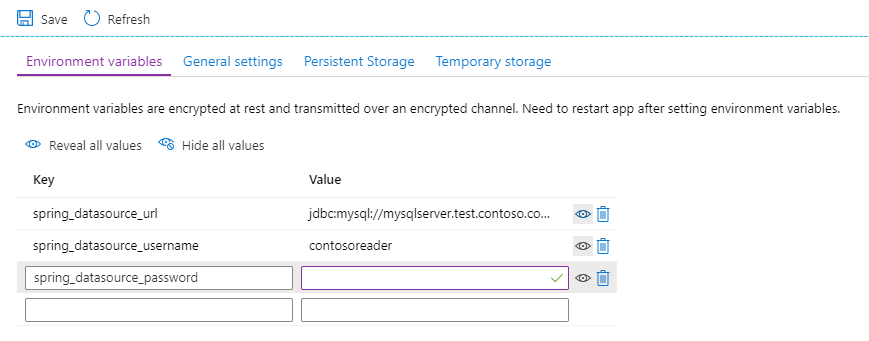

### Create an Azure Spring Apps instance and apps

Provision an Azure Spring Apps instance in your Azure subscription, if one doesn't already exist. Then, create an application there. For more information, see [Quickstart: Deploy your first application to Azure Spring Apps](/azure/spring-apps/quickstart).

[!INCLUDE [ensure-console-logging-and-configure-diagnostic-settings-azure-spring-apps](ensure-console-logging-and-configure-diagnostic-settings-azure-spring-apps.md)]

[!INCLUDE [configure-persistent-storage-azure-spring-apps](configure-persistent-storage-azure-spring-apps.md)]

[!INCLUDE [migrate-all-certificates-to-keyvault-azure-spring-apps](migrate-all-certificates-to-keyvault-azure-spring-apps.md)]

### Configure application performance management (APM) integrations

Azure Spring Apps offers the following APM integrations. Follow the links to enable the APM you need.

- [Application Insights Java In-Process Agent](/azure/spring-apps/how-to-application-insights)
- [Elastic APM Java Agent](/azure/spring-apps/how-to-elastic-apm-java-agent-monitor)
- [Dynatrace Java OneAgent](/azure/spring-apps/how-to-dynatrace-one-agent-monitor)
- [AppDynamics Java Agent](/azure/spring-apps/how-to-appdynamics-java-agent-monitor)
- [New Relic Java agent](/azure/spring-apps/how-to-new-relic-monitor)

If your application isn't using a supported APM, consider using Application Insights instead. Azure Spring Apps offers deep integration with Application Insights for performance management and real-time response to aberrations.

### Disable metrics clients and endpoints in your applications

Remove any metrics clients used or any metrics endpoints exposed in your applications.

### Deploy the application

Deploy each of the migrated microservices (not including the Spring Cloud Config and Registry servers), as described in [Quickstart: Deploy your first application to Azure Spring Apps](/azure/spring-apps/quickstart).

### Configure per-service secrets and externalized settings

You can inject any per-service configuration settings into each service as environment variables. Use the following steps in the Azure portal:

1. Navigate to the Azure Spring Apps Instance and select **Apps**.
1. Select the service to configure.
1. Select **Configuration**.
1. Enter the variables to configure.
1. Select **Save**.



### Migrate and enable the identity provider

If any of the Spring Cloud applications require authentication or authorization, ensure they're configured to access the identity provider:

* If the identity provider is Microsoft Entra ID, no changes should be necessary.
* If the identity provider is an on-premises Active Directory forest, consider implementing a hybrid identity solution with Microsoft Entra ID. For more information, see the [Hybrid identity documentation](/azure/active-directory/hybrid/).
* If the identity provider is another on-premises solution, such as PingFederate, consult the [Custom installation of Microsoft Entra Connect](/azure/active-directory/hybrid/how-to-connect-install-custom) topic to configure federation with Microsoft Entra ID. Alternatively, consider using Spring Security to use your identity provider through [OAuth2/OpenID Connect](https://docs.spring.io/spring-security/reference/index.html) or [SAML](https://docs.spring.io/spring-security/reference/index.html).

### Expose the application

By default, applications deployed to Azure Spring Apps aren't visible externally. You can expose your application by making it public with the following command:

```azurecli
az spring app update --name <application name> --is-public true
```

Skip this step if you're using or intend to use a Spring Cloud Gateway. For more information, see the following section.
