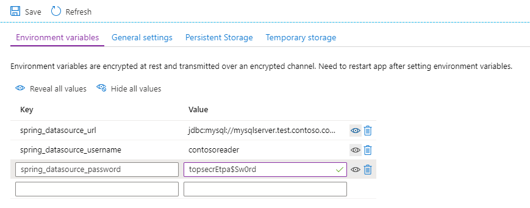

### Create an Azure Spring Cloud instance and apps

Provision an Azure Spring Cloud instance in your Azure subscription, if one does not already exist. Then, create an application there. For more information, see [Quickstart: Launch an existing Azure Spring Cloud application using the Azure portal](/azure/spring-cloud/spring-cloud-quickstart-launch-app-portal).

[!INCLUDE [ensure-console-logging-and-configure-diagnostic-settings-azure-spring-cloud](ensure-console-logging-and-configure-diagnostic-settings-azure-spring-cloud.md)]

[!INCLUDE [configure-persistent-storage-azure-spring-cloud](configure-persistent-storage-azure-spring-cloud.md)]

[!INCLUDE [migrate-all-certificates-to-keyvault-azure-spring-cloud](migrate-all-certificates-to-keyvault-azure-spring-cloud.md)]

### Remove application performance management (APM) integrations

Eliminate any integrations with APM tools/agents. For information on configuring performance management with Azure Monitor, see the [Post-migration](#post-migration) section.

### Disable metrics clients and endpoints in your applications

Remove any metrics clients used or any metrics endpoints exposed in your applications.

### Deploy the application

Deploy each of the migrated microservices (not including the Spring Cloud Config and Registry servers), as described in [Quickstart: Launch an existing Azure Spring Cloud application using the Azure portal](/azure/spring-cloud/spring-cloud-quickstart-launch-app-portal).

### Configure per-service secrets and externalized settings

You can inject any per-service configuration settings into each service as environment variables. Use the following steps in the Azure portal:

1. Navigate to the Azure Spring Cloud Instance and select **Apps**.
1. Select the service to configure.
1. Select **Configuration**.
1. Enter the variables to configure.
1. Select **Save**.



### Migrate and enable the identity provider

If any of the Spring Cloud applications require authentication or authorization, ensure they're configured to access the identity provider:

* If the identity provider is Azure Active Directory, no changes should be necessary.
* If the identity provider is an on-premises Active Directory forest, consider implementing a hybrid identity solution with Azure Active Directory. For more information, see the [Hybrid identity documentation](/azure/active-directory/hybrid/).
* If the identity provider is another on-premises solution, such as PingFederate, consult the [Custom installation of Azure AD Connect](/azure/active-directory/hybrid/how-to-connect-install-custom) topic to configure federation with Azure Active Directory. Alternatively, consider using Spring Security to use your identity provider through [OAuth2/OpenID Connect](https://docs.spring.io/spring-security/site/docs/current/reference/html5/#oauth2) or [SAML](https://docs.spring.io/spring-security/site/docs/current/reference/html5/#servlet-saml2).

### Expose the application

By default, applications deployed to Azure Spring Cloud are not visible externally. You can expose your application by making it public with the following command:

```azurecli
az spring-cloud app update -n <application name> --is-public true
```

Skip this step if you are using or intend to use a Spring Cloud Gateway (more on this in the following section).
