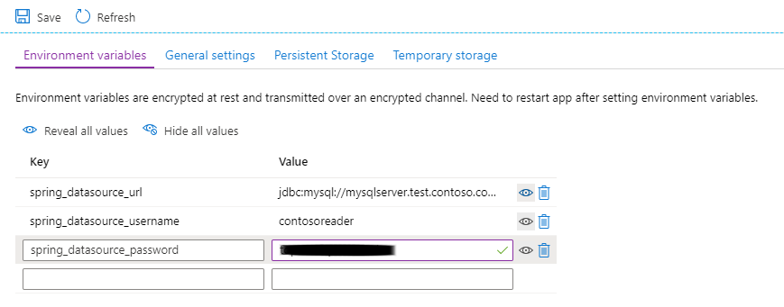

# Migrate Spring Cloud applications to Azure Spring Apps

> [!NOTE]
> Azure Spring Apps is the new name for the Azure Spring Cloud service. Although the service has a new name, you'll see the old name in some places for a while as we work to update assets such as screenshots, videos, and diagrams.

This guide describes what you should be aware of when you want to migrate an existing Spring Cloud application to run on Azure Spring Apps.

## Pre-migration

To ensure a successful migration, before you start, complete the assessment and inventory steps described in the following sections.

If you can't meet any of these pre-migration requirements, see the following companion migration guides:

* Migrate executable JAR applications to containers on Azure Kubernetes Service (guidance planned)
* Migrate executable JAR Applications to Azure Virtual Machines (guidance planned)

### Inspect application components

[!INCLUDE [determine-whether-and-how-the-file-system-is-used-azure-spring-apps](includes/determine-whether-and-how-the-file-system-is-used-azure-spring-apps.md)]

#### Determine whether any of the services contain OS-specific code

[!INCLUDE [determine-whether-your-application-contains-os-specific-code](includes/determine-whether-your-application-contains-os-specific-code-no-title.md)]

[!INCLUDE [switch-to-a-supported-platform-azure-spring-apps](includes/switch-to-a-supported-platform-azure-spring-apps.md)]

[!INCLUDE [identify-spring-boot-versions](includes/identify-spring-boot-versions.md)]

For any applications using Spring Boot 1.x, follow the [Spring Boot 2.0 migration guide](https://github.com/spring-projects/spring-boot/wiki/Spring-Boot-2.0-Migration-Guide) to update them to a supported Spring Boot version. For supported versions, see the [Spring Boot and Spring Cloud versions](/azure/spring-apps/how-to-prepare-app-deployment#spring-boot-and-spring-cloud-versions) section of [Prepare an application for deployment in Azure Spring Apps](/azure/spring-apps/how-to-prepare-app-deployment).

#### Identify Spring Cloud versions

Examine the dependencies of each application you're migrating to determine the version of the Spring Cloud components it uses.

##### Maven

In Maven projects, the Spring Cloud version is typically set in the `spring-cloud.version` property:

```xml
  <properties>
    <java.version>1.8</java.version>
    <spring-cloud.version>2021.0.6</spring-cloud.version>
  </properties>
```

##### Gradle

In Gradle projects, the Spring Cloud version is typically set in the "extra properties" block:

```gradle
ext {
  set('springCloudVersion', "2021.0.6")
}
```

You need to update all applications to use supported versions of Spring Cloud. For a list of supported versions, see the [Spring Boot and Spring Cloud versions](/azure/spring-apps/how-to-prepare-app-deployment#spring-boot-and-spring-cloud-versions) section of [Prepare an application for deployment in Azure Spring Apps](/azure/spring-apps/how-to-prepare-app-deployment).

[!INCLUDE [identify-logs-metrics-apm-azure-spring-apps.md](includes/identify-logs-metrics-apm-azure-spring-apps.md)]

#### Identify Zipkin dependencies

Determine whether your application has dependencies on Zipkin. Update the application to use Application Insights instead. For information, see [Use Application Insights Java In-Process Agent in Azure Spring Apps](/azure/spring-apps/how-to-application-insights) and the [Post-migration](#post-migration) section.

### Inventory external resources

Identify external resources, such as data sources, JMS message brokers, and URLs of other services. In Spring Cloud applications, you can typically find the configuration for such resources in one of the following locations:

* In the *src/main/directory* folder, in a file typically called *application.properties* or *application.yml*.
* In the Spring Cloud Config repository that you identified in the previous step.

[!INCLUDE [inventory-databases-spring-boot](includes/inventory-databases-spring-boot.md)]

[!INCLUDE [identify-jms-brokers-in-spring](includes/identify-jms-brokers-in-spring.md)]

After you've identified the broker or brokers in use, find the corresponding settings. In Spring Cloud applications, you can typically find them in the *application.properties* and *application.yml* files in the application directory, or in the Spring Cloud Config server repository.

[!INCLUDE [jms-broker-settings-examples-in-spring](includes/jms-broker-settings-examples-in-spring.md)]

[!INCLUDE [identify-external-caches-azure-spring-apps](includes/identify-external-caches-azure-spring-apps.md)]

#### Identity providers

Identify all identity providers and all Spring Cloud applications that require authentication and/or authorization. For information on how you can configure identity providers, see the following resources:

* For OAuth2 configuration, see the [Spring Cloud Security quickstart](https://spring.io/projects/spring-cloud-security).
* For Auth0 Spring Security configuration, see the [Auth0 Spring Security documentation](https://auth0.com/docs/quickstart/backend/java-spring-security5/01-authorization).
* For PingFederate Spring Security configuration, see the [Auth0 PingFederate instructions](https://auth0.com/authenticate/java-spring-security/ping-federate/).

#### Resources configured through VMware Tanzu Application Service (TAS) (formerly Pivotal Cloud Foundry)

For applications managed with TAS, external resources, including the resources described earlier, are often configured via TAS service bindings. To examine the configuration for such resources, use the [TAS (Cloud Foundry) CLI](https://docs.cloudfoundry.org/cf-cli/) to view the `VCAP_SERVICES` variable for the application.

```bash
# Log into TAS, if needed (enter credentials when prompted)
cf login -a <API endpoint>

# Set the organization and space containing the application, if not already selected during login.
cf target org <organization name>
cf target space <space name>

# Display variables for the application
cf env <Application Name>
```

Examine the `VCAP_SERVICES` variable for configuration settings of external services bound to the application. For more information, see the [TAS (Cloud Foundry) documentation](https://docs.cloudfoundry.org/devguide/deploy-apps/environment-variable.html#VCAP-SERVICES).

#### All other external resources

It isn't feasible for this guide to document every possible external dependency. After the migration, it's your responsibility to verify that you can satisfy every external dependency of your application.

[!INCLUDE [inventory-configuration-sources-and-secrets-spring-cloud](includes/inventory-configuration-sources-and-secrets-spring-cloud.md)]

[!INCLUDE [inspect-the-deployment-architecture-spring-cloud](includes/inspect-the-deployment-architecture-spring-cloud.md)]

## Migration

### Remove restricted configurations

In the services you’re migrating, find and remove any explicit assignments of the following restricted settings. These properties are automatically injected into your application environment to access Config Server and Service Discovery. If these properties are in your Config Server application files, you might experience conflicts and unexpected behavior. For more information, see the [Restriction](/azure/spring-apps/how-to-config-server#restriction) section of [Configure a managed Spring Cloud Config Server in Azure Spring Apps](/azure/spring-apps/how-to-config-server)

* `eureka.client.service-url.defaultZone`
* `eureka.client.tls.keystore`
* `eureka.instance.preferIpAddress`
* `eureka.instance.instance-id`
* `server.port`
* `spring.cloud.config.tls.keystore`
* `spring.config.import`
* `spring.application.name`
* `spring.jmx.enabled`
* `management.endpoints.jmx.exposure.include`

### Create an Azure Spring Apps instance and apps

Provision an Azure Spring Apps instance in your Azure subscription. Then, provision an app for every service you're migrating. Don't include the Spring Cloud registry and configuration servers. Do include the Spring Cloud Gateway service. For instructions, see [Quickstart: Deploy your first application to Azure Spring Apps](/azure/spring-apps/quickstart).

::: zone pivot="sc-standard-tier"

### Prepare the Spring Cloud Config server

Configure the configuration server in your Azure Spring Apps instance. For more information, see [Set up a Spring Cloud Config Server instance for your service](/azure/spring-apps/how-to-config-server).

> [!NOTE]
> If your current Spring Cloud Config repository is on the local file system or on premises, you first need to migrate or replicate your configuration files to a private cloud-based repository, such as GitHub, Azure Repos, or BitBucket.

[!INCLUDE [ensure-console-logging-and-configure-diagnostic-settings-azure-spring-apps](includes/ensure-console-logging-and-configure-diagnostic-settings-azure-spring-apps.md)]

[!INCLUDE [configure-persistent-storage-azure-spring-apps](includes/configure-persistent-storage-azure-spring-apps.md)]

::: zone-end

::: zone pivot="sc-enterprise-tier"

### VMware Tanzu components

In Enterprise tier, Application Configuration Service for VMware Tanzu® is provided to support externalized configuration for your apps. Managed Spring Cloud Config Server isn't available in Enterprise tier and is only available in Standard and Basic tier of Azure Spring Apps.

#### Application Configuration Service for Tanzu

[Application Configuration Service for Tanzu](https://docs.vmware.com/en/Application-Configuration-Service-for-VMware-Tanzu/index.html) is one of the commercial VMware Tanzu components. Application Configuration Service for Tanzu is Kubernetes-native, and different from Spring Cloud Config Server. Application Configuration Service for Tanzu enables the management of Kubernetes-native ConfigMap resources that are populated from properties defined in one or more Git repositories.

In Enterprise tier, there's no Spring Cloud Config Server, but you can use Application Configuration Service for Tanzu to manage centralized configurations. For more information, see [Use Application Configuration Service for Tanzu](/azure/spring-apps/how-to-enterprise-application-configuration-service)

To use Application Configuration Service for Tanzu, do the following steps for each of your apps:

1. Add an explicit app binding to declare that your app needs to use Application Configuration Service for Tanzu.

   > [!NOTE]
   > When you change the bind/unbind status, you must restart or redeploy the app to make the change take effect.

1. Set config file patterns. Config file patterns enable you to choose which application and profile the app uses. For more information, see the [Pattern](/azure/spring-apps/how-to-enterprise-application-configuration-service#pattern) section of [Use Application Configuration Service for Tanzu](/azure/spring-apps/how-to-enterprise-application-configuration-service).

   Another option is to set the config file patterns at the same time as your app deployment, as shown in the following example:

   ```azurecli
   az spring app deploy \
       --name <app-name> \
       --artifact-path <path-to-your-JAR-file> \
       --config-file-pattern <config-file-pattern>
   ```

Application Configuration Service for Tanzu runs on Kubernetes. To help enable a transparent local development experience, we provide the following suggestions.

* If you already have a Git repository to store your externalized configuration, you can set up Spring Cloud Config Server locally as the centralized configuration for your application. After Config Server starts, it clones the Git repository and provides the repository content through its web controller. For more information, see [Spring Cloud Config](https://cloud.spring.io/spring-cloud-config/reference/html) in the Spring documentation. The `spring-cloud-config-client` provides the ability for your application to automatically pick up the external configuration from the Config Server.

* If you don't have a Git repository or you don't want to set up Config Server locally, you can use the configuration file directly in your project. We recommend that you use a profile to isolate the configuration file so that it's used only in your development environment. For example, use `dev` as the profile. Then, you can create an *application-dev.yml* file in the *src/main/resource* folder to store the configuration. To get your app to use this configuration, start the app locally with `--spring.profiles.active=dev`.

#### Tanzu Service Registry

[VMware Tanzu® Service Registry](https://docs.vmware.com/en/Spring-Cloud-Services-for-VMware-Tanzu/index.html) is one of the commercial VMware Tanzu components. Tanzu Service Registry provides your Enterprise-tier apps with an implementation of the Service Discovery pattern, one of the key tenets of a microservice-based architecture. Your apps can use Tanzu Service Registry to dynamically discover and call registered services. Using Tanzu Service Registry is preferable to hand-configuring each client of a service, which can be difficult, or adopting some form of access convention, which can be brittle in production. For more information, see [Use Tanzu Service Registry](/azure/spring-apps/how-to-enterprise-service-registry).

::: zone-end

### Migrate Spring Cloud Vault secrets to Azure KeyVault

You can inject secrets directly into applications through Spring by using the Azure KeyVault Spring Boot Starter. For more information, see [How to use the Spring Boot Starter for Azure Key Vault](../spring-framework/configure-spring-boot-starter-java-app-with-azure-key-vault.md).

> [!NOTE]
> Migration may require you to rename some secrets. Update your application code accordingly.

### Migrate all certificates to KeyVault

Azure Spring Apps doesn't provide access to the JRE keystore, so you must migrate certificates to Azure KeyVault, and change the application code to access certificates in KeyVault. For more information, see [Get started with Key Vault certificates](/azure/key-vault/certificates/certificate-scenarios) and [Azure Key Vault Certificate client library for Java](/java/api/overview/azure/security-keyvault-certificates-readme).

### Configure application performance management (APM) integrations

Azure Spring Apps offers the following APM integrations. Follow the links to enable the APM you need:

* [Application Insights Java In-Process Agent](/azure/spring-apps/how-to-application-insights)
* [Elastic APM Java Agent](/azure/spring-apps/how-to-elastic-apm-java-agent-monitor)
* [Dynatrace Java OneAgent](/azure/spring-apps/how-to-dynatrace-one-agent-monitor)
* [AppDynamics Java Agent](/azure/spring-apps/how-to-appdynamics-java-agent-monitor)
* [New Relic Java agent](/azure/spring-apps/how-to-new-relic-monitor)

If your application isn't using a supported APM, consider using Application Insights instead. Azure Spring Apps offers deep integration with Application Insights for performance management and real-time response to aberrations.

### Disable metrics clients and endpoints in your applications

Remove any metrics clients used or any metrics endpoints exposed in your applications.

### Deploy the services

Deploy each of the migrated Spring apps (not including the Spring Cloud Config and Registry servers), as described in [Quickstart: Deploy your first application to Azure Spring Apps](/azure/spring-apps/quickstart).

### Configure per-service secrets and externalized settings

You can inject any per-service configuration settings into each service as environment variables. Use the following steps in the Azure portal:

1. Navigate to the Azure Spring Apps Instance and select **Apps**.
1. Select the service to configure.
1. Select **Configuration**.
1. Enter the variables to configure.
1. Select **Save**.



### Migrate and enable the identity provider

If any of the Spring Cloud applications require authentication or authorization, ensure they're configured to access the identity provider:

* If the identity provider is Microsoft Entra ID, no changes should be necessary.
* If the identity provider is an on-premises Active Directory forest, consider implementing a hybrid identity solution with Microsoft Entra ID. For guidance, see the [Hybrid identity documentation](/azure/active-directory/hybrid/).
* If the identity provider is another on-premises solution, such as PingFederate, consult the [Custom installation of Microsoft Entra Connect](/azure/active-directory/hybrid/how-to-connect-install-custom) topic to configure federation with Microsoft Entra ID. Alternatively, consider using Spring Security to use your identity provider through [OAuth2/OpenID Connect](https://docs.spring.io/spring-security/reference/index.html) or [SAML](https://docs.spring.io/spring-security/reference/index.html).

### Update client applications

Update the configuration of all client applications to use the published Azure Spring Apps endpoints for migrated applications.

## Post-migration

* Consider adding a deployment pipeline for automatic, consistent deployments. Instructions are available [for Azure Pipelines](/azure/spring-apps/how-to-cicd), [for GitHub Actions](/azure/spring-apps/how-to-github-actions), and [for Jenkins](/azure/jenkins/tutorial-jenkins-deploy-cli-spring-cloud-service).

* Consider using staging deployments to test code changes in production before they're available to some or all of your end users. For more information, see [Set up a staging environment in Azure Spring Apps](/azure/spring-apps/how-to-staging-environment).

* Consider adding service bindings to connect your application to supported Azure databases. These service bindings would eliminate the need for you to provide connection information, including credentials, to your Spring Cloud applications.

* Consider using Azure Application Insights to monitor performance and interactions of your applications. For more information, see [Application Insights Java In-Process Agent in Azure Spring Apps](/azure/spring-apps/how-to-application-insights).

* Consider adding Azure Monitor alert rules and action groups to quickly detect and address aberrant conditions. For more information, see [Tutorial: Monitor Spring Cloud resources using alerts and action groups](/azure/spring-apps/tutorial-alerts-action-groups).

* Consider replicating the Azure Spring Apps deployment in another region for lower latency and higher reliability and fault tolerance. Use [Azure Traffic Manager](/azure/traffic-manager) to load balance among deployments or use [Azure Front Door](/azure/frontdoor) to add SSL offloading and Web Application Firewall with DDoS protection.

* If geo-replication isn't necessary, consider adding an [Azure Application Gateway](/azure/application-gateway) to add SSL offloading and Web Application Firewall with DDoS protection.

* If your applications use legacy Spring Cloud Netflix components, consider replacing them with current alternatives:

   | Legacy                        | Current                                                |
   |-------------------------------|--------------------------------------------------------|
   | Spring Cloud Eureka           | Spring Cloud Service Registry                          |
   | Spring Cloud Netflix Zuul     | Spring Cloud Gateway                                   |
   | Spring Cloud Netflix Archaius | Spring Cloud Config Server                             |
   | Spring Cloud Netflix Ribbon   | Spring Cloud Load Balancer (client-side load balancer) |
   | Spring Cloud Hystrix          | Spring Cloud Circuit Breaker + Resilience4J            |
   | Spring Cloud Netflix Turbine  | Micrometer + Prometheus                                |
