# Discover and Assess Java Applications with WindUp

This guide describes how to discover and assess any type of Java applications with WindUop to evaluate their readiness to migrate to Azure.

## When should I use WindUp?

[WindUp](https://github.com/windup) is a generic application migration and assessment tool.
It helps large-scale Java application modernization and migration projects across a broad range of transformations and use cases.
It discovers applications through static code analysis, supports effort estimation, accelerates code migration, helping you move applications to Azure.

Created in 2013 by RedHat, WindUp is an open-source project (Eclipse Public License) that bundles a set of rules to transform Java applications to different targets: Azure, JBoss EAP, Camel, Spring, Quarkus or OpenShift.

Windup is designed to help organizations modernize their applications in a way that reduces costs and enables faster innovation.
The platform uses advanced analysis techniques to understand the structure and dependencies of any Java application, and provides guidance on how to refactor and migrate the applications to Azure.

WindUp is part of a broader set of migration tools that live under the umbrella project called [Konveyor](https://www.konveyor.io/).

### Discovering Java applications

Discovery and assessment are the first stages of application migration and modernization using a tool like Windup.
During the discovery phase, the tool scans the legacy application and its components to gain a comprehensive understanding of its structure, architecture, and dependencies.
This information is used to create a detailed inventory of the application and its components, which serves as the basis for further analysis and planning.

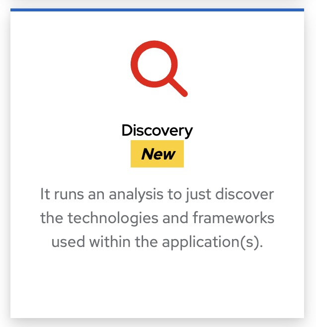

### Assessing Java application for a specific Azure target

After the discovery phase you have the optional assessment phase.
The assessment phase is where the tool analyzes the application and its components to determine its suitability for migration and to identify any potential challenges or limitations.
This phase involves analyzing the application code and check its compliance with the migration target.
The assessment also provides an evaluation of the application’s readiness for migration, including any necessary refactoring or restructuring that may be required.

WindUp is very flexible, and you can create any transformation target you want (by aggregating a set of rules).
But it comes with existing targets, including Azure targets.
The transformation targets you can choose from are:

* Azure: Rules to migrate Java applications to Azure App Service, Azure Container Apps and AKS.
* Containerization: A comprehensive set of cloud and container readiness rules to assess applications for suitability for deployment on AKS or Azure Container Apps.
* Linux: Ensure there are no Windows paths hard coded into your applications and that it can be migrated to Linux.

Azure has a dedicated target in WindUp.
If you select the Azure target and scroll the list of Azure services, you will be able to choose the migration rules available (see Figure 2):

* Azure App Services
* Azure Container Apps
* Azure Kubernetes Service (AKS) 

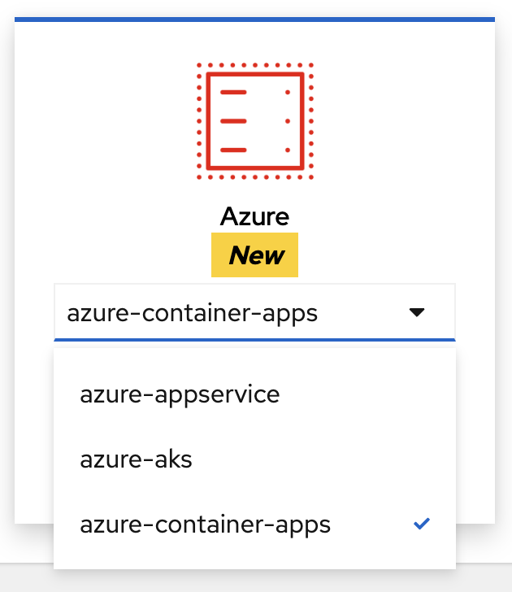

## What results can I get from WindUp?

The outcome of the discovery and assessment phases is a detailed report that provides a roadmap for the migration and modernization of the legacy application, including recommendations for the target platform, technologies, and migration approach.
The report serves as the foundation for the next stages of the migration process, and helps organizations take decisions about how to modernize their applications for maximum benefits.

The report generated by Windup provides a comprehensive overview of your legacy application and its components.
You can use this report to gain insights into the structure and dependencies of the application, and to determine its suitability for migration and modernization.

### Summary of the analysis

The first page of the report lists all the technology tags (see Figure 20).
In the discovery phase of the analysis, WindUp detects the technologies that are used in the application and summarises them as a list of tags.

When you click on the application link, you are taken to the main dashboard (see Figure 21).
This dashboard provides a summary of the analysis, including the number of transformation incidents, the incidents categories, or the story points.

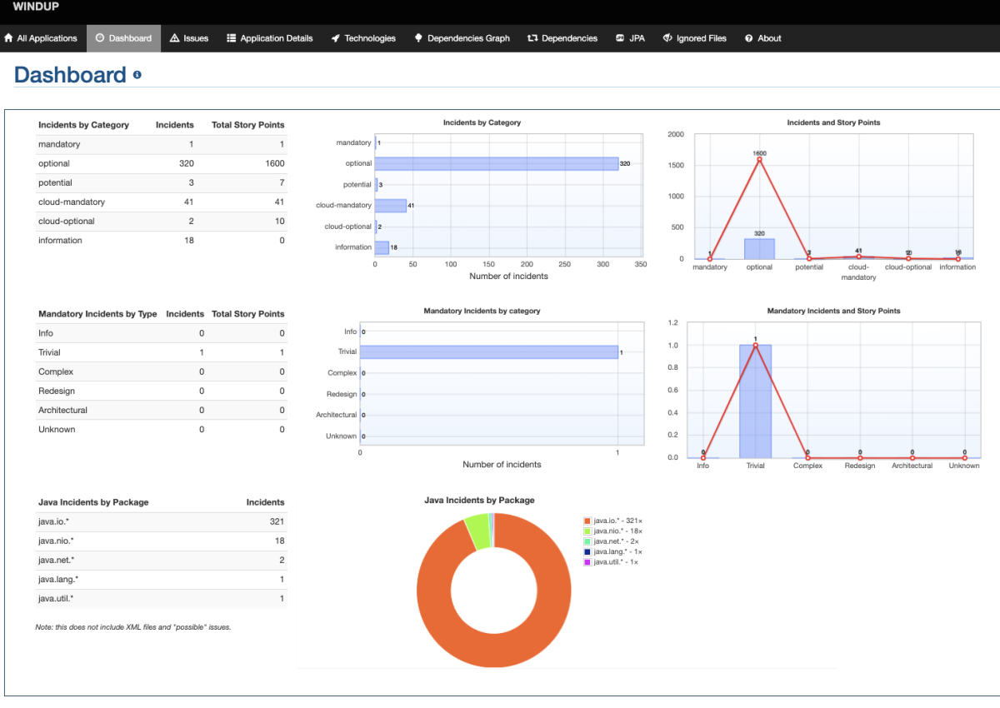

If you zoom in on the Incidents by Category pie chart (see Figure 22), you can see the number of incidents by category: Mandatory, Optional, Potential, Information.

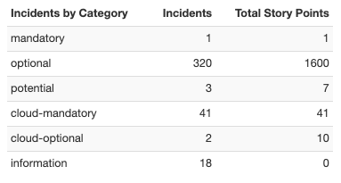

### Discovery report

The discovery report is a report that is generated only for the Discovery Phase.
That means that you will find the list of the technology used by the application in the Information category.
This means that WindUp is just informing you about the technology that it discovered.

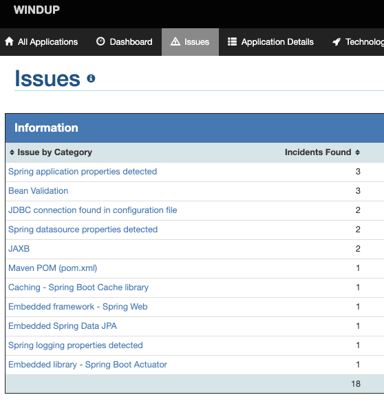

### Assessment report

The summary of the analysis (Figure 20 andFigure 21) only gives you an overview of the transformation issues that would need to be solved to transform your application.
These "Issues" are also called "Incidents" and have a severity (mandatory, optional, potential, information).

When you click on "Issues", you see all the transformation incidents sorted by severity (see Figure 25).
You have the name of the incident (e.g., Windows file system path), the number of incidents found in the entire application, the level of effort you will need to solve this incident, and the story points (number of incidents x the effort).

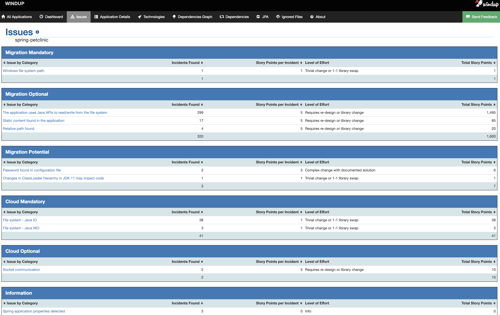

### Detail information for a specific issue

For each incident, you will get more information about it (the issue detail, the content of the rule, etc.), but also the list of all the files that are affected by this incident.
Figure 26 shows the details for the "Windows file system path" in the application.

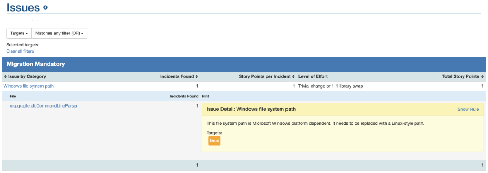

Then, for each file/class that is affected by the incident, you can click on it.
By doing so, WindUp will jump into the source code and highlight the line of code that created the issue.
For example, Figure 27 highlights the line of code inside a Java class that breaks the rule of the Window path.

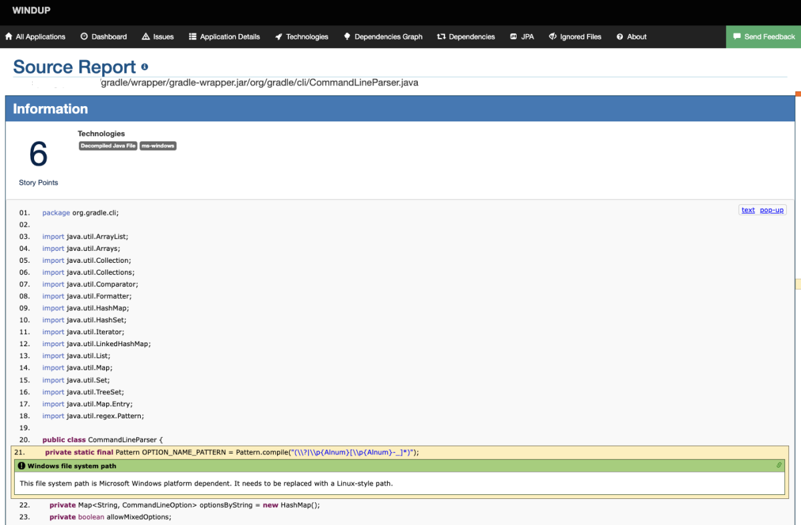

## How should I use WindUp?

Depending on your needs, there are several ways of using WindUp:

* [Web Console](https://access.redhat.com/documentation/en-us/migration_toolkit_for_applications/6.0/html-single/user_interface_guide/index)
* IDE Plugin (Eclipse, Eclipse CHE and [VS Code](https://access.redhat.com/documentation/en-us/migration_toolkit_for_applications/6.0/html-single/visual_studio_code_extension_guide/index))
* [Command Line Interface](https://access.redhat.com/documentation/en-us/migration_toolkit_for_applications/6.0/html-single/cli_guide/index)

### Web Console

Once WindUp is started, point your browser at http://localhost:8080, you should see the Web Console.

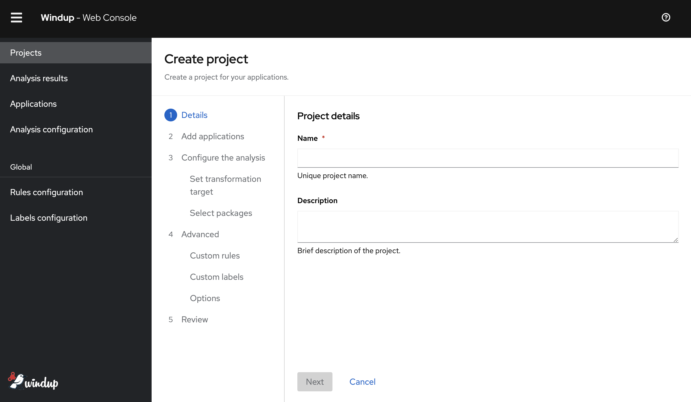

### VS Code extension

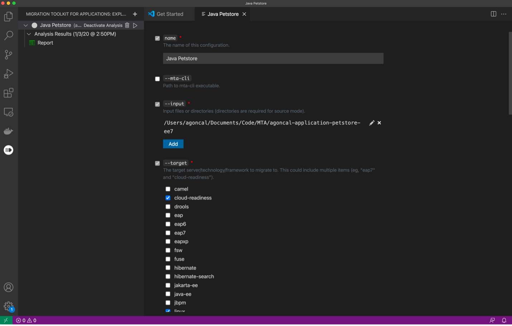

### Command Line

```
./windup-cli --input /Code/spring-petclinic/target/spring-petclinic.jar \
             --target azure-container-apps cloud-readiness linux openjdk \
             --output output-html \
             --packages org.springframework.samples.petclinic
```

## How can I create a new rule?

WindUp can be seen as a rule engine.
It uses rules to extract files from archives, decompile files, scans and classifies file types, analyzes these files, and builds the reports.
In Windup, the rules are defined in the form of a ruleset, which is a collection of individual rules that define specific issues or patterns that should be detected during the analysis.
The ruleset can be customized and extended to meet the specific needs of the application and the migration process.

When Windup runs an analysis, it evaluates each component of the application against the ruleset, looking for any issues or patterns that match the defined rules.
If a component violates one or more rules, Windup generates an issue that describes the problem and provides information on how to fix it.
These rules a defined in XML and follow this simple rule pattern:

```
when(condition)
    perform(action)
    otherwise(action)
```

WindUp provides a comprehensive set of standard migration rules out-of-the-box.
But because applications may contain custom libraries or components, WindUp allows you to write your own rules to identify use of components or software that may not be covered by the existing ruleset.
For that, we use an extremely rich DSL (domain specific language) expressed in XML (more on the syntax in the WindUp Rules Development Guide).

Let’s create a rule that identifies the use of the PostgreSQL JDBC driver in a Java application and suggests the use of the Azure PostgreSQL Flexible Server instead.
The PetClinic application uses Maven to manage its dependencies, therefore you will find the PostgreSQL JDBC driver defined in the pom.xml.

```xml
<dependency>
    <groupId>org.postgresql</groupId>
    <artifactId>postgresql</artifactId>
    <scope>runtime</scope>
</dependency>
```

To detect the use of this dependency, the rule in Listing 1 uses several XML tags:

* `ruleset`: The unique identifier of the ruleset. A ruleset is a collection of rules that are related to a specific technology or topic.
* `targetTechnology`: The technology that the rule targets. In this case, we are targeting Azure App Services, AKS and Azure Container Apps.
* `rule`: The root element of a single rule.
* `when`: The condition that must be met for the rule to be triggered.
* `perform`: The action to be performed when the rule is triggered.
* `hint`: The message to be displayed in the report, its category (Information, Optional, Mandatory) and effort to be fixed (range from 1 easy to 13 difficult).

```xml
<ruleset id="azure-postgre-flexible-server"
         xmlns="http://windup.jboss.org/schema/jboss-ruleset"
         xmlns:xsi="http://www.w3.org/2001/XMLSchema-instance"
         xsi:schemaLocation="http://windup.jboss.org/schema/jboss-ruleset http://windup.jboss.org/schema/jboss-ruleset/windup-jboss-ruleset.xsd">
    <metadata>
        <description>Recommend Azure PostgreSQL Flexible Server.</description>
        <dependencies>
            <addon id="org.jboss.windup.rules,windup-rules-xml,3.0.0.Final"/>
        </dependencies>
        <targetTechnology id="azure-appservice"/>
        <targetTechnology id="azure-aks"/>
        <targetTechnology id="azure-container-apps"/>
    </metadata>
    <rules>
        <rule id="azure-postgre-flexible-server">
            <when>
                <project>
                    <artifact groupId="org.postgresql" artifactId="postgresql"/>
                </project>
            </when>
            <perform>
                <hint title="Azure PostgreSQL Flexible Server" category-id="mandatory" effort="7">
                    <message>The application uses PostgreSQL. It is recommended to use Azure PostgreSQL Flexible Server instead.</message>
                    <link title="Azure PostgreSQL Flexible Server documentation" href="https://learn.microsoft.com/azure/postgresql/flexible-server/overview"/>
                </hint>
            </perform>
        </rule>
    </rules>
</ruleset>
```

When we create a WindUp project to analyze an application, this configuration is stored and can be updated if needed (we can then change the migration targets, the packages to scan, etc.).
To add a new rule we need to change the configuration of the project (see Figure 25) so we can upload the new rule.

Once the rule is enabled, you can run the analysis again and check the report. And like any other incident, you can browse the issues and see the files that are affected by this rule and check the code (see Figure 28).

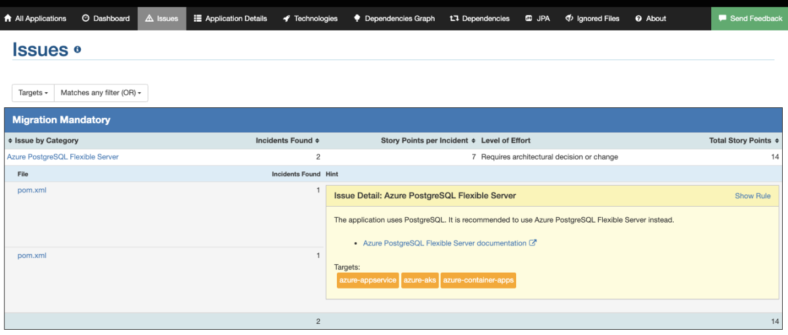

## Frequently asked questions

Q: Where do I download WindUp from?

A: You can download WindUp from https://windup.github.io/downloads

Q: Where can I find more information about WindUp?

A: WindUp has several online guides. From an overview of the tool to the installation and execution of the tool, to the creation of custom rules. You can find all the guides in the [WindUp documentation](https://access.redhat.com/documentation/en-us/migration_toolkit_for_applications/6.0)

Q: Where can I find the WindUp Azure rules?

A: All the Azure rules are available in the [WindUp Ruleset GitHub repository](https://github.com/windup/windup-rulesets/tree/master/rules/rules-reviewed/azure)

Q: Where can I find more information about creating custom rules?

A: WindUp has a dedicated guide to [create custom rules](https://access.redhat.com/documentation/en-us/migration_toolkit_for_applications/6.0/html-single/rules_development_guide/index)
