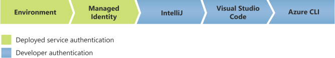

# Authenticate Azure-hosted Java applications

This article looks at how the Azure Identity library supports Microsoft Entra token authentication for applications hosted on Azure. This support is made possible through a set of `TokenCredential` implementations, which are discussed in this article.

This article covers the following subjects:

* [Default Azure credential](#default-azure-credential)
* [Managed Identity credential](#managed-identity-credential)

For troubleshooting authentication issues related to Azure-hosted applications, see [Troubleshoot Azure-hosted application authentication](../troubleshooting-authentication-azure-hosted.md).

## Default Azure credential

`DefaultAzureCredential` is appropriate for most scenarios where the application ultimately runs in the Azure Cloud. `DefaultAzureCredential` combines credentials that are commonly used to authenticate when deployed, with credentials that are used to authenticate in a development environment. `DefaultAzureCredential` attempts to authenticate via the following mechanisms in order:



* Environment - `DefaultAzureCredential` reads account information specified via [environment variables](#environment-variables) and use it to authenticate.
* Managed Identity - If the application deploys to an Azure host with Managed Identity enabled, `DefaultAzureCredential` authenticates with that account.
* IntelliJ - If you've authenticated via Azure Toolkit for IntelliJ, `DefaultAzureCredential` authenticates with that account.
* Visual Studio Code - If you've authenticated via the Visual Studio Code Azure Account plugin, `DefaultAzureCredential` authenticates with that account.
* Azure CLI - If you've authenticated an account via the Azure CLI `az login` command, `DefaultAzureCredential` authenticates with that account.

### Configure DefaultAzureCredential

`DefaultAzureCredential` supports a set of configurations through setters on the `DefaultAzureCredentialBuilder` or environment variables.

* Setting the environment variables `AZURE_CLIENT_ID`, `AZURE_CLIENT_SECRET`, and `AZURE_TENANT_ID` as defined in [Environment variables](#environment-variables) configures `DefaultAzureCredential` to authenticate as the service principal specified by the values.
* Setting `.managedIdentityClientId(String)` on the builder or the environment variable `AZURE_CLIENT_ID` configures `DefaultAzureCredential` to authenticate as a user-defined managed identity, while leaving them empty configures it to authenticate as a system-assigned managed identity.
* Setting `.tenantId(String)` on the builder or the environment variable `AZURE_TENANT_ID` configures `DefaultAzureCredential` to authenticate to a specific tenant for shared token cache, Visual Studio Code, and IntelliJ IDEA.
* Setting the environment variable `AZURE_USERNAME` configures `DefaultAzureCredential` to pick the corresponding cached token from the shared token cache.
* Setting `.intelliJKeePassDatabasePath(String)` on the builder configures `DefaultAzureCredential` to read a specific KeePass file when authenticating with IntelliJ credentials.

### Authenticate with DefaultAzureCredential

The following example demonstrates authenticating the `SecretClient` from the [azure-security-keyvault-secrets][secrets_client_library] client library using `DefaultAzureCredential`.

```java
// Azure SDK client builders accept the credential as a parameter.
SecretClient client = new SecretClientBuilder()
  .vaultUrl("https://<your Key Vault name>.vault.azure.net")
  .credential(new DefaultAzureCredentialBuilder().build())
  .buildClient();
```

### Authenticate a user assigned managed identity with DefaultAzureCredential

The following example demonstrates authenticating the `SecretClient` from the [azure-security-keyvault-secrets][secrets_client_library] client library using `DefaultAzureCredential` deployed to an Azure resource with a user-assigned managed identity configured.

```java
/**
 * The default credential uses the user-assigned managed identity with the specified client ID.
 */
DefaultAzureCredential defaultCredential = new DefaultAzureCredentialBuilder()
  .managedIdentityClientId("<managed identity client ID>")
  .build();

// Azure SDK client builders accept the credential as a parameter.
SecretClient client = new SecretClientBuilder()
  .vaultUrl("https://<your Key Vault name>.vault.azure.net")
  .credential(defaultCredential)
  .buildClient();
```

### Authenticate a user in Azure Toolkit for IntelliJ with DefaultAzureCredential

The following example demonstrates authenticating the `SecretClient` from the [azure-security-keyvault-secrets][secrets_client_library] client library using `DefaultAzureCredential`, on a workstation where IntelliJ IDEA is installed, and the user has signed in with an Azure account to the Azure Toolkit for IntelliJ.

For more information on configuring your IntelliJ IDEA, see [Sign in Azure Toolkit for IntelliJ for IntelliJCredential](dev-env.md#sign-in-azure-toolkit-for-intellij-for-intellijcredential).

```java
/**
 * The default credential uses the KeePass database path to find the user account in IntelliJ on Windows.
 */
// KeePass configuration is required only for Windows. No configuration needed for Linux / Mac.
DefaultAzureCredential defaultCredential = new DefaultAzureCredentialBuilder()
  .intelliJKeePassDatabasePath("C:\\Users\\user\\AppData\\Roaming\\JetBrains\\IdeaIC2020.1\\c.kdbx")
  .build();

// Azure SDK client builders accept the credential as a parameter.
SecretClient client = new SecretClientBuilder()
  .vaultUrl("https://<your Key Vault name>.vault.azure.net")
  .credential(defaultCredential)
  .buildClient();
```

## Managed Identity credential

The Managed Identity authenticates the managed identity (system or user assigned) of an Azure resource. So, if the application is running inside an Azure resource that supports Managed Identity through `IDENTITY/MSI`, `IMDS` endpoints, or both, then this credential gets your application authenticated, and offers a great secretless authentication experience.

For more information, see [What are managed identities for Azure resources?](/azure/active-directory/managed-identities-azure-resources/overview).

### Authenticate in Azure with managed identity

The following example demonstrates authenticating the `SecretClient` from the [azure-security-keyvault-secrets][secrets_client_library] client library using the `ManagedIdentityCredential` in a virtual machine, app service, function app, Cloud Shell, service fabric, arc, or AKS environment on Azure, with system-assigned or user-assigned managed identity enabled.

```java
/**
 * Authenticate with a managed identity.
 */
ManagedIdentityCredential managedIdentityCredential = new ManagedIdentityCredentialBuilder()
  .clientId("<user-assigned managed identity client ID>") // required only for user-assigned
  .build();

// Azure SDK client builders accept the credential as a parameter.
SecretClient client = new SecretClientBuilder()
  .vaultUrl("https://<your Key Vault name>.vault.azure.net")
  .credential(managedIdentityCredential)
  .buildClient();
```

## Environment variables

You can configure `DefaultAzureCredential` and `EnvironmentCredential` with environment variables. Each type of authentication requires values for specific variables:

### Service principal with secret

| Variable name         | Value                                              |
|-----------------------|----------------------------------------------------|
| `AZURE_CLIENT_ID`     | ID of a Microsoft Entra application.            |
| `AZURE_TENANT_ID`     | ID of the application's Microsoft Entra tenant. |
| `AZURE_CLIENT_SECRET` | One of the application's client secrets.           |

### Service principal with certificate

| Variable name                   | Value                                                                                       |
|---------------------------------|---------------------------------------------------------------------------------------------|
| `AZURE_CLIENT_ID`               | ID of a Microsoft Entra application.                                                     |
| `AZURE_TENANT_ID`               | ID of the application's Microsoft Entra tenant.                                          |
| `AZURE_CLIENT_CERTIFICATE_PATH` | Path to a PEM-encoded certificate file including private key (without password protection). |

### Username and password

| Variable name         | Value                                           |
| --------------------- | ------------------------------------------------|
| `AZURE_CLIENT_ID`     | ID of a Microsoft Entra application.         |
| `AZURE_USERNAME`      | A username (usually an email address).          |
| `AZURE_PASSWORD`      | The associated password for the given username. |

Configuration is attempted in this order. For example, if values for a client secret and certificate are both present, the client secret is used.

## Next steps

This article covered authentication for applications hosted in Azure. This form of authentication is one of multiple ways you can authenticate in the Azure SDK for Java. The following articles describe other ways:

* [Azure authentication in development environments](dev-env.md)
* [Authentication with service principals](service-principal.md)
* [Authentication with user credentials](user.md)

If you run into issues related to Azure-hosted application authentication, see [Troubleshoot Azure-hosted application authentication](../troubleshooting-authentication-azure-hosted.md).

After you've mastered authentication, see [Configure logging in the Azure SDK for Java](../logging-overview.md) for information on the logging functionality provided by the SDK.

<!-- LINKS -->
[secrets_client_library]: https://github.com/Azure/azure-sdk-for-java/tree/master/sdk/keyvault/azure-security-keyvault-secrets
