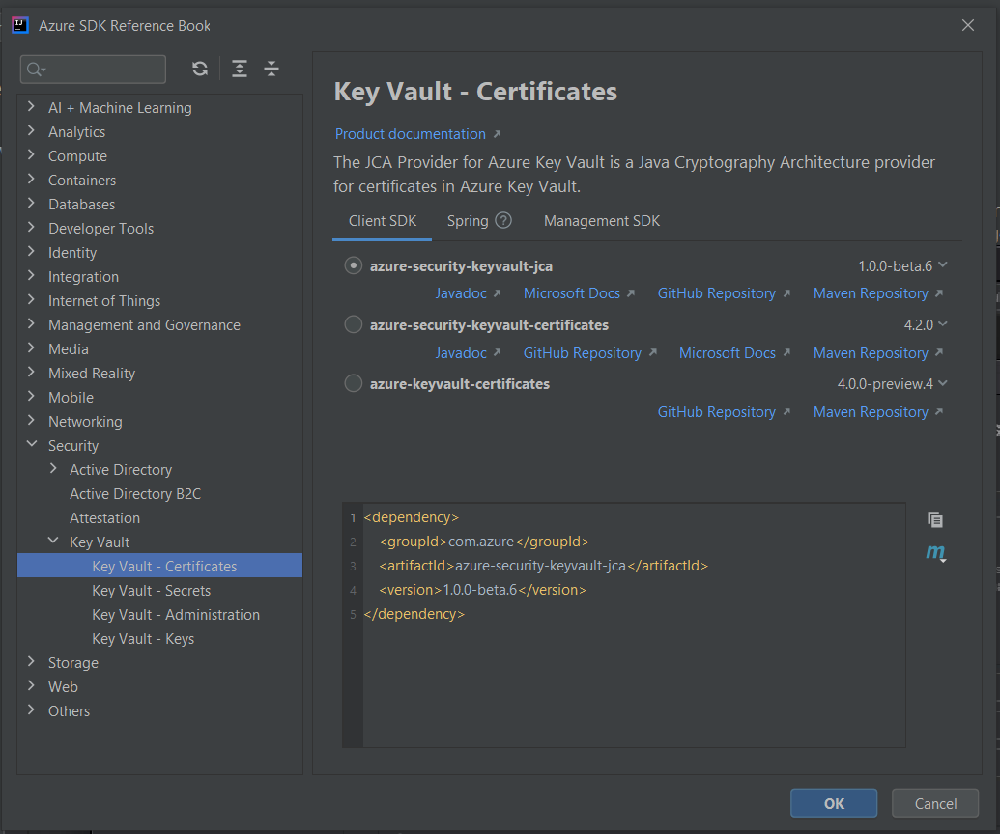

# Get started with Azure extensions for IntelliJ and Eclipse

This article walks you through setting up a development environment for Azure development in Java. Microsoft provides IDE extensions for both IntelliJ and Eclipse to increase productivity when working with the Azure SDK for Java.

## Install the Azure Toolkit for IntelliJ

The [Azure toolkit](../toolkit-for-intellij/index.yml) is necessary if you plan to deploy web apps or APIs programmatically. The toolkit also has a comprehensive SDK reference book embedded for any Azure development with Java SDK. For a quickstart with Azure Web Apps, see [Create a Hello World web app for Azure App Service using IntelliJ](../toolkit-for-intellij/create-hello-world-web-app.md).

The following steps summarize the installation process.

1. Select the **File** menu, and then select **Settings**.
1. Select **Browse repositories**, and then search **Azure** and install the **Azure toolkit for Intellij**.
1. Restart Intellij.
1. Open reference book from **Tools -> Azure -> Azure SDK Reference Book**

   

## Install the Azure Toolkit for Eclipse

The [Azure toolkit](../toolkit-for-eclipse/index.yml) is necessary if you plan to deploy web apps or APIs programmatically. Currently, it isn't used for any other kinds of development. For a quickstart, see [Create a Hello World web app for Azure App Service using Eclipse](../toolkit-for-eclipse/create-hello-world-web-app.md).

The following steps summarize the installation process.

1. Select the **Help** menu, and then select **Install new software**.
1. In the **Work with** box, enter `http://dl.microsoft.com/eclipse/` and select **Enter**.
1. Select the check box next to **Azure toolkit for Java**. Clear the check box for **Contact all update sites during install to find required software**. Then select **Next**.

## Next steps

* [Create a Hello World web app for Azure App Service using IntelliJ](../toolkit-for-intellij/create-hello-world-web-app.md)
* [Create a Hello World web app for Azure App Service using Eclipse](../toolkit-for-eclipse/create-hello-world-web-app.md)
