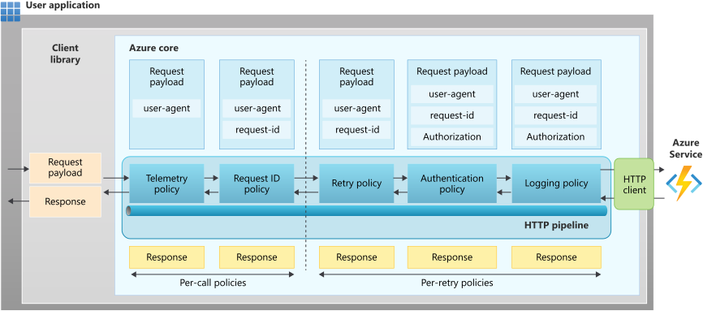

# HTTP clients and pipelines in the Azure SDK for Java

This article provides an overview of using the HTTP client and pipeline functionality within the Azure SDK for Java. This functionality provides a consistent, powerful, and flexible experience for developers using all Azure SDK for Java libraries.

## HTTP clients

The Azure SDK for Java is implemented using an `HttpClient` abstraction. This abstraction enables a pluggable architecture that accepts multiple HTTP client libraries or custom implementations. However, to simplify dependency management for most users, all Azure client libraries depend on `azure-core-http-netty`. As such, the [Netty](https://netty.io) HTTP client is the default client used in all Azure SDK for Java libraries.

Although Netty is the default HTTP client, the SDK provides three client implementations, depending on which dependencies you already have in your project. These implementations are for:

* [Netty](https://netty.io)
* [OkHttp](https://square.github.io/okhttp/)
* [HttpClient](https://openjdk.java.net/groups/net/httpclient/intro.html) introduced in JDK 11

> [!NOTE]
> The JDK `HttpClient` in combination with the Azure SDK for Java is only supported with JDK 12 and higher.

### Replace the default HTTP client

If you prefer another implementation, you can remove the dependency on Netty by excluding it in the build configuration files. In a Maven **pom.xml** file, you exclude the Netty dependency and include another dependency.

The following example shows you how to exclude the Netty dependency from a real dependency on the `azure-security-keyvault-secrets` library. Be sure to exclude Netty from all appropriate `com.azure` libraries, as shown here:

```xml
<dependency>
    <groupId>com.azure</groupId>
    <artifactId>azure-security-keyvault-secrets</artifactId>
    <version>4.9.4</version>
    <exclusions>
      <exclusion>
        <groupId>com.azure</groupId>
        <artifactId>azure-core-http-netty</artifactId>
      </exclusion>
    </exclusions>
</dependency>

<!-- OkHttp -->
<dependency>
  <groupId>com.azure</groupId>
  <artifactId>azure-core-http-okhttp</artifactId>
  <version>1.12.10</version>
</dependency>

<!-- JDK HttpClient -->
<dependency>
  <groupId>com.azure</groupId>
  <artifactId>azure-core-http-jdk-httpclient</artifactId>
  <version>1.0.3</version>
</dependency>
```

> [!NOTE]
> If you remove the Netty dependency but provide no implementation in its place, the application fails to start. An `HttpClient` implementation must exist on the classpath.

### Configure HTTP clients

When you build a service client, it defaults to using `HttpClient.createDefault()`. This method returns a basic `HttpClient` instance based on the provided HTTP client implementation. In case you require a more complex HTTP client, such as a proxy, each implementation offers a builder that allows you to construct a configured `HttpClient` instance. The builders are `NettyAsyncHttpClientBuilder`, `OkHttpAsyncHttpClientBuilder`, and `JdkAsyncHttpClientBuilder`.

The following examples show how to build `HttpClient` instances using Netty, OkHttp, and the JDK HTTP client. These instances proxy through `http://localhost:3128` and authenticate with user `example` with password `weakPassword`.

```java
// Netty
HttpClient httpClient = new NettyAsyncHttpClientBuilder()
    .proxy(new ProxyOptions(ProxyOptions.Type.HTTP, new InetSocketAddress("localhost", 3128))
        .setCredentials("example", "weakPassword"))
    .build();

// OkHttp
HttpClient httpClient = new OkHttpAsyncHttpClientBuilder()
    .proxy(new ProxyOptions(ProxyOptions.Type.HTTP, new InetSocketAddress("localhost", 3128))
        .setCredentials("example", "weakPassword"))
    .build();

// JDK HttpClient
HttpClient client = new JdkAsyncHttpClientBuilder()
    .proxy(new ProxyOptions(ProxyOptions.Type.HTTP, new InetSocketAddress("localhost", 3128))
        .setCredentials("example", "weakPassword"))
    .build();
```

You can now pass the constructed `HttpClient` instance into a service client builder for use as the client for communicating with the service. The following example uses the new `HttpClient` instance to build an Azure Storage Blob client.

```java
BlobClient blobClient = new BlobClientBuilder()
    .connectionString(<connection string>)
    .containerName("container")
    .blobName("blob")
    .httpClient(httpClient)
    .build();
```

For management libraries, you can set the `HttpClient` during Manager configuration.

```java
AzureResourceManager azureResourceManager = AzureResourceManager.configure()
    .withHttpClient(httpClient)
    .authenticate(credential, profile)
    .withDefaultSubscription();
```

## HTTP pipeline

The HTTP pipeline is one of the key components in achieving consistency and diagnosability in the Java client libraries for Azure. An HTTP pipeline is composed of:

* An HTTP transport
* HTTP pipeline policies

You can provide your own custom HTTP pipeline when creating a client. If you don't provide a pipeline, the client library creates one configured to work with that specific client library.

### HTTP transport

The HTTP transport is responsible for establishing the connection to the server, and sending and receiving HTTP messages. The HTTP transport forms the gateway for the Azure SDK client libraries to interact with Azure services. As noted earlier in this article, the Azure SDK for Java uses [Netty](https://netty.io/) by default for its HTTP transport. However, the SDK also provides a pluggable HTTP transport so you can use other implementations where appropriate. The SDK also provides two more HTTP transport implementations for OkHttp and the HTTP client that ships with JDK 11 and later.

### HTTP pipeline policies

A pipeline consists of a sequence of steps executed for each HTTP request-response roundtrip. Each policy has a dedicated purpose and acts on a request or a response or sometimes both. Because all client libraries have a standard 'Azure Core' layer, this layer ensures that each policy executes in order in the pipeline. When you send a request, the policies execute in the order that they're added to the pipeline. When you receive a response from the service, the policies execute in the reverse order. All policies added to the pipeline execute before you send the request and after you receive a response. The policy has to decide whether to act on the request, the response, or both. For example, a logging policy logs the request and response but the authentication policy is only interested in modifying the request.

The Azure Core framework provides the policy with the necessary request and response data along with any necessary context to execute the policy. The policy can then perform its operation with the given data and pass the control along to the next policy in the pipeline.



### HTTP pipeline policy position

When you make HTTP requests to cloud services, it's important to handle transient failures and to retry failed attempts. Because this functionality is a common requirement, Azure Core provides a retry policy that can watch for transient failures and automatically retry the request.

This retry policy, therefore, splits the whole pipeline into two parts: policies that execute before the retry policy and policies that execute after the retry policy. Policies added before the retry policy execute only once per API operation, and policies added after the retry policy execute as many times as the retries.

So, when building the HTTP pipeline, you should understand whether to execute a policy for each request retry or once per API operation.

### Common HTTP pipeline policies

HTTP pipelines for REST-based services have configurations with policies for authentication, retries, logging, telemetry, and specifying the request ID in the header. Azure Core is preloaded with these commonly required HTTP policies that you can add to the pipeline.

| Policy                | GitHub link                                                                                                                                                                                       |
|-----------------------|---------------------------------------------------------------------------------------------------------------------------------------------------------------------------------------------------|
| retry policy          | [RetryPolicy.java](https://github.com/Azure/azure-sdk-for-java/blob/master/sdk/core/azure-core/src/main/java/com/azure/core/http/policy/RetryPolicy.java)                                         |
| authentication policy | [BearerTokenAuthenticationPolicy.java](https://github.com/Azure/azure-sdk-for-java/blob/master/sdk/core/azure-core/src/main/java/com/azure/core/http/policy/BearerTokenAuthenticationPolicy.java) |
| logging policy        | [HttpLoggingPolicy.java](https://github.com/Azure/azure-sdk-for-java/blob/master/sdk/core/azure-core/src/main/java/com/azure/core/http/policy/HttpLoggingPolicy.java)                             |
| request ID policy     | [RequestIdPolicy.java](https://github.com/Azure/azure-sdk-for-java/blob/master/sdk/core/azure-core/src/main/java/com/azure/core/http/policy/RequestIdPolicy.java)                                 |
| telemetry policy      | [UserAgentPolicy.java](https://github.com/Azure/azure-sdk-for-java/blob/master/sdk/core/azure-core/src/main/java/com/azure/core/http/policy/UserAgentPolicy.java)                                 |

### Custom HTTP pipeline policy

The HTTP pipeline policy provides a convenient mechanism to modify or decorate the request and response. You can add custom policies to the pipeline that the user or the client library developer created. When adding the policy to the pipeline, you can specify whether this policy should be executed per-call or per-retry.

To create a custom HTTP pipeline policy, you just extend a base policy type and implement some abstract method. You can then plug the policy into the pipeline.

### Custom headers in HTTP requests

The Azure SDK for Java client libraries provide a consistent way to define customized headers through `Context` objects in the public API, as shown in the following example:

```java
// Add your headers
HttpHeaders headers = new HttpHeaders();
headers.set("my-header1", "my-header1-value");
headers.set("my-header2", "my-header2-value");
headers.set("my-header3", "my-header3-value");

// Call API by passing headers in Context.
configurationClient.addConfigurationSettingWithResponse(
    new ConfigurationSetting().setKey("key").setValue("value"),
    new Context(AddHeadersFromContextPolicy.AZURE_REQUEST_HTTP_HEADERS_KEY, headers));

// The three headers are now be added to the outgoing HTTP request.
```

For more information, see the [AddHeadersFromContextPolicy Class](/java/api/com.azure.core.http.policy.addheadersfromcontextpolicy).

### Default TLS/SSL library

All client libraries, by default, use the Tomcat-native Boring SSL library to enable native-level performance for TLS/SSL operations. The Boring SSL library is an uber JAR containing native libraries for Linux, macOS, and Windows, and provides better performance compared to the default TLS/SSL implementation within the JDK.

#### Reduce Tomcat-Native TLS/SSL dependency size

By default, the uber JAR of the Tomcat-Native Boring SSL library is used in Azure SDKs for Java. To reduce the size of this dependency, you need to include the dependency with an `os` classifier as per [netty-tcnative](https://netty.io/wiki/forked-tomcat-native.html), as shown in the following example:

```xml
<project>
  ...
  <dependencies>
    ...
    <dependency>
      <groupId>io.netty</groupId>
      <artifactId>netty-tcnative-boringssl-static</artifactId>
      <version>2.0.25.Final</version>
      <classifier>${os.detected.classifier}</classifier>
    </dependency>
    ...
  </dependencies>
  ...
  <build>
    ...
    <extensions>
      <extension>
        <groupId>kr.motd.maven</groupId>
        <artifactId>os-maven-plugin</artifactId>
        <version>1.4.0.Final</version>
      </extension>
    </extensions>
    ...
  </build>
  ...
</project>
```

#### Use JDK TLS/SSL

If you'd rather use the default JDK TLS/SSL instead of Tomcat-Native Boring SSL, then you need to exclude the Tomcat-native Boring SSL library. Be aware that, based on our tests, the performance of JDK TLS/SSL is 30% slower compared to Tomcat-Native Boring SSL. When you use `com.azure:azure-core:1.28.0` or later, the `HttpClient`-implementing library (such as `com.azure:azure-core-http-netty`) manages the dependency on Tomcat-Native Boring SSL. To exclude the dependency, add the following configuration to your POM file:

```xml
<project>
  ...
  <dependencies>
    ...
    <dependency>
     <groupId>com.azure</groupId>
       <artifactId>azure-core-http-netty</artifactId>
       <version>1.13.6</version>
       <exclusions>
         <exclusion>
           <groupId>io.netty</groupId>
           <artifactId>netty-tcnative-boringssl-static</artifactId>
         </exclusion>
       </exclusions>
    </dependency>
    ...
  </dependencies>
  ...
</project>
```

## Next steps

Now that you're familiar with HTTP client functionality in the Azure SDK for Java, learn how to further customize the HTTP client you're using. For more information, see [Configure proxies in the Azure SDK for Java](proxying.md).
