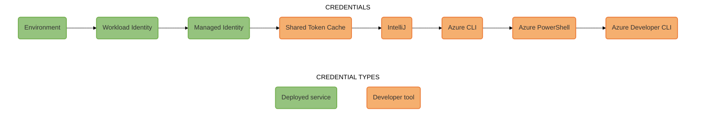

```mermaid
%% STEPS TO GENERATE IMAGE
%% =======================
%% 1. Install mermaid CLI v10.9.1 (see https://github.com/mermaid-js/mermaid-cli/blob/master/README.md):
%%    npm i -g @mermaid-js/mermaid-cli@10.9.1
%% 2. Run commands:
%%    mmdc -i default-azure-credential-auth-flow.md -o ../../media/mermaidjs/default-azure-credential-auth-flow.svg
%%    mmdc -i default-azure-credential-auth-flow.md -o ../../media/mermaidjs/default-azure-credential-auth-flow-big.png

%%{
  init: {
    'theme': 'base',
    'themeVariables': {
      'tertiaryBorderColor': '#fff',
      'tertiaryColor': '#fff'
    }
  }
}%%

flowchart LR;
    accTitle: DefaultAzureCredential authentication flow;
    accDescr: Flowchart showing the credential chain implemented by DefaultAzureCredential;

    subgraph CREDENTIAL TYPES;
        direction LR;
        Deployed(Deployed service):::deployed ~~~ Developer(Developer tool):::developer;
    end;

    subgraph CREDENTIALS;
        direction LR;
        A(Environment):::deployed --> 
        B(Workload Identity):::deployed --> 
        C(Managed Identity):::deployed --> 
        D(Shared Token Cache):::developer --> 
        E(IntelliJ):::developer --> 
        F(Azure CLI):::developer --> 
        G(Azure PowerShell):::developer --> 
        H(Azure Developer CLI):::developer;
    end;

    %% Define styles for credential type boxes
    classDef deployed fill:#95C37E, stroke:#71AD4C, stroke-width:2px;
    classDef developer fill:#F5AF6F, stroke:#EB7C39, stroke-width:2px;

    %% Add API ref links to credential type boxes
    click A "https://learn.microsoft.com/java/api/com.azure.identity.environmentcredential?view=azure-java-stable" _blank;
    click B "https://learn.microsoft.com/java/api/com.azure.identity.workloadidentitycredential?view=azure-java-stable" _blank;
    click C "https://learn.microsoft.com/java/api/com.azure.identity.managedidentitycredential?view=azure-java-stable" _blank;
    click D "https://learn.microsoft.com/java/api/com.azure.identity.sharedtokencachecredential?view=azure-java-stable" _blank;
    click E "https://learn.microsoft.com/java/api/com.azure.identity.intellijcredential?view=azure-java-stable" _blank;
    click F "https://learn.microsoft.com/java/api/com.azure.identity.azureclicredential?view=azure-java-stable" _blank;
    click G "https://learn.microsoft.com/java/api/com.azure.identity.azurepowershellcredential?view=azure-java-stable" _blank;
    click H "https://learn.microsoft.com/java/api/com.azure.identity.azuredeveloperclicredential?view=azure-java-stable" _blank;
```
