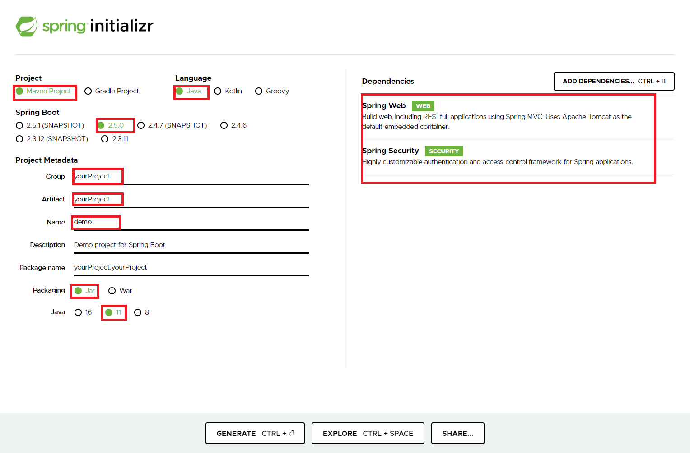
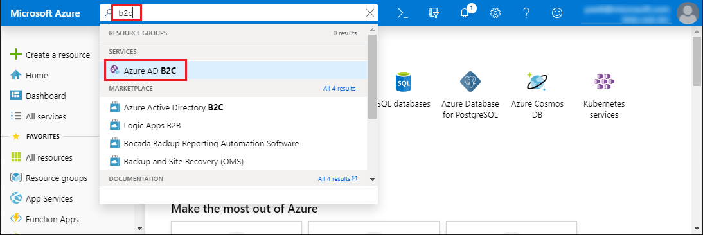
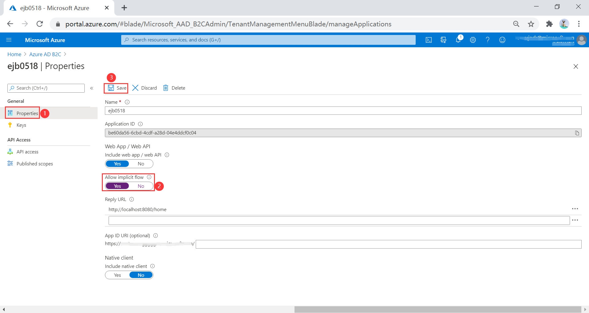
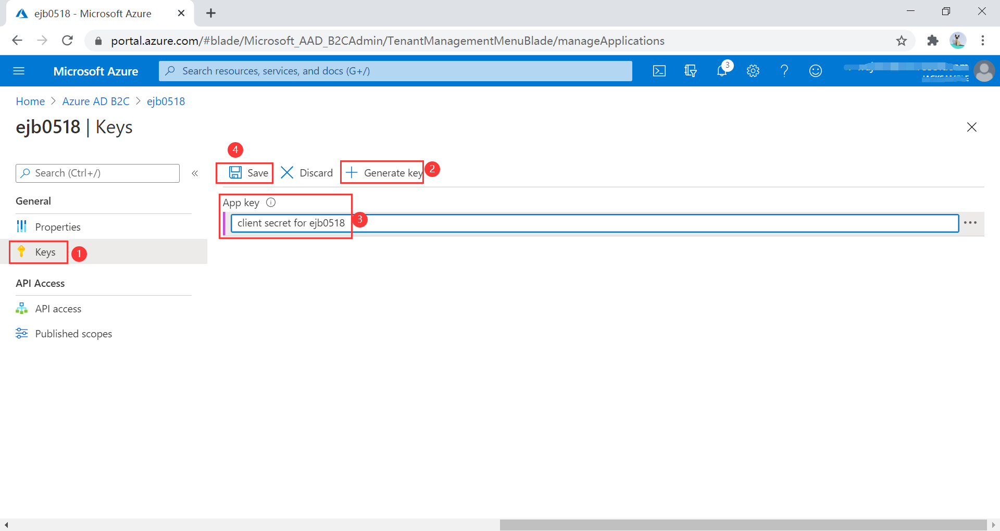

# Tutorial: Secure a Java web app using the Spring Boot Starter for Azure Active Directory B2C

This article demonstrates creating a Java app with the [Spring Initializr](https://start.spring.io/) that uses the Spring Boot Starter for Azure Active Directory (Azure AD).

In this tutorial, you learn how to:

> [!div class="checklist"]
> * Create a Java application using the Spring Initializr
> * Configure Azure Active Directory B2C
> * Secure the application with Spring Boot classes and annotations
> * Build and test your Java application

[Azure Active Directory](https://azure.microsoft.com/services/active-directory) is Microsoft's cloud-scale enterprise identity solution. [Azure Active Directory B2C](https://azure.microsoft.com/services/active-directory/external-identities/b2c/) compliments the feature set of Azure Active Directory, allowing you to manage customer, consumer, and citizen access to your business-to-consumer (B2C) applications.

## Prerequisites

* An Azure subscription. If you don't already have one, create a [free account](https://azure.microsoft.com/free/?WT.mc_id=A261C142F) before you begin.
* A supported Java Development Kit (JDK). For more information about the JDKs available for use when developing on Azure, see <https://aka.ms/azure-jdks>.
* [Apache Maven](http://maven.apache.org/), version 3.0 or later.

## Create an app using Spring Initializr

1. Browse to <https://start.spring.io/>.

2. Fill out the values according to this guidance. Note that the labels and layout may differ from the image shown here.

    * Under **Project**, select **Maven Project**.
    * Under **Language**, select **Java**.
    * Under **Spring Boot**, select **2.3.4**.
    * Under **Group**, **Artifact** and **Name** enter the same value, using a short descriptive string. The UI may automatically fill some of these out as you type.
    * In the **Dependencies** pane, select **Add Dependencies**. Use the UI to add dependencies on **Spring Web** and **Spring Security**.

   

    > [!NOTE]
    > Spring Initializr uses Java 11 as the default version. To use the Spring Boot Starters described in this topic, you must select Java 8 instead.


3. Select **Generate Project**, then download the project to a path on your local computer. Move the downloaded file to a directory named after your project and unzip the file. The file layout should look something like the following, with the value you entered for **Group** in place of `yourProject`.

    ```
    .
    ├── HELP.md
    ├── mvnw
    ├── mvnw.cmd
    ├── pom.xml
    └── src
        ├── main
        │   ├── java
        │   │   └── yourProject
        │   │       └── yourProject
        │   │           └── YourProjectApplication.java
        │   └── resources
        │       ├── application.properties
        │       ├── static
        │       └── templates
        └── test
            └── java
                └── yourProject
                    └── yourProject
                        └── YourProjectApplicationTests.java
    ```

## Create and initialize an Azure Active Directory instance

### Create the Active Directory instance

1. Log into <https://portal.azure.com>.

2. Select **Create a resource**, then **Identity**, and then **See all**. Search for **Azure Active Directory B2C**.

    

3. Select **Create**.

    

4. Select **Create a new Azure AD B2C Tenant**.

    

5. For **Organization name** and **Initial domain name**, provide appropriate values, then select **Create**.

    

6. When the Active Directory creation is complete, navigate to the new directory. Or search for `b2c` and select **Azure AD B2C**.

    

### Add an application registration for your Spring Boot app

1. In the **Manage** pane on the left, select **App registrations**, and then select **New registration**.

   

2. In the **Name** field, enter the value for **Group** from above, then set **Redirect URI (recommended)**  to *http://localhost:8080/home* and select **Register**.

   

3. Back on the **Manage** pane , select **Applications (Legacy)** , then select the application name you created.

   

4. Select **Properties** then set **Allow implicit flow** control to **Yes**.
   
5. Leave the other fields with their default values.
    
6. Select **Save**. It may take a short while before the application is ready.
    
   

7. In the **General** pane select **Keys**, then select **Generate Key**.

8. Set **App key** to the value you entered above for **Group**.

9. Select **Save**. Wait for the key to appear in the app key section, then copy it for use later in this article.

    > [!NOTE]
    > If you leave the **Keys** section and come back, you will not be able to see the key value. In that case, you must create another key and copy it for future use.
    > Occasionally, the generated key may contain characters that are problematic for inclusion in the *application.yml* file, such as backslash or backtick. In that case, discard that key and generate another one.

    

10. Select **Overview**.

11. In the **Policies** section of the left pane, select **User flows**, then select **New user flow**.

12. You will now leave this tutorial, execute another tutorial, and come back to this tutorial when you are done. Here are some things to keep in mind when you go to the other tutorial.

    * Start with the step that requests you to select **New User flow**.
    * When this tutorial refers to `webapp1`, use the value you entered for **Group** instead.
    * When you are selecting claims to return from the flows, ensure **Display Name** is selected. Without this claim, the app being built in this tutorial will not work.
    * When you are asked to run the user flows, the redirect url you specified above is not yet active. You can still run the flows, but the redirection will not complete successfully. This is expected.
    * When you reach "Next steps", return to this tutorial.

    Follow all the steps in [Tutorial: Create user flows in Azure Active Directory B2C](/azure/active-directory-b2c/tutorial-create-user-flows) to create user flows for "sign-up and sign in", "profile editing" and "password reset".

    Azure AD B2C supports local accounts as well as social identity providers. For an example of creating a GitHub identity provider, see [Set up sign-up and sign-in with a GitHub account using Azure Active Directory B2C](/azure/active-directory-b2c/identity-provider-github).

## Configure and compile your app

Now that you've created the Azure AD B2C instance and some user flows, you'll connect your Spring app to the Azure AD B2C instance.

1. From the command line, cd to the directory where you unzipped the .zip file you downloaded from Spring Initializr.

2. Navigate to the parent folder for your project, and open the *pom.xml* Maven project file in a text editor.

3. Add the dependencies for Spring OAuth2 security to the *pom.xml*:

    ```xml
    <dependency>
        <groupId>com.microsoft.azure</groupId>
        <artifactId>azure-active-directory-b2c-spring-boot-starter</artifactId>
        <version>See Below</version>
    </dependency>
    <dependency>
        <groupId>org.springframework.boot</groupId>
        <artifactId>spring-boot-starter-thymeleaf</artifactId>
        <version>See Below</version>
    </dependency>
    <dependency>
        <groupId>org.thymeleaf.extras</groupId>
        <artifactId>thymeleaf-extras-springsecurity5</artifactId>
        <version>See Below</version>
    </dependency>
    ```

    For the `azure-active-directory-b2c-spring-boot-starter`, use the latest version available. You may be able to use [mvnrepository.com](https://mvnrepository.com/ artifact/com.microsoft.azure/azure-active-directory-spring-boot-starter) to look this up. As of this updating the latest version is `2.3.5`.

    For the `spring-boot-starter-thymeleaf`, use the version corresponding to the version of Spring Boot you selected above, for example `2.3.4.RELEASE`.

    For `thymeleaf-extras-springsecurity5`, use the latest version available. You may be able to use [mvnrepository.com](https://mvnrepository.com/artifact/org.thymeleaf.extras/thymeleaf-extras-springsecurity5) to look this up. As of this writing, the latest version is `3.0.4.RELEASE`.

4. Save and close the *pom.xml* file.

    * Verify that your dependencies are correct by running `mvn -DskipTests clean install`. If you do not see `BUILD SUCCESS`, troubleshoot and resolve the problem before continuing.

5. Navigate to the *src/main/resources* folder in your project and create an *application.yml* file in a text editor.

6. Specify the settings for your app registration using the values you created earlier; for example:

    ```yaml
    azure:
      activedirectory:
        b2c:
          tenant: ejb0518domain
          client-id: 11111111-1111-1111-1111-1111111111111111
          client-secret: '<yourAppKey>'
          reply-url: http://localhost:8080/home
          logout-success-url: http://localhost:8080/home
          user-flows:
            sign-up-or-sign-in: B2C_1_signupsignin1
            profile-edit: B2C_1_profileediting1
            password-reset: B2C_1_passwordreset1
    ```

    Notice that the `client-secret` value is enclosed in single quotes. This is necessary because the value of `<yourAppKey>` will almost certainly contain some characters that require being inside single quotes when present in YAML.

    > [!NOTE]
    > As of this writing, the full list of Active Directory B2C Spring Integration values that are available for use in *application.yml* is the following:
    >
    > ```
    > azure:
    >   activedirectory:
    >     b2c:
    >       tenant:
    >       oidc-enabled:
    >       client-id:
    >       client-secret:
    >       reply-url:  # should be absolute url.
    >       logout-success-url:
    >       user-flows:
    >         sign-up-or-sign-in:
    >         profile-edit: # optional
    >         password-reset: # optional
    > ```
    >
    > The *application.yml* file is available in [Azure Active Directory B2C Spring Boot Sample](https://github.com/Azure/azure-sdk-for-java/blob/master/sdk/spring/azure-spring-boot-samples/azure-spring-boot-sample-active-directory-b2c-oidc/src/main/resources/application.yml) on GitHub.

7. Save and close the *application.yml* file.

8. Create a folder named *controller* in *src/main/java/<yourGroupId>/<yourGroupId>*, replacing `<yourGroupId>` with the value you entered for **Group**.

9. Create a new Java file named *WebController.java* in the *controller* folder and open it in a text editor.

10. Enter the following code, changing `yourGroupId` appropriately, then save and close the file:

    ```java
    package yourGroupId.yourGroupId.controller;

    import org.springframework.security.oauth2.client.authentication.OAuth2AuthenticationToken;
    import org.springframework.security.oauth2.core.user.OAuth2User;
    import org.springframework.stereotype.Controller;
    import org.springframework.ui.Model;
    import org.springframework.web.bind.annotation.GetMapping;

    @Controller
    public class WebController {

        private void initializeModel(Model model, OAuth2AuthenticationToken token) {
            if (token != null) {
                final OAuth2User user = token.getPrincipal();

                model.addAttribute("grant_type", user.getAuthorities());
                model.addAllAttributes(user.getAttributes());
            }
        }

        @GetMapping(value = "/")
        public String index(Model model, OAuth2AuthenticationToken token) {
            initializeModel(model, token);

            return "home";
        }

        @GetMapping(value = "/greeting")
        public String greeting(Model model, OAuth2AuthenticationToken token) {
            initializeModel(model, token);

            return "greeting";
        }

        @GetMapping(value = "/home")
        public String home(Model model, OAuth2AuthenticationToken token) {
            initializeModel(model, token);

            return "home";
        }
    }
    ```

    Because every method in the controller calls `initializeModel()`, and that method calls `model.addAllAttributes(user.getAttributes());`, any HTML page in *src/main/resources/templates* is able to access any of those attributes, such as `${name}`, `${grant_type}`, or `${auth_time}`. The values returned from `user.getAttributes()` are in fact the claims of the `id_token` for the authentication. The complete list of available claims is listed in [Microsoft identity platform ID tokens](/azure/active-directory/develop/id-tokens#payload-claims).

11. Create a folder named *security* in *src/main/java/<yourGroupId>/<yourGroupId>*, replacing `yourGroupId` with the value you entered for **Group**.

12. Create a new Java file named *WebSecurityConfiguration.java* in the *security* folder and open it in a text editor.

13. Enter the following code, changing `yourGroupId` appropriately, then save and close the file:

    ```java
    package yourGroupId.yourGroupId.security;

    import com.microsoft.azure.spring.autoconfigure.b2c.AADB2COidcLoginConfigurer;
    import org.springframework.security.config.annotation.web.builders.HttpSecurity;
    import org.springframework.security.config.annotation.web.configuration.EnableWebSecurity;
    import org.springframework.security.config.annotation.web.configuration.WebSecurityConfigurerAdapter;

    @EnableWebSecurity
    public class WebSecurityConfiguration extends WebSecurityConfigurerAdapter {

        private final AADB2COidcLoginConfigurer configurer;

        public WebSecurityConfiguration(AADB2COidcLoginConfigurer configurer) {
            this.configurer = configurer;
        }

        @Override
        protected void configure(HttpSecurity http) throws Exception {
            http
                    .authorizeRequests()
                    .anyRequest()
                    .authenticated()
                    .and()
                    .apply(configurer)
            ;
        }
    }
    ```

14. Copy the *greeting.html* and *home.html* files from [Azure AD B2C Spring Boot Sample](https://github.com/Azure/azure-sdk-for-java/tree/master/sdk/spring/azure-spring-boot-samples/azure-spring-boot-sample-active-directory-b2c-oidc/src/main/resources/templates) to *src/main/resources/templates*, and replace the `${your-profile-edit-user-flow}` and `${your-password-reset-user-flow}` with the names of the user flows that you created earlier.

## Build and test your app

1. Open a command prompt and change directory to the folder where your app's *pom.xml* file is located.

2. Build your Spring Boot application with Maven and run it; for example:

    > [!NOTE]
    > It's extremely important that the time according to the system clock under which the local spring boot app runs is accurate. There is very little tolerance of clock skew when using OAuth 2.0. Even three minutes of inaccuracy may cause the signin to fail with an error similar to `[invalid_id_token] An error occurred while attempting to decode the Jwt: Jwt used before 2020-05-19T18:52:10Z`. As of this writing, [time.gov](https://time.gov/) has an indicator of how far off your clock is from the actual time. The app was successfully run with a skew of +0.019 seconds.

    ```shell
    mvn -DskipTests clean package
    mvn -DskipTests spring-boot:run
    ```

3. After your application is built and started by Maven, open `http://localhost:8080/` in a web browser;
you should be redirected to login page.

    

4. Select the link with text relating to signing in. You should be redirected Azure AD B2C to start the authentication process.

5. After you have logged in successfully, you should see the sample `home page` from the browser,

    

## Summary

In this tutorial, you created a new Java web application using the Azure Active Directory B2C starter, configured a new Azure AD B2C tenant, and registered a new application in it, and then configured your application to use the Spring annotations and classes to protect the web app.

## Clean up resources

When no longer needed, use the [Azure portal](https://portal.azure.com/) to delete the resources created in this article to avoid unexpected charges.

## Next steps

To learn more about Spring and Azure, continue to the Spring on Azure documentation center.

> [!div class="nextstepaction"]
> [Spring on Azure](./index.yml)