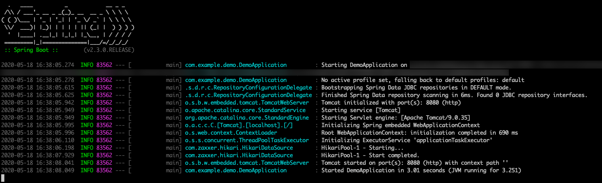
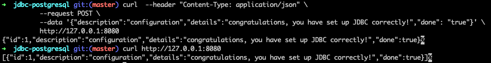

# Use Spring Data JDBC with Azure Database for PostgreSQL

This topic demonstrates creating a sample application that uses [Spring Data JDBC](https://spring.io/projects/spring-data-jdbc) to store and retrieve information in an [Azure Database for PostgreSQL](/azure/postgresql/) database.

[JDBC](https://en.wikipedia.org/wiki/Java_Database_Connectivity) is the standard Java API to connect to traditional relational databases.

[!INCLUDE [spring-data-prerequisites.md](includes/spring-data-prerequisites.md)]

## Sample application

In this article, we will code a sample application. If you want to go faster, this application is already coded and available at [https://github.com/Azure-Samples/quickstart-spring-data-jdbc-postgresql](https://github.com/Azure-Samples/quickstart-spring-data-jdbc-postgresql).


[!INCLUDE [spring-data-postgresql-setup.md](includes/spring-data-postgresql-setup.md)]

### Generate the application by using Spring Initializr

Generate the application on the command line by using the following command:

```bash
curl https://start.spring.io/starter.tgz -d dependencies=web,data-jdbc,postgresql -d baseDir=azure-database-workshop -d bootVersion=2.3.1.RELEASE -d javaVersion=8 | tar -xzvf -
```

### Configure Spring Boot to use Azure Database for PostgreSQL

Open the *src/main/resources/application.properties* file, and add the following text:

```properties
logging.level.org.springframework.jdbc.core=DEBUG

spring.datasource.url=jdbc:postgresql://$AZ_DATABASE_NAME.postgres.database.azure.com:5432/demo
spring.datasource.username=spring@$AZ_DATABASE_NAME
spring.datasource.password=$AZ_POSTGRESQL_PASSWORD

spring.datasource.initialization-mode=always
```

Replace the two `$AZ_DATABASE_NAME` variables and the `$AZ_POSTGRESQL_PASSWORD` variable with the values that you configured at the beginning of this article.

> [!WARNING]
> The configuration property `spring.datasource.initialization-mode=always` means that Spring Boot will automatically generate a database schema, using the *schema.sql* file that we will create later, each time the server is started. This is great for testing, but remember that this will delete your data at each restart, so you shouldn't use it in production.

You should now be able to start your application by using the provided Maven wrapper as follows:

```bash
./mvnw spring-boot:run
```

Here's a screenshot of the application running for the first time:

[](media/configure-spring-data-jdbc-with-azure-postgresql/create-postgresql-01.png#lightbox)

### Create the database schema

Spring Boot will automatically execute the *src/main/resources/schema.sql* file in order to create a database schema. Create that file and add the following content:

```sql
DROP TABLE IF EXISTS todo;
CREATE TABLE todo (id SERIAL PRIMARY KEY, description VARCHAR(255), details VARCHAR(4096), done BOOLEAN);
```

Stop the running application, and start it again using the following command. The application will now use the `demo` database that you created earlier, and create a `todo` table inside it.

```bash
./mvnw spring-boot:run
```

## Code the application

Next, add the Java code that will use JDBC to store and retrieve data from your PostgreSQL server.

[!INCLUDE [spring-data-jdbc-create-application.md](includes/spring-data-jdbc-create-application.md)]

Here's a screenshot of these cURL requests:

[](media/configure-spring-data-jdbc-with-azure-postgresql/create-postgresql-02.png#lightbox)

Congratulations! You've created a Spring Boot application that uses JDBC to store and retrieve data from Azure Database for PostgreSQL.

[!INCLUDE [spring-data-conclusion.md](includes/spring-data-conclusion.md)]

### Additional resources

For more information about Spring Data JDBC, see Spring's [reference documentation](https://docs.spring.io/spring-data/jdbc/docs/current/reference/html/#reference).

For more information about using Azure with Java, see [Azure for Java developers](/azure/developer/java/) and [Working with Azure DevOps and Java](/azure/devops/).
