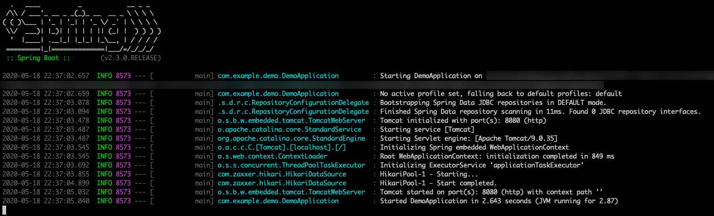
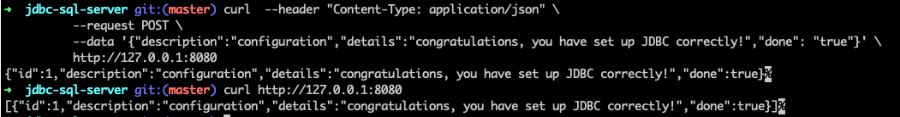

# Use Spring Data JDBC with Azure SQL Database

This topic demonstrates creating a sample application that uses [Spring Data JDBC](https://spring.io/projects/spring-data-jdbc) to store and retrieve information in [Azure SQL Database](https://docs.microsoft.com/azure/sql-database/).

[JDBC](https://en.wikipedia.org/wiki/Java_Database_Connectivity) is the standard Java API to connect to traditional relational databases.

[!INCLUDE [spring-data-prerequisites.md](includes/spring-data-prerequisites.md)]

[!INCLUDE [spring-data-sql-server-setup.md](includes/spring-data-sql-server-setup.md)]

### Generate the application by using Spring Initializr

Generate the application on the command line by entering:

```bash
curl https://start.spring.io/starter.tgz -d dependencies=web,data-jdbc,sqlserver -d baseDir=azure-database-workshop -d bootVersion=2.3.0.RELEASE -d javaVersion=8 | tar -xzvf -
```

### Configure Spring Boot to use Azure SQL Database

Open the *src/main/resources/application.properties* file, and add:

```properties
logging.level.org.springframework.jdbc.core=DEBUG

spring.datasource.url=jdbc:sqlserver://$AZ_DATABASE_NAME.database.windows.net:1433;database=demo;encrypt=true;trustServerCertificate=false;hostNameInCertificate=*.database.windows.net;loginTimeout=30;
spring.datasource.username=spring@$AZ_DATABASE_NAME
spring.datasource.password=$AZ_SQL_SERVER_PASSWORD

spring.datasource.initialization-mode=always
```

- Replace the two `$AZ_DATABASE_NAME` variables with the value that you configured at the beginning of this article.
- Replace the `$AZ_SQL_SERVER_PASSWORD` variable with the value that you configured at the beginning of this article.

> [!WARNING]
> The configuration property `spring.datasource.initialization-mode=always` means that Spring Boot will automatically generate a database schema, using the `schema.sql` file that we will create later, each time the server is started. This is great for testing, but remember this will delete your data at each restart, so this shouldn't be used in production!

You should now be able to start your application by using the provided Maven wrapper:

```bash
./mvnw spring-boot:run
```

Here's a screenshot of the application running for the first time:

[](media/configure-spring-data-jdbc-with-azure-sql-server/create-sql-server-01.png#lightbox)

### Create the database schema

Spring Boot will automatically execute *src/main/resources/`schema.sql`* in order to create a database schema. Create that file, with the following content:

```sql
DROP TABLE IF EXISTS todo;
CREATE TABLE todo (id INT IDENTITY PRIMARY KEY, description VARCHAR(255), details VARCHAR(4096), done BIT);
```

Stop the running application, and start it again. The application will now use the `demo` database that you created earlier, and create a `todo` table inside it.

```bash
./mvnw spring-boot:run
```

## Code the application

Next, add the Java code that will use JDBC to store and retrieve data from your Azure SQL Database server.

[!INCLUDE [spring-data-jdbc-create-application.md](includes/spring-data-jdbc-create-application.md)]

Here's a screenshot of these cURL requests:

[](media/configure-spring-data-jdbc-with-azure-sql-server/create-sql-server-02.png#lightbox)

Congratulations! You've created a Spring Boot application that uses JDBC to store and retrieve data from Azure SQL Database.

[!INCLUDE [spring-data-conclusion.md](includes/spring-data-conclusion.md)]

### Additional resources

For more information about Spring Data JDBC, see Spring's [reference documentation](https://docs.spring.io/spring-data/jdbc/docs/current/reference/html/#reference).

For more information about using Azure with Java, see [Azure for Java developers](/azure/developer/java/) and [Working with Azure DevOps and Java](/azure/devops/).
