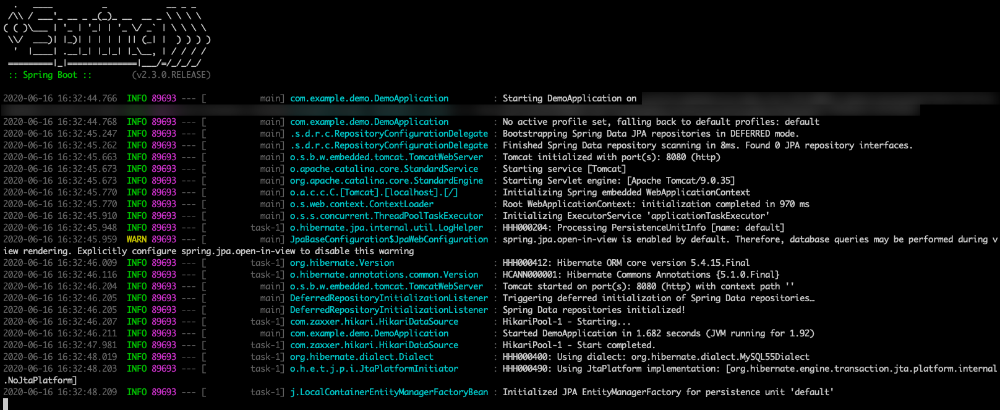
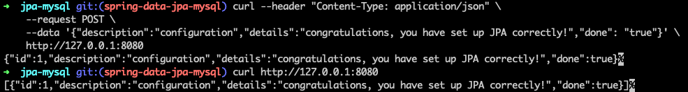

# Use Spring Data JPA with Azure Database for MySQL

This topic demonstrates creating a sample application that uses [Spring Data JPA](https://spring.io/projects/spring-data-jpa) to store and retrieve information in [Azure Database for MySQL](/azure/mysql/).

[The Java Persistence API (JPA)](https://en.wikipedia.org/wiki/Java_Persistence_API) is the standard Java API for object-relational mapping.

[!INCLUDE [spring-data-prerequisites.md](includes/spring-data-prerequisites.md)]

## Sample application

In this article, we will code a sample application. If you want to go faster, this application is already coded and available at [https://github.com/Azure-Samples/quickstart-spring-data-jpa-mysql](https://github.com/Azure-Samples/quickstart-spring-data-jpa-mysql).

[!INCLUDE [spring-data-mysql-setup.md](includes/spring-data-mysql-setup.md)]

### Generate the application by using Spring Initializr

Generate the application on the command line by entering:

```bash
curl https://start.spring.io/starter.tgz -d dependencies=web,data-jpa,mysql -d baseDir=azure-database-workshop -d bootVersion=2.3.4.RELEASE -d javaVersion=8 | tar -xzvf -
```
 > [!NOTE]
 > Spring Initializr uses Java 11 as the default version. To use the Spring Boot Starters described in this topic, you must select Java 8 instead.

### Configure Spring Boot to use Azure Database for MySQL

Open the *src/main/resources/application.properties* file, and add the following. Be sure to replace the two `$AZ_DATABASE_NAME` variables and the `$AZ_MYSQL_PASSWORD` variable with the values that you configured at the beginning of this article.

```properties
logging.level.org.hibernate.SQL=DEBUG

spring.datasource.url=jdbc:mysql://$AZ_DATABASE_NAME.mysql.database.azure.com:3306/demo?serverTimezone=UTC
spring.datasource.username=spring@$AZ_DATABASE_NAME
spring.datasource.password=$AZ_MYSQL_PASSWORD

spring.jpa.show-sql=true
spring.jpa.hibernate.ddl-auto=create-drop
```

> [!WARNING]
> The configuration property `spring.jpa.hibernate.ddl-auto=create-drop` means that Spring Boot will automatically create a database schema at application start-up, and will try to delete it when it shuts down. This is great for testing, but this shouldn't be used in production!

> [!NOTE]
> We append `?serverTimezone=UTC` to the configuration property `spring.datasource.url`, to tell the JDBC driver to use the UTC date format (or Coordinated Universal Time) when connecting to the database. Otherwise, our Java server would not use the same date format as the database, which would result in an error.

You should now be able to start your application by using the provided Maven wrapper:

```bash
./mvnw spring-boot:run
```

Here's a screenshot of the application running for the first time:

[](media/configure-spring-data-jpa-with-azure-mysql/create-mysql-01.png#lightbox)

## Code the application

Next, add the Java code that will use JPA to store and retrieve data from your MySQL server.

[!INCLUDE [spring-data-jpa-create-application.md](includes/spring-data-jpa-create-application.md)]

Here's a screenshot of these cURL requests:

[](media/configure-spring-data-jpa-with-azure-mysql/create-mysql-02.png#lightbox)

Congratulations! You've created a Spring Boot application that uses JPA to store and retrieve data from Azure Database for MySQL.

[!INCLUDE [spring-data-conclusion.md](includes/spring-data-conclusion.md)]

### Additional resources

For more information about Spring Data JPA, see Spring's [reference documentation](https://docs.spring.io/spring-data/jpa/docs/current/reference/html/#reference).

For more information about using Azure with Java, see [Azure for Java developers](../index.yml) and [Working with Azure DevOps and Java](/azure/devops/).