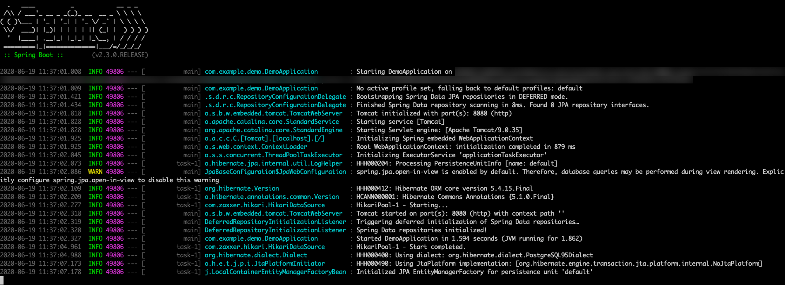
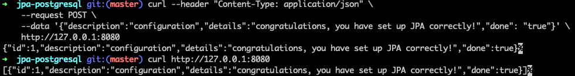

# Use Spring Data JPA with Azure Database for PostgreSQL

This topic demonstrates creating a sample application that uses [Spring Data JPA](https://spring.io/projects/spring-data-jpa) to store and retrieve information in [Azure Database for PostgreSQL](https://docs.microsoft.com/azure/postgresql/).

[The Java Persistence API (JPA)](https://en.wikipedia.org/wiki/Java_Persistence_API) is the standard Java API for object-relational mapping.

[!INCLUDE [spring-data-prerequisites.md](includes/spring-data-prerequisites.md)]

[!INCLUDE [spring-data-postgresql-setup.md](includes/spring-data-postgresql-setup.md)]

### Generate the application by using Spring Initializr

Generate the application on the command line by entering:

```bash
curl https://start.spring.io/starter.tgz -d dependencies=web,data-jpa,postgresql -d baseDir=azure-database-workshop -d bootVersion=2.3.1.RELEASE -d javaVersion=8 | tar -xzvf -
```

### Configure Spring Boot to use Azure Database for PostgreSQL

Open the *src/main/resources/application.properties* file, and add the following. Be sure to replace the two `$AZ_DATABASE_NAME` variables and the `$AZ_POSTGRESQL_PASSWORD` variable with the values that you configured at the beginning of this article.

```properties
logging.level.org.hibernate.SQL=DEBUG

spring.datasource.url=jdbc:postgresql://$AZ_DATABASE_NAME.postgres.database.azure.com:5432/demo
spring.datasource.username=spring@$AZ_DATABASE_NAME
spring.datasource.password=$AZ_POSTGRESQL_PASSWORD

spring.jpa.show-sql=true
spring.jpa.hibernate.ddl-auto=create-drop
```

> [!WARNING]
> The configuration property `spring.jpa.hibernate.ddl-auto=create-drop` means that Spring Boot will automatically create a database schema at application start-up, and will try to delete it when it shuts down. This is great for testing, but this shouldn't be used in production!

You should now be able to start your application by using the provided Maven wrapper:

```bash
./mvnw spring-boot:run
```

Here's a screenshot of the application running for the first time:

[](media/configure-spring-data-jpa-with-azure-postgresql/create-postgresql-01.png#lightbox)

## Code the application

Next, add the Java code that will use JPA to store and retrieve data from your PostgreSQL server.

[!INCLUDE [spring-data-jpa-create-application.md](includes/spring-data-jpa-create-application.md)]

Here's a screenshot of these cURL requests:

[](media/configure-spring-data-jpa-with-azure-postgresql/create-postgresql-02.png#lightbox)

Congratulations! You've created a Spring Boot application that uses JPA to store and retrieve data from Azure Database for PostgreSQL.

[!INCLUDE [spring-data-conclusion.md](includes/spring-data-conclusion.md)]

### Additional resources

For more information about Spring Data JPA, see Spring's [reference documentation](https://docs.spring.io/spring-data/jpa/docs/current/reference/html/#reference).

For more information about using Azure with Java, see [Azure for Java developers](/azure/developer/java/) and [Working with Azure DevOps and Java](/azure/devops/).
