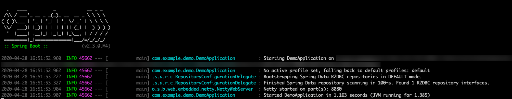
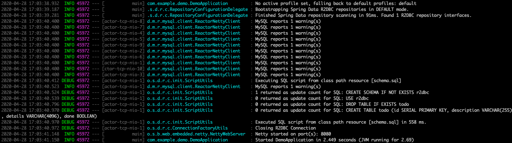
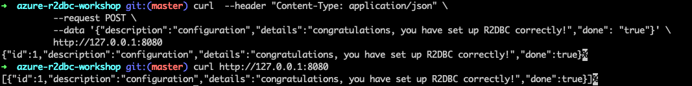

# Use Spring Data R2DBC with Azure Database for MySQL

This topic demonstrates creating a sample application that uses [Spring Data R2DBC](https://spring.io/projects/spring-data-r2dbc) to store and retrieve information in [Azure Database for MySQL](https://docs.microsoft.com/azure/mysql/) by using the R2DBC implementation for MySQL from the [r2dbc-mysql GitHub repository](https://github.com/mirromutth/r2dbc-mysql).

[R2DBC](https://r2dbc.io/) brings reactive APIs to traditional relational databases. You can use it with Spring WebFlux to create fully reactive Spring Boot applications that use non-blocking APIs. It provides better scalability than the classic "one thread per connection" approach.

[!INCLUDE [spring-data-prerequisites.md](includes/spring-data-prerequisites.md)]

[!INCLUDE [spring-data-mysql-setup.md](includes/spring-data-mysql-setup.md)]

## Create a reactive Spring Boot application

To create a reactive Spring Boot application, we'll use [Spring Initializr](https://start.spring.io/). The application that we'll create uses:

- Spring Boot 2.3.0 M4.
- Java 8 (but it will also work with newer versions like Java 11).
- The following dependencies: Spring Reactive Web (also known as Spring WebFlux) and Spring Data R2DBC.

### Generate the application by using Spring Initializr

Generate the application on the command line by entering:

```bash
curl https://start.spring.io/starter.tgz -d dependencies=webflux,data-r2dbc -d baseDir=azure-r2dbc-workshop -d bootVersion=2.3.0.M4 -d javaVersion=8 | tar -xzvf -
```

### Add the reactive MySQL driver implementation

Open the generated project's *pom.xml* file to add the reactive MySQL driver from the [r2dbc-mysql repository on GitHub](https://github.com/mirromutth/r2dbc-mysql).

After the `spring-boot-starter-webflux` dependency, add the following snippet:

```xml
<dependency>
   <groupId>dev.miku</groupId>
   <artifactId>r2dbc-mysql</artifactId>
   <version>0.8.1.RELEASE</version>
   <scope>runtime</scope>
</dependency>
```

### Configure Spring Boot to use Azure Database for MySQL

Open the *src/main/resources/application.properties* file, and add:

```properties
logging.level.org.springframework.data.r2dbc=DEBUG

spring.r2dbc.url=r2dbc:pool:mysql://$AZ_DATABASE_NAME.mysql.database.azure.com:3306/r2dbc
spring.r2dbc.username=r2dbc@$AZ_DATABASE_NAME
spring.r2dbc.password=$AZ_MYSQL_PASSWORD
```

- Replace the two `$AZ_DATABASE_NAME` variables with the value that you configured at the beginning of this article.
- Replace the `$AZ_MYSQL_PASSWORD` variable with the value that you configured at the beginning of this article.

> [!NOTE]
> For better performance, the `spring.r2dbc.url` property is configured to use a connection pool using [r2dbc-pool](https://github.com/r2dbc/r2dbc-pool).

You should now be able to start your application by using the provided Maven wrapper:

```bash
./mvnw spring-boot:run
```

Here's a screenshot of the application running for the first time:

[](media/configure-spring-data-r2dbc-with-azure-mysql/create-mysql-01.png#lightbox)

### Create the database schema

Inside the main `DemoApplication` class, configure a new Spring bean that will create a database schema:

```java
    @Bean
    public ConnectionFactoryInitializer initializer(ConnectionFactory connectionFactory) {
        ConnectionFactoryInitializer initializer = new ConnectionFactoryInitializer();
        initializer.setConnectionFactory(connectionFactory);
        ResourceDatabasePopulator populator = new ResourceDatabasePopulator(new ClassPathResource("schema.sql"));
        initializer.setDatabasePopulator(populator);
        return initializer;
    }
```

This Spring bean uses a file called *schema.sql*, so create that file in the *src/main/resources* folder:

```sql
DROP TABLE IF EXISTS todo;
CREATE TABLE todo (id SERIAL PRIMARY KEY, description VARCHAR(255), details VARCHAR(4096), done BOOLEAN);
```

Use the following command to stop the application and run it again. The application will now use the `r2dbc` database that you created earlier, and create a `todo` table inside it.

```bash
./mvnw spring-boot:run
```

Here's a screenshot of the database table as it's being created:

[](media/configure-spring-data-r2dbc-with-azure-mysql/create-mysql-02.png#lightbox)

## Code the application

Next, add the Java code that will use R2DBC to store and retrieve data from your MySQL server.

Create a new `Todo` Java class, next to the `DemoApplication` class:

```java
package com.example.demo;

import org.springframework.data.annotation.Id;

public class Todo {

    public Todo() {
    }

    public Todo(String description, String details, boolean done) {
        this.description = description;
        this.details = details;
        this.done = done;
    }

    @Id
    private Long id;

    private String description;

    private String details;

    private boolean done;

    public Long getId() {
        return id;
    }

    public void setId(Long id) {
        this.id = id;
    }

    public String getDescription() {
        return description;
    }

    public void setDescription(String description) {
        this.description = description;
    }

    public String getDetails() {
        return details;
    }

    public void setDetails(String details) {
        this.details = details;
    }

    public boolean isDone() {
        return done;
    }

    public void setDone(boolean done) {
        this.done = done;
    }
}
```

This class is a domain model mapped on the `todo` table that you created before.

To manage that class, you'll need a repository. Define a new `TodoRepository` interface in the same package:

```java
package com.example.demo;

import org.springframework.data.repository.reactive.ReactiveCrudRepository;

public interface TodoRepository extends ReactiveCrudRepository<Todo, Long> {
}
```

This repository is a reactive repository that Spring Data R2DBC manages.

Finish the application by creating a controller that can store and retrieve data. Implement a `TodoController` class in the same package, and add the following code:

```java
package com.example.demo;

import org.springframework.http.HttpStatus;
import org.springframework.web.bind.annotation.*;
import reactor.core.publisher.Flux;
import reactor.core.publisher.Mono;

@RestController
@RequestMapping("/")
public class TodoController {

    private final TodoRepository todoRepository;

    public TodoController(TodoRepository todoRepository) {
        this.todoRepository = todoRepository;
    }

    @PostMapping("/")
    @ResponseStatus(HttpStatus.CREATED)
    public Mono<Todo> createTodo(@RequestBody Todo todo) {
        return todoRepository.save(todo);
    }

    @GetMapping("/")
    public Flux<Todo> getTodos() {
        return todoRepository.findAll();
    }
}
```

Finally, halt the application and start it again:

```bash
./mvnw spring-boot:run
```

## Test the application

To test the application, you can use cURL.

First, create a new "todo" item in the database:

```bash
curl  --header "Content-Type: application/json" \
          --request POST \
          --data '{"description":"configuration","details":"congratulations, you have set up R2DBC correctly!","done": "true"}' \
          http://127.0.0.1:8080
```

This command should return the created item:

```json
{"id":1,"description":"configuration","details":"congratulations, you have set up R2DBC correctly!","done":true}
```

Next, retrieve the data by using a new cURL request:

```bash
curl http://127.0.0.1:8080
```

This command will return the list of "todo" items, including the item you've created:

```json
[{"id":1,"description":"configuration","details":"congratulations, you have set up R2DBC correctly!","done":true}]
```

Here's a screenshot of these cURL requests:

[](media/configure-spring-data-r2dbc-with-azure-mysql/create-mysql-03.png#lightbox)

Congratulations! You've created a fully reactive Spring Boot application that uses R2DBC to store and retrieve data from Azure Database for MySQL.

## Clean up resources

To clean up all resources used during this quickstart, delete the resource group:

```azurecli
az group delete \
    --name $AZ_RESOURCE_GROUP \
    --yes
```

## Next steps

To learn more about Spring and Azure, continue to the Spring on Azure documentation center.

> [!div class="nextstepaction"]
> [Spring on Azure](/azure/developer/java/spring-framework)

### Additional resources

For more information about Spring Data R2DBC, see Spring's [reference documentation](https://docs.spring.io/spring-data/r2dbc/docs/1.0.x/reference/html/#reference).

For more information about using Azure with Java, see [Azure for Java developers](/azure/developer/java/) and [Working with Azure DevOps and Java](/azure/devops/).
