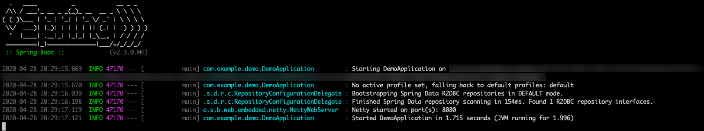
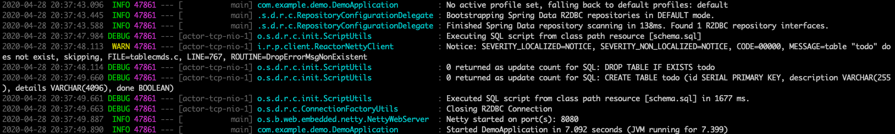
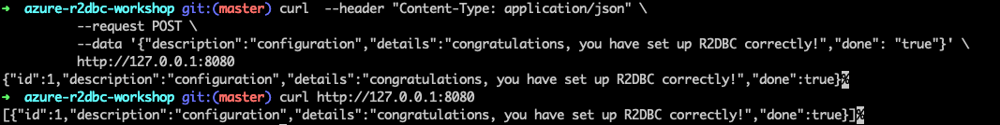

# Use Spring Data R2DBC with Azure Database for PostgreSQL

This topic demonstrates creating a sample application that uses [Spring Data R2DBC](https://spring.io/projects/spring-data-r2dbc) to store and retrieve information in [Azure Database for PostgreSQL](https://docs.microsoft.com/azure/postgresql/) by using the R2DBC implementation for PostgreSQL from the [r2dbc-postgresql GitHub repository](https://github.com/r2dbc/r2dbc-postgresql).

[R2DBC](https://r2dbc.io/) brings reactive APIs to traditional relational databases. You can use it with Spring WebFlux to create fully reactive Spring Boot applications that use non-blocking APIs. It provides better scalability than the classic "one thread per connection" approach.

[!INCLUDE [spring-data-prerequisites.md](includes/spring-data-prerequisites.md)]

## Prepare the working environment

First, set up some environment variables by using the following commands:

```bash
AZ_RESOURCE_GROUP=r2dbc-workshop
AZ_DATABASE_NAME=<YOUR_DATABASE_NAME>
AZ_LOCATION=<YOUR_AZURE_REGION>
AZ_POSTGRESQL_USERNAME=r2dbc
AZ_POSTGRESQL_PASSWORD=<YOUR_POSTGRESQL_PASSWORD>
AZ_LOCAL_IP_ADDRESS=<YOUR_LOCAL_IP_ADDRESS>
```

Replace the placeholders with the following values, which are used throughout this article:

- `<YOUR_DATABASE_NAME>`: The name of your PostgreSQL server. It should be unique across Azure.
- `<YOUR_AZURE_REGION>`: The Azure region you'll use. You can use `eastus` by default, but we recommend that you configure a region closer to where you live. You can have the full list of available regions by entering `az account list-locations`.
- `<YOUR_POSTGRESQL_PASSWORD>`: The password of your PostgreSQL database server. That password should have a minimum of eight characters. The characters should be from three of the following categories: English uppercase letters, English lowercase letters, numbers (0-9), and non-alphanumeric characters (!, $, #, %, and so on).
- `<YOUR_LOCAL_IP_ADDRESS>`: The IP address of your local computer, from which you'll run your Spring Boot application. One convenient way to find it is to point your browser to [whatismyip.akamai.com](http://whatismyip.akamai.com/).

Next, create a resource group:

```azurecli
az group create \
    --name $AZ_RESOURCE_GROUP \
    --location $AZ_LOCATION \
    | jq
```

> [!NOTE]
> We use the `jq` utility, which is installed by default on [Azure Cloud Shell](https://shell.azure.com/) to display JSON data and make it more readable.
> If you don't like that utility, you can safely remove the `| jq` part of all the commands we'll use.

## Create an Azure Database for PostgreSQL instance

The first thing we'll create is a managed PostgreSQL server.

> [!NOTE]
> You can read more detailed information about creating PostgreSQL servers in [Create an Azure Database for PostgreSQL server by using the Azure portal](/azure/postgresql/quickstart-create-server-database-portal).

In [Azure Cloud Shell](https://shell.azure.com/), run the following script:

```azurecli
az postgres server create \
    --resource-group $AZ_RESOURCE_GROUP \
    --name $AZ_DATABASE_NAME \
    --location $AZ_LOCATION \
    --sku-name B_Gen5_1 \
    --storage-size 5120 \
    --admin-user $AZ_POSTGRESQL_USERNAME \
    --admin-password $AZ_POSTGRESQL_PASSWORD \
    | jq
```

This command creates a small PostgreSQL server.

### Configure a firewall rule for your PostgreSQL server

Azure Database for PostgreSQL instances are secured by default. They have a firewall that doesn't allow any incoming connection. To be able to use your database, you need to add a firewall rule that will allow the local IP address to access the database server.

Because you configured our local IP address at the beginning of this article, you can open the server's firewall by running:

```azurecli
az postgres server firewall-rule create \
    --resource-group $AZ_RESOURCE_GROUP \
    --name $AZ_DATABASE_NAME-database-allow-local-ip \
    --server $AZ_DATABASE_NAME \
    --start-ip-address $AZ_LOCAL_IP_ADDRESS \
    --end-ip-address $AZ_LOCAL_IP_ADDRESS \
    | jq
```

### Configure a PostgreSQL database

The PostgreSQL server that you created earlier is empty. It doesn't have any database that you can use with the Spring Boot application. Create a new database called `r2dbc`:

```azurecli
az postgres db create \
    --resource-group $AZ_RESOURCE_GROUP \
    --name r2dbc \
    --server-name $AZ_DATABASE_NAME \
    | jq
```

[!INCLUDE [spring-data-create-reactive.md](includes/spring-data-create-reactive.md)]

### Generate the application by using Spring Initializr

Generate the application on the command line by entering:

```bash
curl https://start.spring.io/starter.tgz -d dependencies=webflux,data-r2dbc -d baseDir=azure-r2dbc-workshop -d bootVersion=2.3.0.RC1 -d javaVersion=8 | tar -xzvf -
```

### Add the reactive PostgreSQL driver implementation

Open the generated project's *pom.xml* file to add the reactive PostgreSQL driver from the [r2dbc-postgresql repository on GitHub](https://github.com/r2dbc/r2dbc-postgresql).

After the `spring-boot-starter-webflux` dependency, add the following snippet:

```xml
<dependency>
    <groupId>io.r2dbc</groupId>
    <artifactId>r2dbc-postgresql</artifactId>
    <scope>runtime</scope>
</dependency>
```

### Configure Spring Boot to use Azure Database for PostgreSQL

Open the *src/main/resources/application.properties* file, and add:

```properties
logging.level.org.springframework.data.r2dbc=DEBUG

spring.r2dbc.url=r2dbc:pool:postgres://$AZ_DATABASE_NAME.postgres.database.azure.com:5432/r2dbc
spring.r2dbc.username=r2dbc@$AZ_DATABASE_NAME
spring.r2dbc.password=$AZ_POSTGRESQL_PASSWORD
spring.r2dbc.properties.sslMode=REQUIRE
```

> [!WARNING]
> For security reasons, Azure Database for PostgreSQL requires to use SSL connections. This is why you need to add the `spring.r2dbc.properties.sslMode=REQUIRE` configuration property, otherwise the R2DBC PostgreSQL driver will try to connect using an insecure connection, which will fail.

- Replace the two `$AZ_DATABASE_NAME` variables with the value that you configured at the beginning of this article.
- Replace the `$AZ_POSTGRESQL_PASSWORD` variable with the value that you configured at the beginning of this article.

> [!NOTE]
> For better performance, the `spring.r2dbc.url` property is configured to use a connection pool using [r2dbc-pool](https://github.com/r2dbc/r2dbc-pool).

You should now be able to start your application by using the provided Maven wrapper:

```bash
./mvnw spring-boot:run
```

Here's a screenshot of the application running for the first time:

[](media/configure-spring-data-r2dbc-with-azure-postgresql/create-postgresql-01.png#lightbox)

### Create the database schema

[!INCLUDE [spring-data-r2dbc-create-schema.md](includes/spring-data-r2dbc-create-schema.md)]

```sql
DROP TABLE IF EXISTS todo;
CREATE TABLE todo (id SERIAL PRIMARY KEY, description VARCHAR(255), details VARCHAR(4096), done BOOLEAN);
```

Use the following command to stop the application and run it again. The application will now use the `r2dbc` database that you created earlier, and create a `todo` table inside it.

```bash
./mvnw spring-boot:run
```

Here's a screenshot of the database table as it's being created:

[](media/configure-spring-data-r2dbc-with-azure-postgresql/create-postgresql-02.png#lightbox)

## Code the application

Next, add the Java code that will use R2DBC to store and retrieve data from your PostgreSQL server.

[!INCLUDE [spring-data-r2dbc-create-application.md](includes/spring-data-r2dbc-create-application.md)]

Here's a screenshot of these cURL requests:

[](media/configure-spring-data-r2dbc-with-azure-postgresql/create-postgresql-03.png#lightbox)

Congratulations! You've created a fully reactive Spring Boot application that uses R2DBC to store and retrieve data from Azure Database for PostgreSQL.

[!INCLUDE [spring-data-conclusion.md](includes/spring-data-conclusion.md)]

### Additional resources

For more information about Spring Data R2DBC, see Spring's [reference documentation](https://docs.spring.io/spring-data/r2dbc/docs/1.0.x/reference/html/#reference).

For more information about using Azure with Java, see [Azure for Java developers](/azure/developer/java/) and [Working with Azure DevOps and Java](/azure/devops/).
